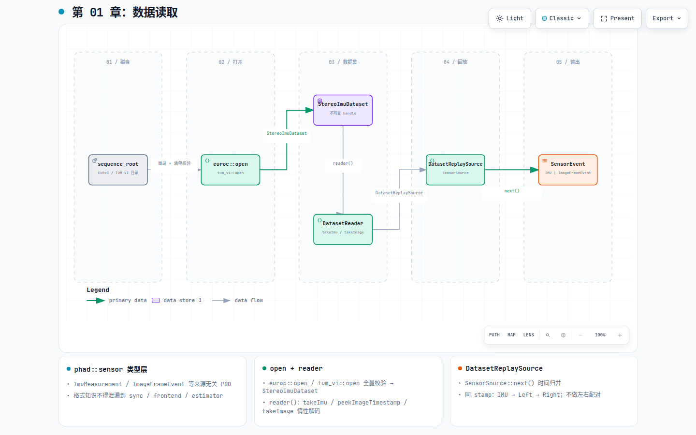

# 第 01 章：数据读取

## 这一环解决什么问题

VIO 的第一条可验证闭环是「从磁盘读出正确的传感器数据」。若时间戳、单位、外参方向或
清单校验有误，后面的同步、跟踪与估计都会建立在错误输入上，且难以定位根因。因此 loader
通常是整条 pipeline 里最先落地、也最值得单独验收的一环。

## 在 pipeline 中的位置

[](diagrams/01-dataset-io.html)

交互版：[`diagrams/01-dataset-io.html`](diagrams/01-dataset-io.html)

| | |
|---|---|
| **输入** | EuRoC / TUM VI 的 `sequence_root`（CSV、YAML、PNG） |
| **输出** | 按时间归并的 `SensorEvent`（`ImuMeasurement` 或 `ImageFrameEvent`） |
| **下游** | `apps::StereoPairStream` + `phad::sync`（第 02 章） |

同 stamp 事件顺序：**IMU → Left → Right**。本环止于 `SensorSource::next()`，不做左右配对。

## 模块内部分解

权威合同见 [`phad/io/README.md`](../../phad/io/README.md)。本环分 **sensor 类型层** 与 **io adapter 层**。

### phad::sensor（类型，无格式知识）

[`phad/sensor/`](../../phad/sensor/) 只定义来源无关的 POD：`ImuMeasurement`、`ImageFrameEvent`、
`StereoImuCalibration`、`CameraId` 等。任何 `euroc` / `tum_vi` 字符串不得出现在
`phad::sync`、`phad::frontend`、`phad::estimator`。

### phad::io_dataset：打开与 handle

| 步骤 | API / 类型 | 做什么 |
|---|---|---|
| 打开 | `euroc::open` / `tum_vi::open` | 校验单路 metadata、路径、标定；左右清单不等长仍允许成功 |
| 持有 | `StereoImuDataset` | 不可变 handle；`calibration()` + `summary()`（imu/left/right 计数） |
| 读取 | `reader()` → `StereoImuDatasetReader` | move-only、single-pass；`takeImu` / `peekImageTimestamp` / `takeImage` |

`takeImage(CameraId)` 才触发 PNG 惰性解码；解码失败对该相机 sticky，不阻塞另一路。
`exactTimestampIntersectionCount()` 仅诊断，**不是**配对策略。

### phad::io：回放 seam

| 组件 | 职责 |
|---|---|
| `SensorSource` | pull-based 抽象：`next()` → `SensorEvent \| EndOfStream \| SensorSourceError` |
| `DatasetReplaySource` | 三路时间归并；同 stamp **IMU → Left → Right** |
| `euroc::openGroundtruth` | 评估侧 `Trajectory`（不进 replay 主路径） |

错误分层：`DatasetError`（open）、`DatasetReaderError`（解码）、`SensorSourceError`（next）；
与 `phad::eval::EvalError` 不混用。

## 当前代码从哪里读

| 优先级 | 文件 |
|---|---|
| 1 | [`phad/io/README.md`](../../phad/io/README.md) |
| 2 | `phad/io/dataset/euroc/euroc_dataset.hpp` — `euroc::open()` |
| 3 | `phad/io/dataset/stereo_imu_dataset.hpp` — handle + reader |
| 4 | `phad/io/dataset/dataset_replay_source.hpp` — `DatasetReplaySource` |

```text
sequence_root → open → StereoImuDataset → reader() → DatasetReplaySource::next() → SensorEvent
```

## 开发过程怎么长出来的

- 里程碑：[`../design/roadmap.md`](../design/roadmap.md) **M1**（离线 Stereo-IMU 数据加载）。
- 历史调研：[`../research/2026-07-28-note-euroc-dataset-loader-design.md`](../research/2026-07-28-note-euroc-dataset-loader-design.md)。
- 活架构：[`../design/architecture.md`](../design/architecture.md) §3.1 Sensor adapters。

## 建议动手验证

```bash
./build/phad_euroc_inspect /path/to/MH_01_easy
```

相关测试：`phad_io_dataset_tests` / `euroc_dataset_test`、`euroc_mh01_test`、
`dataset_replay_source_test`、`tum_vi_dataset_test`。
