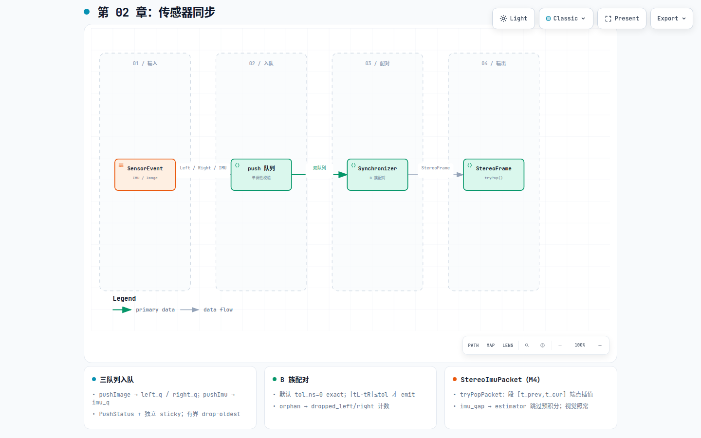

# 第 02 章：传感器同步

## 这一环解决什么问题

`DatasetReplaySource` 按时间拉出的 `SensorEvent` 仍是**单路**事件：左目、右目、IMU
各自独立到达。VIO 的下一环需要的是「同一时刻的一对左右图」，M4 起还需要「两帧图像
之间的 IMU 段」。同步器的职责就是把多路事件整理成这些**有明确时间语义**的数据包，
且与数据集格式无关——EuRoC 左右清单不等长、IMU 200 Hz 而图像 20 Hz，都应在
sync 层处理，而不是塞回 `phad::io` adapter。

## 在 pipeline 中的位置

[](diagrams/02-synchronization.html)

交互版：[`diagrams/02-synchronization.html`](diagrams/02-synchronization.html)

| | |
|---|---|
| **输入** | `SensorEvent`（`ImuMeasurement` 或 `ImageFrameEvent`） |
| **输出** | `StereoFrame`（`tryPop()`）；M4 另产出 `StereoImuPacket`（`tryPopPacket()`） |
| **下游** | `phad::camera` 立体校正（第 03 章） |

VO 主路径消费 `StereoFrame`。`StereoImuPacket` 在 M4 接入 estimator，详见 [`06-imu-vio.md`](06-imu-vio.md)。

## 模块内部分解

权威合同见 [`phad/sync/README.md`](../../phad/sync/README.md)。`phad::io` 与 `phad::sync` **互不依赖**；
编排由 [`apps/stereo_pair_stream.hpp`](../../apps/stereo_pair_stream.hpp) 完成。

### StereoPairSynchronizer：三队列

```text
pushImage(Left|Right) → left_q / right_q     pushImu → imu_q
                              └──── drain：|tL−tR| ≤ tol_ns ────┘
```

| 子系统 | 行为 |
|---|---|
| **入队** | 单调 stamp 校验；`PushStatus`：kOk / kOutOfOrder / kDuplicate / kInvalidStamp / kInvalidValue(IMU) |
| **sticky** | 图像与 IMU 独立 sticky；置位后后续 push 拒绝，但已配好的对仍可 `tryPop` |
| **B 族配对** | 默认 `tol_ns=0` exact；否则丢偏早一侧（orphan → `dropped_left/right`） |
| **溢出** | 有界队列 + drop-oldest → `dropped_*_overflow`；库内不打日志 |

### M4.1：IMU 切段（`tryPopPacket`）

每 emit 一对 `StereoFrame` 时构造 `StereoImuPacket`：

| 字段 / 语义 | 说明 |
|---|---|
| 段 `[t_prev, t_cur]` | `t_cur` = 配对帧 left stamp；相邻段共享边界样本 |
| 端点 | 恰在端点的原样本，否则相邻 pair 线性插值 |
| `imu_gap` | 段宽超阈值 / 无法构造端点 / 段内无样本 → estimator 跳过预积分 |
| 首帧 | 零段 `t_prev == t_cur`；更早 IMU 计入 `dropped_imu` |

诊断：`StereoPairDiagnostics`（`pushed_*`、`emitted_stereo`、`imu_gap_count` 等）——
见 sync README 字段表。

## 当前代码从哪里读

| 优先级 | 文件 |
|---|---|
| 1 | [`phad/sync/README.md`](../../phad/sync/README.md) |
| 2 | `phad/sync/stereo_pair_synchronizer.hpp` |
| 3 | `phad/sensor/stereo_imu_packet.hpp` |
| 4 | [`apps/stereo_pair_stream.hpp`](../../apps/stereo_pair_stream.hpp) |

## 开发过程怎么长出来的

- 里程碑：[`../design/roadmap.md`](../design/roadmap.md) **M3.2**（StereoOnly）、**M4.1**（IMU 切段）。
- 活架构：[`../design/architecture.md`](../design/architecture.md) §3.2 Sensor synchronizer。
- 设计笔记：[`../research/2026-07-31-note-stereo-pair-synchronizer-design.md`](../research/2026-07-31-note-stereo-pair-synchronizer-design.md)。
- 实施计划：[`../plans/2026-07-31_m3.2_stereo_pair_synchronizer_5b7d1c93.plan.md`](../plans/2026-07-31_m3.2_stereo_pair_synchronizer_5b7d1c93.plan.md)、
  [`../plans/2026-08-08_m4.1_sync_imu_96a99568.plan.md`](../plans/2026-08-08_m4.1_sync_imu_96a99568.plan.md)。

## 建议动手验证

相关测试：`phad_sync_tests` / `stereo_pair_synchronizer_test`。

读 `StereoPairDiagnostics` 后跑短序列，核对 `emitted_stereo` 与 `pushed_left/right`、
orphan drop 是否可解释（EuRoC exact 配对时通常 orphan 很少）。
