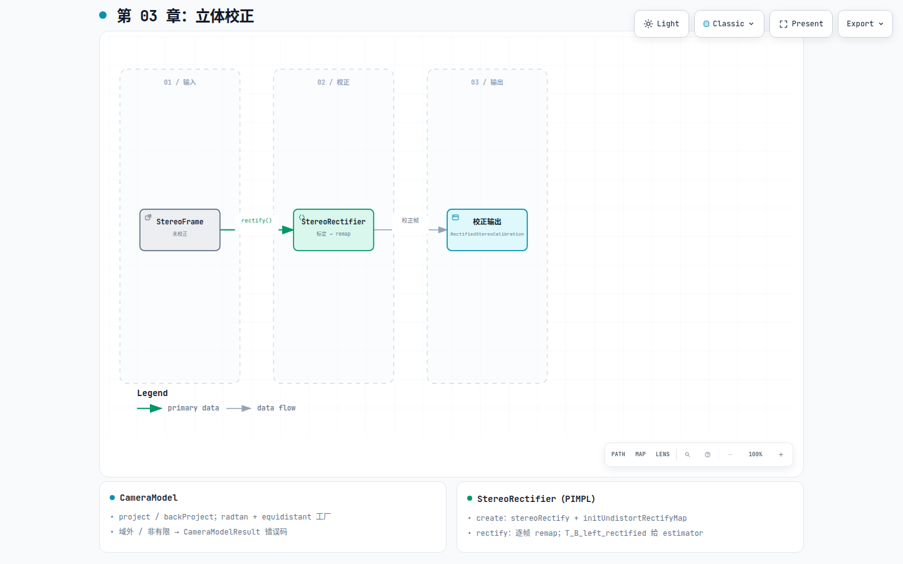

# 第 03 章：立体校正

## 这一环解决什么问题

原始双目图带畸变且左右光轴一般不共面。特征跟踪与 BA 都假设**极线水平对齐**的
rectified 图像，以及与之配套的共享内参、baseline 与 `T_B_left_rectified`。
`phad::camera` 把标定数值变成可调用的几何模型，并在 session 启动时用
OpenCV `stereoRectify` 预计算 remap 表，逐帧只做 `remap`——校正是一次性成本，
跟踪循环里不应重复解畸变。

## 在 pipeline 中的位置

[](diagrams/03-rectification.html)

交互版：[`diagrams/03-rectification.html`](diagrams/03-rectification.html)

| | |
|---|---|
| **输入** | 原始 `StereoFrame` + `StereoImuCalibration`（dataset `open` 时得） |
| **输出** | 校正后 `StereoFrame` + `RectifiedStereoCalibration` |
| **下游** | `phad::frontend::StereoTracker`（第 04 章） |

本环不做特征检测、不做位姿估计。TUM VI equidistant 整图校正当前未支持（M5 项）。

## 模块内部分解

权威合同见 [`phad/camera/README.md`](../../phad/camera/README.md)。标定数值在 `phad::sensor`；
投影、畸变与 remap 在本目录。

### CameraModel（单目几何）

| API | 作用 |
|---|---|
| `createCameraModel(parameters)` | radtan / equidistant 工厂 |
| `project(point_camera)` | 3D → 像素；失败码：非有限 / 域外 / 数值失败 |
| `backProject(pixel)` | 像素 → 单位 bearing（重投影容差自检） |

equidistant 可用于投影/反投影；**整图双目校正**当前仅 radtan。

### StereoRectifier（整图校正，PIMPL）

| 阶段 | 做什么 |
|---|---|
| `create(stereo_imu_calib)` | `cv::stereoRectify`（`CALIB_ZERO_DISPARITY`, `alpha=0`）+ `initUndistortRectifyMap` |
| `rectify(raw_stereo_frame)` | 逐帧 `remap`；OpenCV 仅在 `.cpp` / PIMPL |
| `calibration()` | `RectifiedStereoCalibration`：共享 fx/fy/cx/cy、baseline、`T_B_left_rectified()` |

外参链：`T_B_left_rectified = T_B_left * T_left_left_rect`（`R = R1ᵀ`, `t = 0`）。
estimator / frontend **必须**用 `T_B_left_rectified()`，勿用未校正左目外参。

### session 中的生命周期

[`apps/offline_vo_session.cpp`](../../apps/offline_vo_session.cpp)：**循环外** `StereoRectifier::create`，
**循环内** `rectify`——remap 表只建一次。

## 当前代码从哪里读

| 优先级 | 文件 |
|---|---|
| 1 | [`phad/camera/README.md`](../../phad/camera/README.md) |
| 2 | `phad/camera/stereo_rectifier.hpp` |
| 3 | `phad/camera/rectified_stereo_calibration.hpp` |
| 4 | `phad/camera/camera_model.hpp`（单测与工具） |

坐标合同：[`../design/conventions.md`](../design/conventions.md) — `T_<target>_<source>`、body≡IMU。

## 开发过程怎么长出来的

- 里程碑：[`../design/roadmap.md`](../design/roadmap.md) **M2** 双目 VO 闭环。
- 活架构：[`../design/architecture.md`](../design/architecture.md) §3 模块边界。

## 建议动手验证

相关测试：`phad_camera_tests`（投影往返、恒等 remap、MH_01 行对齐 smoke）。

```bash
./build/phad_euroc_runner /path/to/MH_01_easy   # GUI，人工确认极线对齐
```
