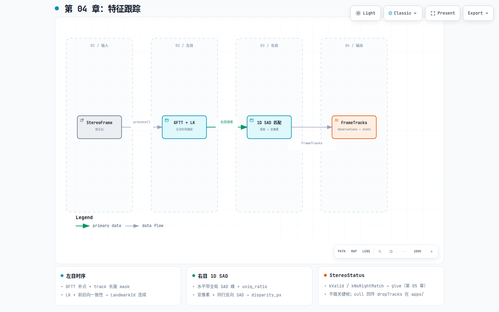

# 第 04 章：特征跟踪

## 这一环解决什么问题

后端 BA 需要的是**跨帧可关联**的 2D 观测，而不是每帧独立的角点云。frontend 在
校正图上维护带 `LandmarkId` 的时序 track：左目 LK 保证时序连续，右目 1D SAD 给出
视差与 `StereoStatus`。这一环的质量直接决定后端能否三角化、PnP 能否收敛——因此
M2 把 frontend 提前到 VO 闭环的第二步，而不是最后才做。

## 在 pipeline 中的位置

[](diagrams/04-feature-tracking.html)

交互版：[`diagrams/04-feature-tracking.html`](diagrams/04-feature-tracking.html)

| | |
|---|---|
| **输入** | 校正后 `StereoFrame` + `RectifiedStereoCalibration` |
| **输出** | `FrameTracks`（`TrackObservation` + `FrameStats`） |
| **下游** | `apps/stereo_vo_glue.hpp` + session 关键帧逻辑（第 05 章） |

**目标架构 vs 当前代码**：[`../design/architecture.md`](../design/architecture.md) §3.3
把关键帧画在 frontend；现行 [`phad/frontend/README.md`](../../phad/frontend/README.md) 明确
**不做**关键帧决策、不定义 `VioMeasurement`。frontend 只产出 `FrameTracks`。

## 模块内部分解

权威合同见 [`phad/frontend/README.md`](../../phad/frontend/README.md)。OpenCV 为 PRIVATE（PIMPL）。

### StereoTracker::process 流水线

| 阶段 | 算法 | 输出 |
|---|---|---|
| 1. 补点 | GFTT + 按 track 长度涂 mask | 新 `LandmarkId`（单调不复用） |
| 2. 左目 | LK 光流 + 前后向一致性 | 时序连续 `left_pixel` |
| 3. 右目 | 水平带 1D SAD → 亚像素 → 同行反向 SAD | `disparity_px` + `StereoStatus` |
| 4. 几何门 | 行容差、视差/深度区间 | `kValid` / 拒绝类 status |

右目搜索带：`[u_l - d_max, u_l - d_min]`，由 `min_disparity_px`、`min_depth_m`、`max_depth_m`
与 `fx * baseline` 导出；**全局** SAD 最小峰 + `stereo_uniq_ratio` 次优检验。

### StereoStatus 与下游

| 值 | 含义 | 进入 glue？ |
|---|---|---|
| `kValid` | 全部几何门通过 | 是（带 disparity） |
| `kNoRightMatch` | SAD/亚像素/反向失败；track 保留 | 是（`length≥2` 时 disparity=0） |
| `kInvalidDisparity` | 行差或视差非法 | 否 |
| `kDepthOutOfRange` | `z = fx*baseline/disparity` 越界 | 否 |

### composition root 回传（不在 frontend 内）

session 在 estimator cull 后可调用：

- `dropTracks(ids)` — 永久移除 track 表项
- `markEvictable(ids)` — GFTT 缺槽时按 id 升序 lazy evict

frontend **不** include estimator 类型；策略见 [`apps/AGENTS.md`](../../apps/AGENTS.md)。

## 当前代码从哪里读

| 优先级 | 文件 |
|---|---|
| 1 | [`phad/frontend/README.md`](../../phad/frontend/README.md) |
| 2 | `phad/frontend/stereo_tracker.hpp` / `stereo_tracks.hpp` |
| 3 | `StereoTrackerOptions` — GFTT / LK / 立体门限字段 |

probe CSV 合同见 frontend README（`frames-csv` / `tracks-csv`）。

## 开发过程怎么长出来的

- 里程碑：[`../design/roadmap.md`](../design/roadmap.md) **M2.2**（双目前端）。
- 实施计划：[`../plans/2026-07-31_m2.2_stereo_frontend_38ddaa97.plan.md`](../plans/2026-07-31_m2.2_stereo_frontend_38ddaa97.plan.md)。
- 硬化：[`../research/2026-08-06-note-m3-3-slice6-frontend-hardening-design.md`](../research/2026-08-06-note-m3-3-slice6-frontend-hardening-design.md)。

## 建议动手验证

```bash
./build/phad_stereo_frontend_probe /path/to/MH_01_easy \
  --frames-csv /tmp/frames.csv --tracks-csv /tmp/tracks.csv
```

相关测试：`phad_frontend_tests`、`phad_frontend_mh01_test`。
离线绘图：[`scripts/plot_tracks.py`](../../scripts/plot_tracks.py)。
