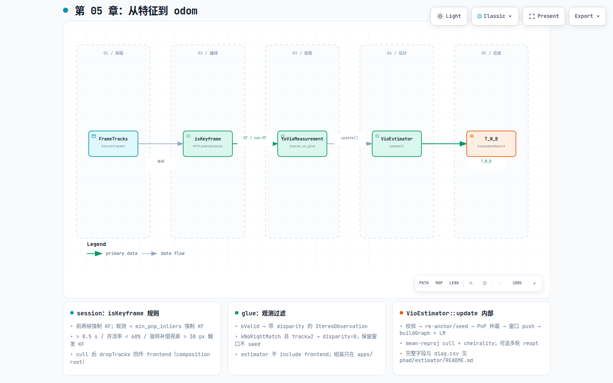

# 第 05 章：从特征到 odom

## 这一环解决什么问题

`FrameTracks` 仍是前端观测；估计器需要的是带时间戳、过滤后观测的
**测量包**。这一环把「何时提交一帧」与「提交什么」拆开：session 按视差、
跟踪率、时间间隔做关键帧决策；`stereo_vo_glue` 把 `kValid`（及特定条件下的
`kNoRightMatch`）观测组装成 `VioMeasurement`；`VioEstimator::update()` 在固定窗口
因子图上依次做校验、PnP 初值、LM、外点剔除与可选重优，输出 `T_W_B`。这是整条
VO/VIO pipeline 第一次产出可对标真值的位姿轨迹。

权威合同（完整字段、诊断、M4 视觉连续性与 transaction 语义）见
[`phad/estimator/README.md`](../../phad/estimator/README.md)；本章只串**模块内部分解**
与阅读顺序。

## 在 pipeline 中的位置

[](diagrams/05-tracks-to-odom.html)

交互版：[`diagrams/05-tracks-to-odom.html`](diagrams/05-tracks-to-odom.html)

| | |
|---|---|
| **输入** | 每帧 `FrameTracks`（+ 同步 packet 内 IMU 段，M4） |
| **中间** | `isKeyframe` 门 → `VioMeasurement`（glue 组装） |
| **输出** | `VioUpdateResult` → `T_W_B` 轨迹点；`culled_landmark_ids` 可回传 frontend |

**三层分工（不要混成一个类）**

| 层 | 组件 | 职责 |
|---|---|---|
| 编排 | [`apps/offline_vo_session`](../../apps/offline_vo_session.hpp) | replay 循环、`isKeyframe()`、调用 glue / estimator、cull 后 `dropTracks` |
| 组装 | [`apps/stereo_vo_glue.hpp`](../../apps/stereo_vo_glue.hpp) | `FrameTracks` → `VioMeasurement`；保持 `phad::estimator` 不依赖 frontend |
| 估计 | [`phad::estimator`](../../phad/estimator/) | 窗口、landmark、因子图、PnP、BA、段生命周期；**不**做关键帧决策 |

## 模块内部分解

### apps/：`OfflineVoSession` 与关键帧

每帧顺序：`track()` → `isKeyframe(tracks, ts)` →（若为 KF 或 accepted non-KF 路径）
`toVioMeasurement()` → `estimator.update(measurement, is_kf)` → 根据 diagnostics 决定是否
`dropTracks(culled_landmark_ids)`。

`isKeyframeImpl()` 组合规则（[`offline_vo_session.cpp`](../../apps/offline_vo_session.cpp)）：

| 规则 | 条件 | 意图 |
|---|---|---|
| 0 | 空观测 | 永不 KF（estimator 也会拒） |
| 1 | 前两帧 | 强制 KF，bootstrap 窗口 |
| 1b | 观测数 < `min_pnp_inliers` | 强制 KF，保证 PnP 可跑 |
| 2 | 距上一 KF > 0.5 s | 时间兜底 |
| 3 | 与上一 KF 共视 track 存活率 < 60% | 跟踪退化 |
| 4 | 旋转补偿后平均视差 > 30 px | 几何退化（纯旋转不触发） |

非关键帧仍可能 `update(..., keyframe=false)`：进入窗口与 LM，但不 seed 新 landmark、
不参与首段/re-anchor。详见 estimator README「关键帧参数（M3.3 Slice ⑤）」。

cull 回传（composition root，不在 estimator 内）：

- `block_culled_rebirth`：estimator 侧拒同 id 复生；session 侧 `drop_culled_tracks`（默认开）
  把永久 cull 的 id 通知 frontend `dropTracks`。
- 两级门、`zombie_drop_age` 等探针在 [`apps/AGENTS.md`](../../apps/AGENTS.md)。

### apps/：`stereo_vo_glue`

[`toVioMeasurement()`](../../apps/stereo_vo_glue.hpp) 只做**类型与过滤**，不做几何：

| `StereoStatus` | 是否进入 measurement | 备注 |
|---|---|---|
| `kValid` | 是 | 带 `disparity_px` |
| `kNoRightMatch` 且 `length ≥ 2` | 是 | `disparity_px = 0`；零视差不 seed，可保留在窗口等立体恢复 |
| 其他 | 否 | 不进入 estimator |

输出 `VioMeasurement`：`m_timestamp`、`m_observations[]`、`m_imu`（M4 同步 packet 切段）。

### phad::estimator：`VioEstimator::update()` 内部阶段

公开入口：[`vio_estimator.hpp`](../../phad/estimator/vio_estimator.hpp)  
`VioUpdateResult update(const VioMeasurement&, bool keyframe = true)`  
GTSAM 图、Values、PIM 均在 PIMPL 内（`PRIVATE` 链接）。

一次 `update()` 的**逻辑顺序**（正常已初始化路径；首段 / re-anchor 跳过 PnP）：

```text
校验 measurement
    → 重叠断裂？（shared==0）→ enable_reanchor / min_seed_observations / seedSegment
    → 摄入前 visual support / mapped observation 统计
    → poseInitialValue()（恒速或上帧）
    → tryPnpInit + modality-aware RMS 仲裁（OpenCV RANSAC，PIMPL 内）
    → 窗口 push（KF / non-KF 不同 eviction 策略）
    → buildGraph + Levenberg–Marquardt
    → mean-reproj cull + cheirality；可选多轮 rebuild + reopt
    → commit transaction → VioUpdateResult + UpdateDiagnostics
```

| 子系统 | 做什么 | 权威段落 |
|---|---|---|
| 段 / re-anchor | `segment_id` 递增、窗口与 landmark 清空后 seed | README §段生命周期 |
| PnP 初值 | mapped 3D–2D → proposal；与 guess RMS 仲裁 | README §PnP 初值 |
| 因子图 | `GenericStereoFactor` / mono projection；最老帧 Prior 定 gauge | README §M4 active local visual continuity |
| 外点 | mean-reproj 剔点、cheirality、拒 cull 复生 | README §外点剔除 |
| 诊断 | `pnp_*`、`outliers_*`、`num_mapped_observations`、26 列 `diag.csv` | README §诊断 CSV |

M4 另增：gyro interval、visual coast / `kVisualOutage`、`StereoVoUpdateTransaction` 回滚等——
见 [`06-imu-vio.md`](06-imu-vio.md) 与 [`docs/specs/2026-08-25-m4-minimal-full-state-vio.md`](../specs/2026-08-25-m4-minimal-full-state-vio.md)。

**命名说明**：M2.3 文档与 git 历史常写 `StereoVoEstimator` / `KeyframeMeasurement`；
现行 public API 为 `VioEstimator` / `VioMeasurement`（[`types.hpp`](../../phad/estimator/types.hpp)）。

## 当前代码从哪里读

| 优先级 | 文件 | 看什么 |
|---|---|---|
| 1 | [`phad/estimator/README.md`](../../phad/estimator/README.md) | 完整合同与 slice 语义 |
| 2 | [`apps/offline_vo_session.cpp`](../../apps/offline_vo_session.cpp) | `isKeyframeImpl`、主循环、cull 回传 |
| 3 | [`apps/stereo_vo_glue.hpp`](../../apps/stereo_vo_glue.hpp) | glue 过滤规则 |
| 4 | `phad/estimator/vio_estimator.hpp` + `vio_estimator.cpp` | 公开 API 与 PIMPL 边界 |
| 5 | `phad/estimator/types.hpp` | `VioMeasurement`、`UpdateDiagnostics`、`UpdateStatus` |

## 开发过程怎么长出来的

- 里程碑：[`../design/roadmap.md`](../design/roadmap.md) **M2.3**（VO 后端）→ **M3.3**（PnP / cull / KF / 段）→ **M4**（full-state VIO）。
- ADR：[`../adr/0001-gtsam-vio-backend.md`](../adr/0001-gtsam-vio-backend.md)。
- 设计笔记：[`../research/2026-07-31-note-m2-3-vo-backend-design.md`](../research/2026-07-31-note-m2-3-vo-backend-design.md)；
  M3.3 各 slice 见 estimator README 内链（PnP、outlier-cull、reopt、cull-track-drop 等）。
- 实施计划：[`../plans/2026-07-31_m2.3_vo_backend_dcdbfc71.plan.md`](../plans/2026-07-31_m2.3_vo_backend_dcdbfc71.plan.md)。

## 建议动手验证

```bash
# 短序列 probe（stdout 摘要 + 可选 26 列 diag.csv）
./build/phad_stereo_vo_probe /path/to/MH_01_easy --diag-csv /tmp/diag.csv

# 全 pipeline + 落盘 bench（见 phad/bench/README.md）
./build/phad_vo_bench /path/to/MH_01_easy --bench-root /tmp/phad_bench
```

相关测试：`phad_estimator_tests`（`vio_estimator_test`、`keyframe_update_test` 等）。

读 `diag.csv` 时建议与 README 列合同对照：`num_mapped_observations` vs `num_shared`、
`is_keyframe`、`segment_id`、`unsupported_span_ns` 联立可区分 PnP 失败、overlap 断裂与
visual outage。
