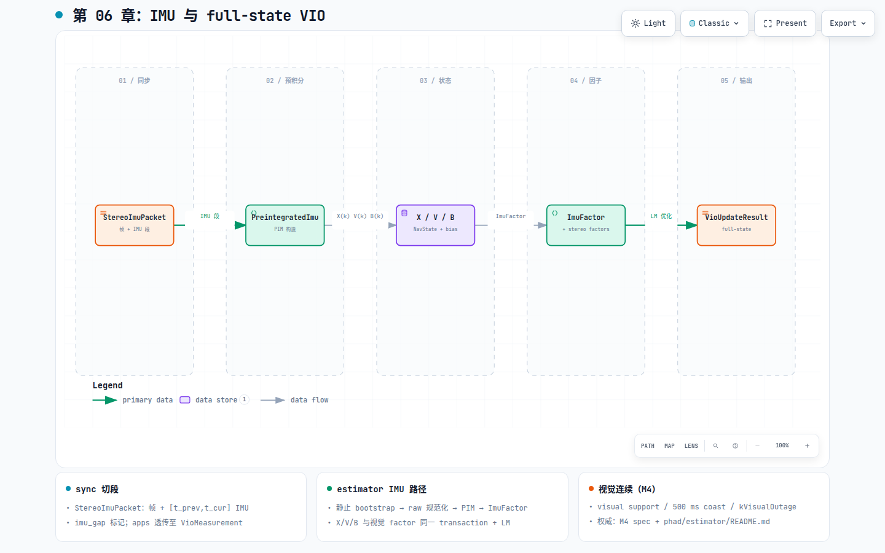

# 第 06 章：IMU 与 full-state VIO

## 这一环解决什么问题

纯 VO 在快速旋转、短时纹理缺失时仅靠视觉容易漂移；IMU 提供帧间旋转与平移的
短期约束。M4 在**不改变**视觉观测合同的前提下，把 sync 切出的 IMU 段预积分为
`PreintegratedImu`，在因子图上加入 `X(k)`、`V(k)`、`B(k)` 与 `ImuFactor`，形成
full-state VIO。VO 主路径仍可单独运行；IMU 是 sync → estimator 的增量侧支，不是
重写 frontend。

## 在 pipeline 中的位置

[](diagrams/06-imu-vio.html)

交互版：[`diagrams/06-imu-vio.html`](diagrams/06-imu-vio.html)

| | |
|---|---|
| **输入** | `StereoImuPacket`（配对帧 + `[t_prev, t_cur]` IMU 段）+ 视觉 `VioMeasurement` |
| **中间** | raw IMU 规范化 → PIM → `ImuFactor` + stereo/mono factors |
| **输出** | 含 `X/V/B` 的 `VioUpdateResult` |

上游同步：第 02 章 `tryPopPacket()`。视觉链仍经第 04–05 章；**唯一**估计入口仍是
`VioEstimator::update()`。

## 模块内部分解

### phad::sync → apps → estimator seam

| 层 | 职责 |
|---|---|
| sync | 切段、端点插值、`imu_gap` 标记；**不**预积分 |
| apps | `toVioMeasurement(tracks, packet.m_imu)` 透传 IMU payload |
| estimator | 规范化、PIM、factor、窗口、transaction；GTSAM 全在 PIMPL |

`imu_gap == true`：跳过该段 `ImuFactor`，视觉因子照常。

### VioEstimator::update 中的 IMU 路径（M4）

权威：[`docs/specs/2026-08-25-m4-minimal-full-state-vio.md`](../specs/2026-08-25-m4-minimal-full-state-vio.md)、
[`phad/estimator/README.md`](../../phad/estimator/README.md)。

```text
validate measurement + IMU interval
    → initializing？静止 bootstrap（mean gyro / accel 定 roll-pitch，v0=0）
    → integrate raw samples → PreintegratedImu（endpoint 插值在 estimator 内）
    → stage X(k), V(k), B(k) + ImuFactor + BetweenFactor(bias)
    → 与视觉 factor 同一 LM / transaction
    → commit 或 rollback（hard failure 恢复 committed snapshot）
```

| 合同点 | 说明 |
|---|---|
| State cadence | 每个有效 IMU interval 的同步 packet 建立 `X/V/B`；keyframe 只控 landmark seed/evict |
| Raw sample | SI、body 系、含 physical bias；apps 不做 state-dependent correction |
| Interval | `t_end` = 当前图像 stamp；`t_begin` = 前驱 anchor；整数纳秒 exact 比较 |
| Bootstrap | 静止门闭合前 `kInitializing`；首 PIM 覆盖 `(t0,t1]` |
| Transaction | `StereoVoUpdateTransaction`：post-staging hard failure 必须 rollback |

### M4 视觉连续（与 IMU 并行，非替代）

同一 `update()` 内另有三层视觉语义（observation retained / graph visually constrained /
full visual support）与 **500 ms visual coast**、`kVisualOutage`——见 estimator README
§「M4 active local visual continuity」。世界系连续另见
[`docs/specs/2026-08-26-m4-world-frame-continuity.md`](../specs/2026-08-26-m4-world-frame-continuity.md)。

## 当前代码从哪里读

| 优先级 | 文档 / 文件 |
|---|---|
| 1 | [`../specs/2026-08-25-m4-minimal-full-state-vio.md`](../specs/2026-08-25-m4-minimal-full-state-vio.md) |
| 2 | [`phad/estimator/README.md`](../../phad/estimator/README.md) |
| 3 | [`phad/sync/README.md`](../../phad/sync/README.md) — `StereoImuPacket` |
| 4 | `phad/estimator/vio_estimator.hpp` + `types.hpp` |
| 5 | ADR：[`../adr/0002-stage-gated-gyro-only-bias-state.md`](../adr/0002-stage-gated-gyro-only-bias-state.md) |

## 开发过程怎么长出来的

- 里程碑：[`../design/roadmap.md`](../design/roadmap.md) **M4**。
- 调研：[`../research/2026-08-08-note-m4-imu-integration-design.md`](../research/2026-08-08-note-m4-imu-integration-design.md)。
- 基准：[`../benchmark/m4/README.md`](../benchmark/m4/README.md)（须含 `meta.json` 参数快照）。

## 建议动手验证

- `phad_estimator_tests` / `vio_full_state_test`、`vio_lifecycle_test`
- 全序列 bench 与 checkpoint 对比（EuRoC-11 等；已合入 ≠ formal gate 通过）

动态初始化（M5）不在本章；见
[`../research/2026-08-26-note-phad-vio-dynamic-initialization-and-recovery-research.md`](../research/2026-08-26-note-phad-vio-dynamic-initialization-and-recovery-research.md)。
