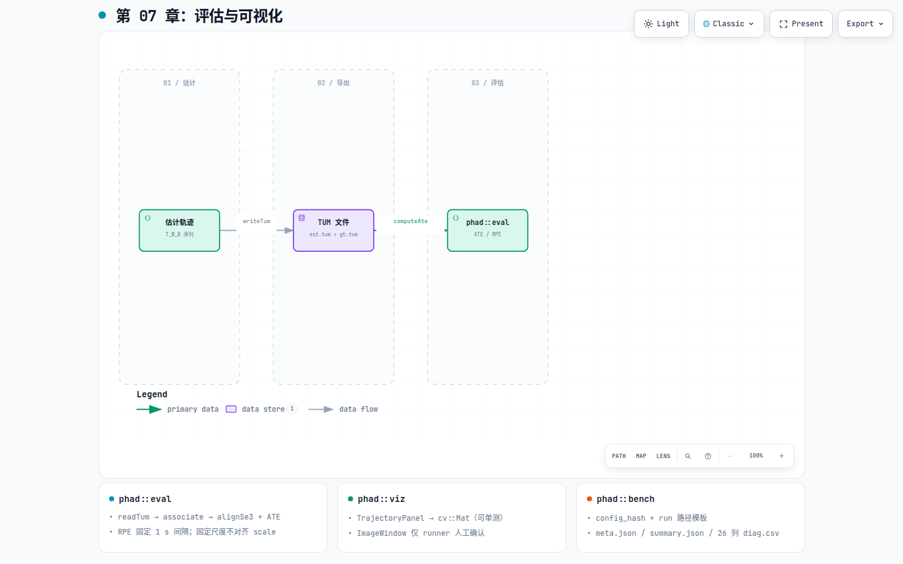

# 第 07 章：评估与可视化

## 这一环解决什么问题

没有可重复的轨迹误差数字，就无法判断「这次改动让系统变好还是变坏」。评估与
可视化模块**不参与优化**：它们消费估计结果（与真值），产出 ATE/RPE、俯视轨迹
面板、以及 bench 回归落盘。M2.1 刻意把 eval 放在第一条估计轨迹之前就绪，使
后续每个 milestone 都有外部可观察的出口。

## 在 pipeline 中的位置

[](diagrams/07-eval-viz.html)

交互版：[`diagrams/07-eval-viz.html`](diagrams/07-eval-viz.html)

主评估路径：**估计轨迹 → TUM → associate + align → ATE/RPE**。并行能力见下表。

| 模块 | 输入 | 输出 | 不做 |
|---|---|---|---|
| [`phad::eval`](../../phad/eval/) | `Trajectory` 或 TUM | `AteReport` / `RpeReport` | 解析 EuRoC GT（在 io） |
| [`phad::viz`](../../phad/viz/) | `Trajectory` | `TrajectoryPanel` → `cv::Mat` | ATE、3D 场景 |
| [`phad::bench`](../../phad/bench/) | apps 展平的 config | `meta.json` / `summary.json` schema | 跑 pipeline、算指标 |

`phad_vo_bench` / `phad_stereo_vo_probe` 共用 session（第 05 章），保证 `diag.csv` 合同一致。

## 模块内部分解

### phad::eval：轨迹误差

权威：[`phad/eval/README.md`](../../phad/eval/README.md)。

```text
readTum(est), readTum(gt)  ──►  Trajectory
        associate(est, gt)  ──►  时间最近邻对
              ├─ alignSe3 (固定尺度 Umeyama) + computeAte → AteReport
              └─ computeRpe (固定 1 s 间隔) → RpeReport（无需对齐）
```

| 约定 | 说明 |
|---|---|
| TUM | `timestamp tx ty tz qx qy qz qw`；秒 + 米 + Hamilton 四元数；与 evo 兼容 |
| 时间戳 | 写出 9 位小数秒，避免 EuRoC 量级 `double` 丢精度 |
| 尺度 | 双目尺度已知：ATE **不**估计 scale |
| 错误 | `EvalError` / `EvalResult`；与 `DatasetError` 分离 |

真值路径：`euroc::openGroundtruth`（io）→ `Trajectory` → 可 `writeTum` 或直接 `computeAte`。

### phad::viz：内存渲染 vs 窗口

| 组件 | 职责 | 测试 |
|---|---|---|
| `TrajectoryPanel` | 固定视野俯视 x-y；`render(ts)` 标当前位姿 | 只断言 `cv::Mat`，无窗 |
| `ImageWindow` | highgui 显示 + `pump`（`q`/Esc 退出） | runner 人工确认；agent 不擅自弹窗 |

分层：`Panel → Mat`（可 CI）→ 可选 `ImageWindow`（`phad_euroc_runner`）。

### phad::bench + phad_vo_bench：回归落盘

权威：[`phad/bench/README.md`](../../phad/bench/README.md)。

| 概念 | 说明 |
|---|---|
| `ConfigSnapshot` | apps 展平 options → 规范化文本 → FNV-1a `config_hash`（8 hex） |
| run 目录 | `<bench_root>/<seq>/<commit>[_dirty]/<label>_<hash8>/` |
| `meta.json` | 完整 config + git identity + schema_version |
| `summary.json` | ATE/RPE、段/PnP/剔点 robustness 字段；`ate` 缺失为 `null` 非 0 |
| `diag.csv` | 26 列帧级诊断（与 probe 共用 `writeDiagCsv()`） |

bench **库**不算 ATE、不写盘；组装在 `apps/phad_vo_bench.cpp`。

## 当前代码从哪里读

| 优先级 | 文件 |
|---|---|
| 1 | [`phad/eval/README.md`](../../phad/eval/README.md) |
| 2 | [`phad/viz/README.md`](../../phad/viz/README.md) |
| 3 | [`phad/bench/README.md`](../../phad/bench/README.md) |
| 4 | `apps/phad_traj_eval.cpp`、`apps/phad_vo_bench.cpp`、`apps/phad_euroc_runner.cpp` |

## 开发过程怎么长出来的

- 里程碑：[`../design/roadmap.md`](../design/roadmap.md) **M2.1**（eval/viz）、**M3.1**（bench）。
- 计划：[`../plans/2026-07-30_m2.1_eval_visualization_baseline_d818d653.plan.md`](../plans/2026-07-30_m2.1_eval_visualization_baseline_d818d653.plan.md)、
  [`../plans/2026-07-31_m3.1_vo_regression_benchmark_7c4e91a2.plan.md`](../plans/2026-07-31_m3.1_vo_regression_benchmark_7c4e91a2.plan.md)。
- bench 设计：[`../research/2026-07-31-note-m3-1-vo-regression-benchmark-design.md`](../research/2026-07-31-note-m3-1-vo-regression-benchmark-design.md)。

## 建议动手验证

```bash
./build/phad_euroc_gt_export /path/to/MH_01_easy gt.tum
./build/phad_traj_eval est.tum gt.tum
evo_ape tum gt.tum est.tum -a
```

相关测试：`phad_eval_tests`；`tests/viz/`（无窗）。
bench 表：[`scripts/bench_table.py`](../../scripts/bench_table.py)。
