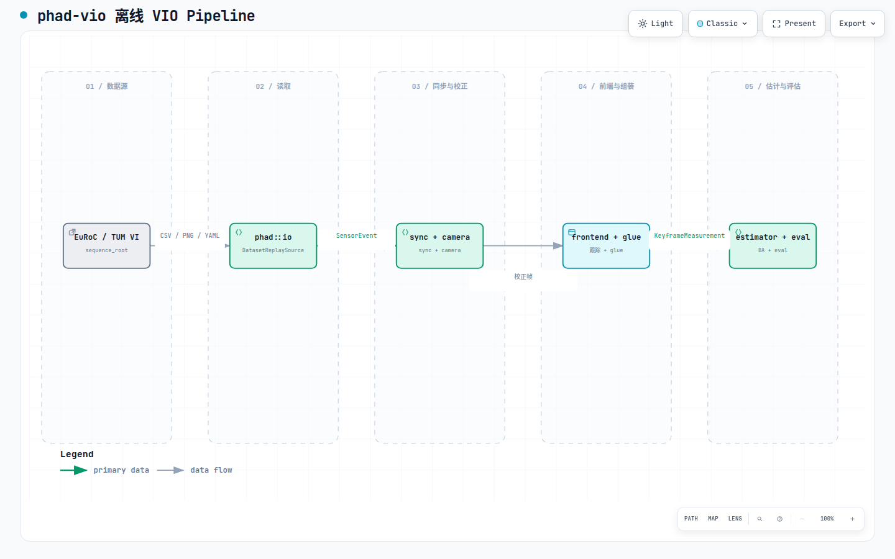
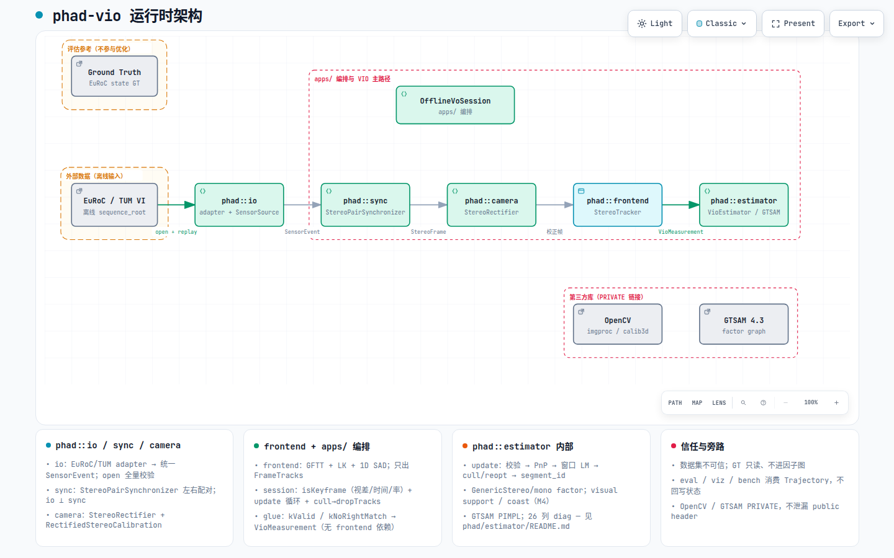

# learn —— 这一环怎么走通

本文档描述当前约定，不是绝对约束，会随项目开发修订。

本目录是**教学叙事**：按 pipeline 环节解释「这一环解决什么问题、代码在哪里、当时怎么长出来」。
模块边界、类型与验收合同仍以 [`../design/`](../design/)、[`../specs/`](../specs/) 与各
`phad/*/README.md` 为准；这里只引用，不复制权威正文。

历史过程笔记仍在 [`../research/`](../research/)、[`../plans/`](../plans/)（只追加 / 原位修订）。
learn 用链接串阅读路径，不搬迁历史正文。

文档地图见 [`../README.md`](../README.md)。

## Pipeline 总览

[](diagrams/pipeline.html)

交互版（浏览器打开）：[`diagrams/pipeline.html`](diagrams/pipeline.html)

总览 dataflow 按**教学顺序**合并列（sync+camera、frontend+glue 等），适合串章节阅读。
IMU 侧支（M4）在 card 区说明，详见 [`06-imu-vio.md`](06-imu-vio.md)。

## 运行时架构

[](diagrams/runtime-architecture.html)

交互版：[`diagrams/runtime-architecture.html`](diagrams/runtime-architecture.html)

源码：[`diagrams/runtime-architecture.architecture.json`](diagrams/runtime-architecture.architecture.json)

该图按**现行离线实现**展开 10 个核心组件：一条主数据路径（EuRoC → io → sync → camera → frontend → estimator）、
`OfflineVoSession` 编排、`OpenCV` / `GTSAM` 外部依赖，以及四层信任边界。
**各模块内部阶段**（如 `isKeyframe`、glue 过滤、`VioEstimator::update` 子步骤）写在 cards，不额外加边。
权威合同见各 `phad/*/README.md` 与 [`../design/architecture.md`](../design/architecture.md)。

## 章节目录

| 章 | 主题 | 状态 |
|---|---|---|
| [01-dataset-io.md](01-dataset-io.md) | 数据读取 | 正文 + 模块分解 |
| [02-synchronization.md](02-synchronization.md) | 左右配对与 IMU 切段 | 正文 + 模块分解 |
| [03-rectification.md](03-rectification.md) | 标定与立体校正 | 正文 + 模块分解 |
| [04-feature-tracking.md](04-feature-tracking.md) | 特征提取与跟踪 | 正文 + 模块分解 |
| [05-tracks-to-odom.md](05-tracks-to-odom.md) | 从特征到 odom | 正文 + 模块分解（范例） |
| [06-imu-vio.md](06-imu-vio.md) | IMU 与 full-state VIO | 正文 + 模块分解 |
| [07-eval-viz.md](07-eval-viz.md) | 评估与可视化 | 正文 + 模块分解 |

章节按 [`apps/offline_vo_session.hpp`](../../apps/offline_vo_session.hpp) 的数据流排序，
不按 milestone 时间线排序。

## 单章模板

每章固定五节：动机 → pipeline 位置（含 Archify 图）→ **模块内部分解** → 代码走读 → 开发过程 → 动手验证。

「模块内部分解」不复制 `phad/*/README.md` / spec 全文，而是按**现行代码**列出子组件、
内部阶段与权威文档链接。第 05 章（estimator + session + glue）为范例。

## 与权威文档的分工

| 问题 | 目录 |
|---|---|
| 这一环怎么走通（教学） | `docs/learn/` |
| 系统是什么 | [`../design/`](../design/) |
| 这一片必须交付什么 | [`../specs/`](../specs/) |
| 查到了什么 / 切片笔记 | [`../research/`](../research/) |
| 怎么执行 | [`../plans/`](../plans/) |

## 图稿维护（Archify）

交互图源文件在 [`diagrams/`](diagrams/)（`.dataflow.json` / `.architecture.json` → `.html`）。重新生成：

```bash
# 课程总览 dataflow
node ~/.claude/skills/archify/bin/archify.mjs deliver dataflow \
  docs/learn/diagrams/pipeline.dataflow.json docs/learn/diagrams/pipeline.html \
  --quality showcase

# 运行时架构（showcase）
node ~/.claude/skills/archify/bin/archify.mjs deliver architecture \
  docs/learn/diagrams/runtime-architecture.architecture.json \
  docs/learn/diagrams/runtime-architecture.html \
  --quality showcase

# 单章 dataflow（将 NN 换成 01-dataset-io、02-synchronization 等）
node ~/.claude/skills/archify/bin/archify.mjs deliver dataflow \
  docs/learn/diagrams/NN.dataflow.json docs/learn/diagrams/NN.html \
  --quality showcase
```

改 JSON 后先 `validate … --quality showcase --json`，通过再 `deliver`；交付后可选
`visual-check <output.html> --json` 检查 1440×900 等视口 containment。
