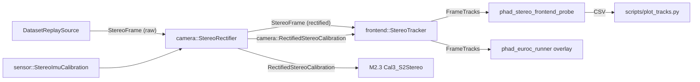

# M2.2 双目前端

对应里程碑：[实现里程碑与验收标准](../roadmap.md) 的 M2.2 双目前端。模块边界依据
[目标架构与模块职责](../architecture.md) 第 3.3 节。

## 切片划分

每片是一个可独立提交的 vertical slice，commit subject 带 issue 号。

- **Slice ① 立体校正**：`phad::camera` 新增校正后标定与 rectifier。可观察行为是校正后左右图行对齐。
- **Slice ② 左目时序跟踪**：新增 `phad::frontend`，GFTT + mask 补点、左目 LK、`LandmarkId` 与 track 表。可观察行为是 track 数不归零。
- **Slice ③ 双目匹配**：右目每帧从当前左目重匹配，四档状态与几何门限，帧级统计。可观察行为是 epipolar error 分布与剔除率。
- **Slice ④ 探针与文档**：probe CSV、绘图脚本、runner 叠加、README 与 roadmap。

## 已对齐的决策

| 决策点 | 结论 |
|---|---|
| 校正策略 | 前置整幅图像校正，`cv::stereoRectify` + `initUndistortRectifyMap` + `remap`，`alpha=0` 使校正图内像素全部有效（代价是丢边缘视野） |
| 畸变模型范围 | 只支持 EuRoC 的 radtan；TUM VI 的 equidistant 留到 M5 需要无静止段序列时再加 |
| 输出合同 | 只产出 track 与指标。不定义 `KeyframeMeasurement`、不做关键帧判断、不产出位姿 |
| track 存储 | frontend 内部持久 track 表，`LandmarkId` 单调递增、丢失即删、永不复用；历史观测不在 frontend 内无限累积 |
| 跟踪拓扑 | 仅左目做时序 LK，右目每帧从当前左目重新 LK 匹配 |
| 不做左右各自时序跟踪的理由 | 极线残差在构造上检测不到沿极线的漂移，而那正是视差误差即深度误差 |
| 几何门限 | 反向 LK 常开（往返 0.5 px）、行差 `\|y_L - y_R\|`、视差恒正、深度落在 `[min_depth, max_depth]`；三项剔除率就是出口要求的可读指标 |
| 无双目匹配的语义 | 保留 track，四档状态枚举记录本帧原因（有效 / 右目匹配失败 / 视差非法 / 深度超范围） |
| 检测与均匀化 | `goodFeaturesToTrack` 全图一次调用，按 track 长度降序涂 mask 使长寿 track 在冲突中胜出，低于目标数才补点；测出结块再考虑网格分桶 |
| 指标载体 | 新增无窗口 `phad_stereo_frontend_probe` 输出 CSV，配 `scripts/` 离线绘图；不接入 spdlog（留到 M2.3 接 GTSAM 时一起） |
| OpenCV 边界 | public header 只用 Eigen 与 POD，OpenCV 全部 PRIVATE 藏进 `.cpp`，用 PIMPL 持有 `cv::Mat`；不复制 `phad_viz` 把 `opencv_core` 设为 PUBLIC 的做法，避免传染到 M2.3 estimator |

## 数据流



## 步骤 1：校正后标定（Slice ①）

新增 `phad/camera/rectified_stereo_calibration.hpp/.cpp`。左右共享 `fx/fy/cx/cy`、零畸变、加 baseline，外参为 `T_B_left_rectified`：

```cpp
class RectifiedStereoCalibration
{
public:
  [[nodiscard]] static CalibrationResult<RectifiedStereoCalibration> create(
      double fx_pixels, double fy_pixels, double cx_pixels, double cy_pixels,
      double baseline_m, int image_width, int image_height,
      sensor::RigidTransform T_B_left_rectified );
  // accessors: fxPixels() ... baselineM(), imageWidth(), imageHeight(),
  //            T_B_left_rectified()
};
```

它是 M2.3 `Cal3_S2Stereo` 的直接输入，所以放 `phad::camera` 而不是 `phad::frontend`，否则 estimator 会为了拿标定而依赖 frontend。

单测 `tests/camera/rectified_stereo_calibration_test.cpp`（进 `phad_camera_tests`）：纯几何、不需要图像。对一组已知相机系 3D 点，左右投影必须满足 `y_L == y_R`（数值容差内）且 `disparity == fx * baseline / z`；`baseline_m <= 0`、非有限内参、非正图像尺寸走 `CalibrationError`。

## 步骤 2：Rectifier（Slice ①）

新增 `phad/camera/stereo_rectifier.hpp/.cpp`。public header 不出现 OpenCV，remap 表用 PIMPL 藏起来：

```cpp
class StereoRectifier
{
public:
  [[nodiscard]] static CameraModelResult<StereoRectifier> create(
      const sensor::StereoImuCalibration& calibration );
  ~StereoRectifier();
  StereoRectifier( StereoRectifier&& ) noexcept;

  [[nodiscard]] const RectifiedStereoCalibration& calibration() const noexcept;
  [[nodiscard]] CameraModelResult<sensor::StereoFrame> rectify(
      const sensor::StereoFrame& raw_frame ) const;

private:
  struct Impl;
  std::unique_ptr<Impl> m_impl;
};
```

`create` 里从左右 `PinholeRadialTangentialParameters` 与 `T_B_left/right_camera` 推出 `T_left_right`，调 `cv::stereoRectify(..., cv::CALIB_ZERO_DISPARITY, 0.0)`，再 `initUndistortRectifyMap` 建两对 `CV_16SC2` 表。equidistant 参数走 `kOutsideModelDomain` 显式报错，不静默当 radtan 处理。

进出都是 `sensor::StereoFrame`，因此每帧有 `Image` → `cv::Mat` → `remap` → `Image` 的拷贝。752×480 灰度在 20 Hz 下可忽略，按「无 profiling 证据不优化」保留，若 probe 实测成为瓶颈再谈零拷贝视图。

CMake：`find_package(OpenCV 4 ... COMPONENTS core highgui imgcodecs imgproc calib3d video)`，`phad_camera` 加 `PRIVATE opencv_core opencv_imgproc opencv_calib3d`。

单测 `tests/camera/stereo_rectifier_test.cpp`：零畸变 + 单位相对旋转 + 纯 x 平移的输入下，校正是恒等映射 —— 输出图像逐像素等于输入，且 `calibration()` 复现输入内参、`baseline_m == |t_x|`。这一条同时钉住 `alpha=0` 下的内参约定与 remap 路径的正确性。

## 步骤 3：track 类型与左目时序跟踪（Slice ②）

新增 `phad_frontend` 库（`phad/frontend/`），PUBLIC 依赖 `phad::camera`，PRIVATE 依赖 `opencv_core opencv_imgproc opencv_video`。

`phad/frontend/stereo_tracks.hpp`（header-only 值类型）：

```cpp
using LandmarkId = std::uint64_t;

enum class StereoStatus : std::uint8_t
{
  kValid = 0,
  kNoRightMatch,
  kInvalidDisparity,
  kDepthOutOfRange
};

struct TrackObservation
{
  LandmarkId      id;
  Eigen::Vector2d left_pixel;
  double          disparity_px;   // 仅 kValid 有意义
  StereoStatus    status;
  std::uint32_t   length;         // 已观测帧数，含本帧
};

struct FrameStats { /* 见步骤 5 */ };

struct FrameTracks
{
  common::Timestamp             timestamp;
  std::vector<TrackObservation> observations;
  FrameStats                    stats;
};
```

`phad/frontend/stereo_tracker.hpp/.cpp`，同样 PIMPL 藏 `cv::Mat` 上一帧与 `std::vector<cv::Point2f>`：

```cpp
struct StereoTrackerOptions
{
  int    max_tracks           = 200;
  double quality_level        = 0.01;
  double min_distance_px      = 20.0;
  int    mask_radius_px       = 20;
  int    lk_window_px         = 21;
  int    lk_pyramid_levels    = 3;
  double forward_backward_px  = 0.5;
  double max_epipolar_px      = 1.5;   // 步骤 4
  double min_disparity_px     = 0.5;   // 步骤 4
  double min_depth_m          = 0.3;   // 步骤 4
  double max_depth_m          = 40.0;  // 步骤 4
};

class StereoTracker
{
public:
  StereoTracker( RectifiedStereoCalibration calibration,
                 StereoTrackerOptions options );
  [[nodiscard]] FrameTracks process( const sensor::StereoFrame& rectified );
};
```

本片只做左目：LK 初值取上一帧位置（M2.2 无 IMU 也无位姿，不做预测），反向 LK 往返 > `forward_backward_px` 即判失败并删除 track；按 `length` 降序涂 mask 后 `goodFeaturesToTrack` 补到 `max_tracks`；新点分配单调递增 id。本片 `status` 恒为 `kNoRightMatch`、`disparity_px` 恒为 0，步骤 4 填实。

测试 fixture `tests/frontend/synthetic_stereo.hpp`（`phad::testing`，对齐 `tests/common/synthetic_trajectory.hpp` 的做法）：把已知 3D 点经 `RectifiedStereoCalibration` 投影，在 `sensor::Image` 的 `std::vector<uint8_t>` 上画亚像素高斯斑，用于合成可控的图像对与相机运动。不引入 OpenCV 到测试。

`tests/frontend/stereo_tracker_test.cpp` 断言：纯平移下 track 存活 K 帧且 `length == K`、id 稳定；斑点移出视野后 id 不被新点复用（新 id 严格大于历史最大值）；斑点大量离场后补点使总数回到 `max_tracks` 附近。

## 步骤 4：双目匹配与四档状态（Slice ③）

`process` 内在左目更新之后，对每个存活 track 用 `calcOpticalFlowPyrLK` 从当前左目匹配到当前右目，初值为「左目当前位置减去该 track 上一帧视差」，首次匹配用零视差。依次判：LK 失败或反向不一致 → `kNoRightMatch`；`|y_L - y_R| > max_epipolar_px` 或 `disparity <= min_disparity_px` → `kInvalidDisparity`；`z = fx * baseline / disparity` 落在 `[min_depth_m, max_depth_m]` 之外 → `kDepthOutOfRange`；否则 `kValid`。四档都保留 track，只有 `kValid` 才带有效 `disparity_px`。

`tests/frontend/stereo_tracker_test.cpp` 补：合成对上 `kValid` 的 `disparity_px` 与 `fx * baseline / z` 一致（亚像素容差）；只从右图移除某斑点 → 该 track 转 `kNoRightMatch` 且仍在表中；把斑点放到 `max_depth_m` 之外 → `kDepthOutOfRange`；人为在右图施加纵向偏移 → `kInvalidDisparity`。

## 步骤 5：帧级统计（Slice ③）

`FrameStats` 承载出口要求的可读指标：

```cpp
struct FrameStats
{
  std::uint32_t tracked;              // 时序 LK 存活
  std::uint32_t detected;             // 本帧补点
  std::uint32_t forward_backward_rejected;
  std::uint32_t epipolar_rejected;
  std::uint32_t disparity_rejected;
  std::uint32_t depth_rejected;
  double        epipolar_median_px;   // 仅统计 LK 成功的右目匹配
  double        epipolar_p95_px;
  std::uint32_t track_length_median;
  std::uint32_t track_length_max;
};
```

track 长度分布不靠帧级中位数还原，probe 另写一份 track 生命表（见步骤 6）。

## 步骤 6：probe 与绘图（Slice ④）

新增 `apps/phad_stereo_frontend_probe.cpp`，不开窗口，跑完整序列：

```text
phad_stereo_frontend_probe <sequence-root> --frames-csv <path> [--tracks-csv <path>]
```

`--frames-csv` 每帧一行，列为 `timestamp_ns,tracked,detected,valid,no_right_match,invalid_disparity,depth_out_of_range,fb_rejected,epipolar_median_px,epipolar_p95_px`。`--tracks-csv` 在 track 死亡时追加 `id,first_timestamp_ns,last_timestamp_ns,length`，给出精确的长度分布。结尾向 stdout 打 summary：帧数、track 数最小值（出口要求不为零）、各类剔除率、epipolar error 的中位数与 p95。

`scripts/plot_tracks.py` 消费两份 CSV，画 track 数随时间、track 长度直方图、epipolar error 直方图。依赖沿用 `scripts/requirements.txt` 的 venv，不进 CMake 也不进 CI。

## 步骤 7：runner 叠加（Slice ④）

`apps/phad_euroc_runner.cpp` 里删掉临时的 `detectCorners`/`drawCorners`（roadmap 已把它标为 M2.2 的前身探针），改成回放校正后图像并叠加真实 track：`kValid` 与非 `kValid` 用不同颜色画左目点，右目侧画匹配点，画左右连线，并叠 `FrameStats` 文本。

叠加逻辑先留在 app 内，不进 `phad::viz` —— 只有一个消费者，且指标从 probe CSV 读而不从画面读。出现第二个消费者再抽到 `phad::viz`。GUI 端到端需人工确认，agent 不擅自弹窗。

## 步骤 8：全序列门控测试（Slice ④）

`tests/frontend/euroc_mh01_frontend_test.cpp`，`PHAD_ENABLE_MH01_TESTS=ON` 下建 `phad_frontend_mh01_test`，标签 `mh01`。跑 `MH_01_easy` 全序列，断言 track 数每帧非零、`kValid` 观测的 median epipolar error 低于阈值、`LandmarkId` 全程无复用。这是出口条件的机器化形式。

## 步骤 9：文档

- 新增 `phad/frontend/README.md`，按 `phad/eval/README.md` 的模板（顶部写「本文档描述当前约定，不是绝对约束，会随项目开发修订。」，含职责边界、文件布局、数据流、CSV 格式合同）。
- 改 `phad/camera/README.md`：职责边界表里「立体校正、undistort 整图管线（未实现则不算本库职责）」从「不做」移到「做」，并补 rectifier 与校正后标定的说明。这是本次唯一一处改动已记录的模块边界。
- 改 `docs/roadmap.md` 的 M2.2 段：标注完成并链接本计划，同时删掉 M1 段末尾关于 runner GFTT 探针的那句（步骤 7 已移除它）。

## 手工验证

以下不进 CI，需要本地 EuRoC 序列（`/home/lin/Projects/data/thidparty/euroc/native/<sequence>`）：

```bash
# 全序列指标，无窗口
./build/phad_stereo_frontend_probe \
  /home/lin/Projects/data/thidparty/euroc/native/MH_01_easy \
  --frames-csv /tmp/mh01_frames.csv --tracks-csv /tmp/mh01_tracks.csv

# 离线绘图，需 scripts/ 的 venv
python scripts/plot_tracks.py --frames-csv /tmp/mh01_frames.csv \
  --tracks-csv /tmp/mh01_tracks.csv

# GUI 回放与 track 叠加，需人工确认
./build/phad_euroc_runner /home/lin/Projects/data/thidparty/euroc/native/MH_01_easy
```

门控测试：

```bash
cmake -S . -B build -DCMAKE_EXPORT_COMPILE_COMMANDS=ON \
  -DPHAD_ENABLE_MH01_TESTS=ON \
  -DPHAD_EUROC_MH01_PATH=/home/lin/Projects/data/thidparty/euroc/native/MH_01_easy
cmake --build build
ctest --test-dir build --output-on-failure -L mh01
```

## 流程

按 `docs/agents/issue-tracker.md`，先 `env -u GITHUB_TOKEN gh issue create` 开 M2.2 issue（`GITHUB_TOKEN` 的 PAT 没有 Issues 写权限）。在主 checkout 上开短生命周期分支 `m2.2-stereo-frontend`，每个切片一个 commit、subject 带 issue 号，完成后本地 merge 回 `main` 并删分支，不 push 到 remote。改 CMake 后重跑 `cmake -S . -B build -DCMAKE_EXPORT_COMPILE_COMMANDS=ON` 以刷新 clangd 的 compilation database。

## 不在本次范围

`KeyframeMeasurement` 与 `StereoObservation` 的定义、关键帧判断、位姿输出、TUM VI 的 equidistant 校正、网格分桶检测、IMU rotation prediction、spdlog 接入。
