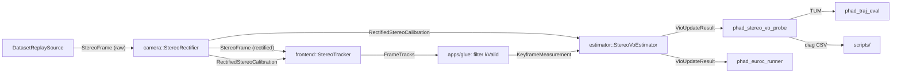

# M2.3 VO 后端

对应里程碑：[实现里程碑与验收标准](../roadmap.md) 的 M2.3 VO 后端。模块边界依据
[目标架构与模块职责](../architecture.md) 第 3.4 节与第 4 节。设计与取舍见
[M2.3 VO 后端设计](../research/m2.3-vo-backend-design.md)，开源对照见
[M2.3 VO backend open source references](../research/m2.3-vo-backend-open-source-refs.md)。
Issue：[#20](https://github.com/Nothand0212/phad-vio/issues/20)。

## 切片划分

每片是一个可独立提交的 vertical slice，commit subject 带 `(#20)`。

- **Slice ⓪ GTSAM 接入**：`find_package` + `phad_estimator` 空壳 + 冒烟测试。可观察行为是链接得上、`gtsam::Pose3` 能构造、Eigen 类型往返正确。单列成片是因为它是本里程碑时间风险最大的一步，卡住时不应该已经写了一堆业务代码。
- **Slice ① 合同类型**：`LandmarkId` 上移到 `phad::common`，`phad::estimator` 的值类型落地。可观察行为是 glue 能编译出 `KeyframeMeasurement`。
- **Slice ② 估计器核心**：标定映射、landmark 初值、窗口图重建与 LM。可观察行为是合成数据上扰动初值能被拉回、重投影 RMS 下降。
- **Slice ③ 诊断与失败路径**：状态机、连通性、cheirality、诊断字段。可观察行为是退化输入产生显式状态而不是静默的假成功。
- **Slice ④ 探针与基线**：probe、runner 接入、`MH_01_easy` 基线数字与文档。可观察行为是第一条估计轨迹与第一个 ATE。

## 已对齐的决策

| 决策点 | 结论 |
|---|---|
| 关键帧 | 每帧都进 estimator，不做关键帧判断 |
| Seam | apps/glue 把 `FrameTracks`（仅 `kValid`）组装成 `KeyframeMeasurement`；`phad::estimator` 不依赖 `phad::frontend`，避免库环依赖 |
| `LandmarkId` | 上移到 `phad::common`，两侧 alias 同一类型；此前两个 namespace 各定义一个 `uint64_t` 别名，写反了静默编译通过 |
| 外参 | `body_P_sensor = RectifiedStereoCalibration::T_B_left_rectified()`，与 `Cal3_S2Stereo` 同源；构造函数不单独收外参 |
| Gauge | 单一强 `PriorFactor<Pose3>` 钉当前窗口最老帧，滑窗时迁移（均值取该帧当前估计） |
| Gauge 因子类型 | `PriorFactor` 而非 `NonlinearEquality`，后者按 GTSAM 官方示例注释会强制 QR |
| 窗口 | 固定长度默认 10，滑出的 pose 与 landmark 直接丢弃，不做边缘化 |
| Landmark 初值 | 首次 `kValid` 观测用 `StereoCamera::backproject`；roadmap 字面写的 `triangulatePoint3` 需要 ≥2 个位姿，单帧立体用 backproject 是等价闭式路径 |
| Landmark 入图门限 | 窗口内 ≥2 次观测才建 factor；单次观测的点 3 个测量对 3 个未知量、精确可解、对位姿零信息 |
| 图维护 | 每步重建窗口图与 Values 再 LM；候选帧先入临时窗口，LM 成功才提交，因此失败天然不毒化后续帧 |
| 位姿初值 | 恒速外推 `T_prev · (T_prevprev⁻¹ · T_prev)`；不是 PnP，PnP 属 M3 |
| 视觉噪声 | 各向同性 1 px on `(uL, uR, v)`，外包 `noiseModel::Robust` + `mEstimator::Huber(k = 3.0)` |
| Prior sigma | 旋转 `1e-4` rad、平移 `1e-4` m |
| 输出语义 | 每步只写最新帧位姿；窗口内旧帧被重新优化但已导出的轨迹点不回改 |
| GTSAM 接入 | `find_package(GTSAM 4.3 REQUIRED)`，本机 `/usr/local` 已装 4.3.0 |
| 指标载体 | 新增无窗口 `phad_stereo_vo_probe`；spdlog 仍不接入，留到有多线程日志需求时 |

## 数据流



## 步骤 1：GTSAM 接入（Slice ⓪）

根 `CMakeLists.txt` 加 `find_package(GTSAM 4.3 REQUIRED)`，建 `phad_estimator`
（alias `phad::estimator`），PUBLIC 依赖 `phad::common phad::camera`，PRIVATE 链接
GTSAM。仓库只有单一根 `CMakeLists.txt`，没有 per-module 的，按现有 target 的写法
直接加。

三个已知的坑，冒烟测试要一次性排掉：

- 仓库对自己的 target 开了 `-Wall -Wextra -Wpedantic -Wconversion -Wsign-conversion`，
  GTSAM 头文件会刷屏。PIMPL 已把 GTSAM 挡在公开头文件外，因此 PRIVATE 链接，必要时
  把它的 include 目录标成 SYSTEM。
- GTSAM 的 Eigen 必须和 `Eigen3::Eigen` 3.4 是同一份。`GTSAMConfig.cmake` 里是
  `find_dependency(Eigen3 REQUIRED)`，正常一致，但若 GTSAM 曾用自带 Eigen 构建就是
  ODR 隐患，冒烟测试要覆盖一次 Eigen 类型往返。
- 若该 GTSAM 带 `-march=native` 构建，跨机器分发有对齐/ABI 问题；本里程碑只在本机跑，
  记录一笔即可。

`tests/estimator/gtsam_smoke_test.cpp`：构造 `gtsam::Pose3`，与 `Eigen::Isometry3d`
互转一次并断言矩阵相等。这条测试跑通之前不写业务代码。

`README.md` 补 GTSAM 安装步骤——`thirdparty/` 被 gitignore，不能默认别人机器上有。

## 步骤 2：`LandmarkId` 上移（Slice ①）

新增 `phad/common/landmark_id.hpp`：

```cpp
namespace phad::common
{
  using LandmarkId = std::uint64_t;
}
```

`phad/frontend/stereo_tracks.hpp` 里的定义改为 `using LandmarkId = common::LandmarkId;`。
`phad_frontend` 已经 PUBLIC 依赖 `phad::camera`，后者 PUBLIC 依赖 `phad::sensor`，
需要另加 `phad::common`。改完重跑 `phad_frontend_tests` 确认无回归。

## 步骤 3：合同类型（Slice ①）

`phad/estimator/types.hpp`，public header 只用 Eigen、STL 与 `phad::common`：

```cpp
namespace phad::estimator
{

  using common::LandmarkId;

  struct StereoObservation
  {
    LandmarkId      id;
    Eigen::Vector2d left_pixel;    // rectified left
    double          disparity_px;  // must be > 0
  };

  struct KeyframeMeasurement
  {
    common::Timestamp              timestamp;
    std::vector<StereoObservation> observations;
  };

  struct EstimatorOptions
  {
    int    window_size                = 10;
    int    min_landmark_observations  = 2;
    int    min_shared_landmarks       = 10;
    double stereo_sigma_px            = 1.0;
    double huber_k_px                 = 3.0;
    double prior_rotation_sigma_rad   = 1e-4;
    double prior_translation_sigma_m  = 1e-4;
    bool   use_constant_velocity_init = true;
  };

}  // namespace phad::estimator
```

`VioEstimate` / `UpdateDiagnostics` / `VioUpdateResult` / `UpdateStatus` 见设计文档
§3.2。结果类型沿用 architecture.md 的目标命名，M4 加 `V`/`B` 时字段扩展、名字不变；
类名 `StereoVoEstimator` 标注 M2 的纯视觉现状，不以抽象基类预留。

## 步骤 4：标定映射与 `StereoPoint2` 换算（Slice ②）

从 `RectifiedStereoCalibration` 构造 `Cal3_S2Stereo(fx, fy, s = 0, cx, cy, baseline)`，
`body_P_sensor` 取同一对象的 `T_B_left_rectified()`。

GTSAM 的 `StereoCamera::project` 给出 `uL − uR = fx·b / Z`，与前端 `disparity =
left.x - right.x` 一致，因此：

```text
StereoPoint2( uL = left_pixel.x(),
              uR = left_pixel.x() - disparity_px,
              v  = left_pixel.y() )
```

右目行坐标校正后与左目对齐，前端已用 `max_epipolar_px` 门限过，只传左目的 `v`。
这是整个 slice 里符号错误最容易藏身的一行，单测断言已知深度的世界点
`project` → `backproject` 回到原点，且 `uL − uR == fx * baseline / z`。

## 步骤 5：估计器核心（Slice ②）

`phad/estimator/stereo_vo_estimator.hpp/.cpp`，PIMPL 藏 `NonlinearFactorGraph`、
`Values` 与窗口状态。构造函数只收 `RectifiedStereoCalibration` 与 `EstimatorOptions`。

`update` 的步骤：

1. 校验输入：时间戳严格递增、观测非空、视差 > 0、像素有限。
2. 首帧：`T_W_B = I`；每个观测 `backproject` 得左相机系点，经
   `T_W_B · T_B_left_rectified` 到世界系。
3. 后续帧：恒速外推位姿初值；未见过的 id `backproject`，已见 id 沿用当前估计；
   统计 `num_shared`。
4. 候选入窗（临时）；超出 `window_size` 时弹最老帧，删掉窗口内已无观测的 landmark。
   被删的 id 日后重新被跟踪时按「未见过」重新 `backproject`。
5. 重建图：symbols `x(k)` / `l(j)`；只有窗口内观测数 ≥ `min_landmark_observations`
   的 landmark 入图；每个入图观测建 `GenericStereoFactor<Pose3, Point3>`。
6. `LevenbergMarquardtOptimizer`。
7. 仅当 LM 正常结束才写回窗口 pose 与 landmark；抛
   `IndeterminantLinearSystemException` 等异常时丢弃候选帧，内部状态保持调用前的
   样子。每步重建图让这一步天然是事务性的。

单测：合成轨迹与 landmark，扰动初值后 pose 与 landmark 误差下降；
`reproj_rms_after_px < reproj_rms_before_px`。

## 步骤 6：Gauge 与窗口（Slice ②）

窗口最老帧加 `PriorFactor<Pose3>`，均值取该帧当前估计，sigma 为
`prior_rotation_sigma_rad` / `prior_translation_sigma_m`。滑窗时 prior 迁移到新的
最老帧。单一 Pose3 prior 固定 6 DOF，双目立体给出尺度，gauge 完整。

单测：prior 始终挂在窗口最老帧的 key 上；滑出的帧不在 `Values` 里；窗口内只被观测
一次的 id 不出现在图里。

## 步骤 7：噪声与位姿初值（Slice ②）

噪声模型 `noiseModel::Robust::Create(mEstimator::Huber::Create(huber_k_px),
noiseModel::Isotropic::Sigma(3, stereo_sigma_px))`。sigma 为 1 px 时白化残差就是像素
残差，`k = 3.0` 即超过 3 px 开始降权。

上 Huber 的理由记在设计文档 §1：它是噪声模型的参数而非外点剔除算法，前端目前只有
前后向一致性与极线/视差/深度门限，缺运动模型层面的剔除，单个漂移的 LK 点在 1 px
sigma 下足以掰弯整个窗口。M3 的 RANSAC 相对该配置测收益。

恒速外推同理：只用上两个已接受帧的相对位姿，不解 PnP、不碰 OpenCV，因此不越 M3 的
界；MH_01 在 20 Hz 下 body 速度可达 1–2 m/s，零运动初值配合无 robust kernel 是最典型
的发散组合。只有一个已接受帧时退化为 `T_prev`。

单测：注入一个大幅偏移的观测，断言它对最终位姿的影响显著小于纯高斯噪声模型下的影响。

## 步骤 8：诊断与失败路径（Slice ③）

`kRejected` 与 `kFailed` 走同一条恢复路径：该帧不进窗口，窗口/landmark 表/最近两个
已接受位姿全部保持调用前的样子；下一帧的恒速外推使用最近两个**已接受**帧；不写轨迹
点；probe CSV 照常写一行并用 `status` 列区分；估计器没有「已损坏」终态。

连通性退化（设计文档 §4.5）：`num_shared` 永远进诊断；`0 < num_shared <
min_shared_landmarks` 仍然优化但置 `low_connectivity`；`num_shared == 0` 直接
`kRejected`——此时新帧位姿完全自由，因为它自己的新 landmark 恰好被自己的观测唯一
确定，LM 会把它留在初值上并报告一个很小的 error，即一次静默的假成功。

Cheirality：factor 默认不 throw；计数 `num_cheirality`；优化后丢弃仍在相机后方的
landmark，下一步重建图时它自然不再入图。

单测：零共视帧 → `kRejected` 且窗口状态不变；一次 `kRejected` 之后下一帧的恒速外推
跳过被拒帧，结果与该帧从未出现过时一致；behind-camera 的 `num_cheirality` 计数正确
且序列不中止；按 `LandmarkId` 能汇总完整观测时间戳。

## 步骤 9：外参回归测试（Slice ③）

这一步单列，因为取错外参不会让任何测试变红。观测是校正后的像素，`Cal3_S2Stereo` 也
来自 `RectifiedStereoCalibration`，所以 `body_P_sensor` 对应的 sensor 系是**校正后**的
左目，它与 `StereoImuCalibration::T_B_left_camera()` 差一个 `stereoRectify` 的 `R1`。
取错相当于给每个 pose 右乘一个常量误差；右乘的常量吸收不进 Umeyama 对齐，会表现为
正比于角速度的杆臂误差。EuRoC 的 `R1` 约零点几度，米级出口照样通过，因此它会安静地
成为 M2.3 基线的一部分，直到 M3 追厘米时才发作。

两个测试：

- 构造 `R1 ≠ I`、`t_B_left ≠ 0` 的合成标定，生成一段带旋转的运动，断言恢复出的是
  `T_W_B` 而不是 `T_W_leftcam`。
- 用外参 A 生成观测、构造时喂外参 B，断言优化后 `reproj_rms_after_px` 仍高于阈值且
  位姿误差显著。注意错误外参**不会**返回 `kFailed`——它不违反任何合同，只产出貌似
  合理但错的轨迹，所以判据是残差信号而不是状态码。

## 步骤 10：probe 与 runner（Slice ④）

新增 `apps/phad_stereo_vo_probe.cpp`，不开窗口，跑完整序列：

```text
phad_stereo_vo_probe <sequence-root> --tum <path> [--diag-csv <path>]
```

`--diag-csv` 每帧一行，列为 `timestamp_ns, status, num_obs, num_landmarks,
num_shared, low_connectivity, window_size, prior_key, reproj_rms_before_px,
reproj_rms_after_px, num_cheirality, lm_iterations, max_window_pose_shift_m`。
结尾向 stdout 打 summary：帧数、各状态计数与拒帧比例、`low_connectivity` 帧数、
重投影 RMS 的中位数与 p95。

`apps/phad_euroc_runner.cpp` 接入 estimator，把估计轨迹叠加到 `TrajectoryPanel` 已有的
真值上。GUI 端到端需人工确认，agent 不擅自弹窗。

## 步骤 11：MH_01 基线（Slice ④）

在 `MH_01_easy` 上跑 probe 与 `phad_traj_eval`，把结果记进 roadmap 的 M2.3 段。

**基线不是一个 ATE 数字**：必须同时记录拒帧比例、`low_connectivity` 帧数与重投影 RMS
分布，否则「ATE 很好」可能只是因为丢掉了难的那些帧，M3 也就无从对比。roadmap 出口里
的「完整轨迹文件」定义为：轨迹覆盖序列的完整时间跨度，写出的位姿数等于 `kOk` 帧数，
且被拒帧数与原因分布被显式报告。

## 步骤 12：文档（Slice ④）

- 新增 `phad/estimator/README.md`，按 `phad/frontend/README.md` 的模板（顶部写
  「本文档描述当前约定，不是绝对约束，会随项目开发修订。」，含职责边界、文件布局、
  数据流、CSV 格式合同）。
- 改 `docs/roadmap.md` 的 M2.3 段：标注完成并填入基线数字（设计与本计划的链接已在）。
- `phad/frontend/README.md` 补一句：M2.3 由 glue 消费 `FrameTracks`，仍不在 frontend
  内定义 `KeyframeMeasurement`。

## 手工验证

以下不进 CI，需要本地 EuRoC 序列（`/home/lin/Projects/data/thidparty/euroc/native/<sequence>`）：

```bash
# 全序列估计，无窗口
./build/phad_stereo_vo_probe \
  /home/lin/Projects/data/thidparty/euroc/native/MH_01_easy \
  --tum /tmp/mh01_vo.tum --diag-csv /tmp/mh01_vo_diag.csv

# 真值导出与 ATE
./build/phad_euroc_gt_export \
  /home/lin/Projects/data/thidparty/euroc/native/MH_01_easy /tmp/mh01_gt.tum
./build/phad_traj_eval /tmp/mh01_gt.tum /tmp/mh01_vo.tum

# 与 evo 交叉验证
evo_ape tum /tmp/mh01_gt.tum /tmp/mh01_vo.tum -a

# GUI 回放与轨迹叠加，需人工确认
./build/phad_euroc_runner /home/lin/Projects/data/thidparty/euroc/native/MH_01_easy
```

单元测试：

```bash
cmake -S . -B build -DCMAKE_EXPORT_COMPILE_COMMANDS=ON
cmake --build build
ctest --test-dir build --output-on-failure -L unit
```

## 流程

Issue [#20](https://github.com/Nothand0212/phad-vio/issues/20) 已建（`ready-for-agent`）。
在主 checkout 上开短生命周期分支 `m2.3-vo-backend`，每个切片一个 commit、subject 带
`(#20)`，完成后本地 merge 回 `main` 并删分支，不 push 到 remote。改 CMake 后重跑
`cmake -S . -B build -DCMAKE_EXPORT_COMPILE_COMMANDS=ON` 以刷新 clangd 的 compilation
database。

## 风险与预案

- **GTSAM 接入卡住**：Slice ⓪ 单独成片就是为此。若 `find_package` 或 Eigen 一致性
  排不掉，退路是 `add_subdirectory(thirdparty/gtsam-4.3a1)`，代价是首次构建很久且
  `thirdparty/` 目前被 gitignore。
- **窗口 10 帧 @ 20 Hz 只跨 0.5 s**，运动基线很短，深度主要来自双目而非运动视差。
  若 ATE 差到不可解释，先调窗口长度再怀疑因子栈。
- **每帧全是关键帧**，每步重建约 10 pose × 数百 landmark 的图并做完整 LM。实时率不是
  M2.3 出口（M7 才要求 ≥1x），但若单帧耗时到秒级会拖慢迭代，届时 `Ordering::METIS`
  是第一个开关。
- **噪声与 Huber 的取值没有一手实测依据**，它们是待标定的起点而非承诺值。

## 不在本次范围

关键帧策略、`findEssentialMat` / `solvePnPRansac` 几何验证与位姿初值、IMU 与
preintegration、`V`/`B` 状态、边缘化与 fixed-lag smoother、smart factor、多线程、
回环、MH_02–05 门控、spdlog 接入。
