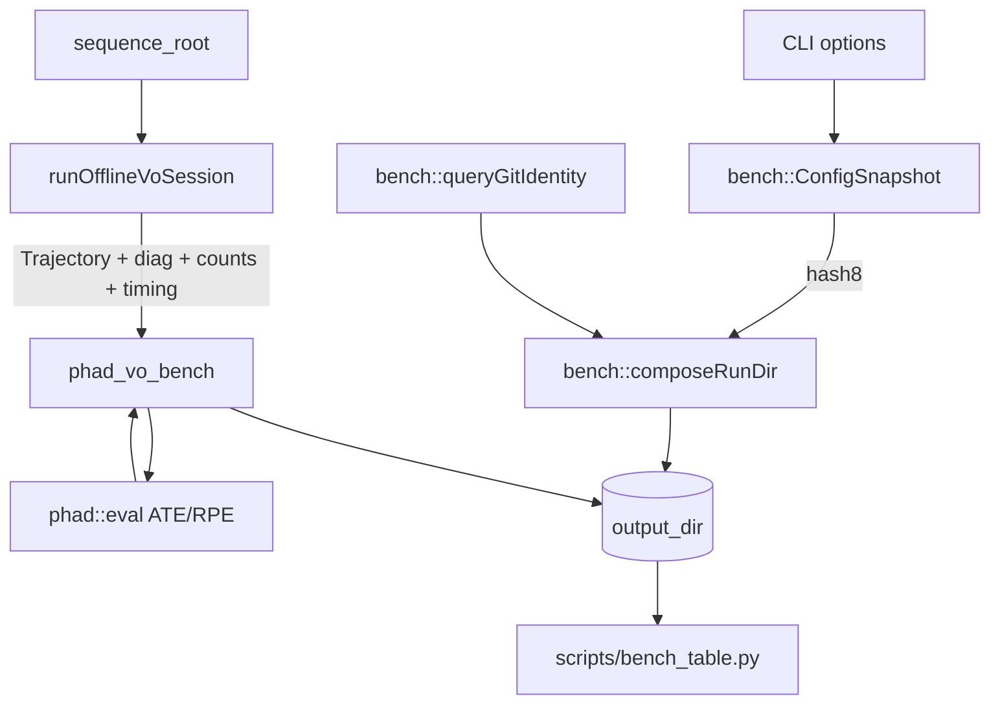

# M3.1 VO 回归 Benchmark

设计稿：[M3.1 VO 回归 Benchmark 设计](../research/m3.1-vo-regression-benchmark-design.md)。
Issue：[#21](https://github.com/Nothand0212/phad-vio/issues/21)。
基线来源：[M2.3 VO 后端](2026-07-31_m2.3_vo_backend_dcdbfc71.plan.md)（MH_01 ATE
translation RMSE 0.150 m，3682/3682 `kOk`）。

## 切片划分

- **Slice ①（本次）**：`phad::bench` 纯逻辑库 + 单测。不碰 pipeline。
- **Slice ②（本次）**：`OfflineVoSession` 抽出 + probe 迁移 + 逐字节对拍。
- **Slice ③（本次）**：`phad_vo_bench` app + MH_01 端到端。
- **Slice ④（本次）**：拼表脚本 + 文档一致性。

四片都在本计划内，但按顺序分别提交（commit subject 带 `(#21)`）。

## 已对齐的决策

| 决策点 | 结论 |
|---|---|
| 交付形态 | 纯逻辑库 `phad::bench` + app `phad_vo_bench`；session 留 `apps/` 但编成静态库 |
| 目标命名 | 库 target `phad_bench`；app 改名 `phad_vo_bench`（避开同名冲突） |
| bench 库依赖 | 零 `phad::*` 依赖；只收 key→scalar，展平在 apps 侧 |
| 结果交付 | `OfflineVoSessionResult` 带 `Trajectory` + 时间跨度；session 不落盘 |
| JSON | `nlohmann_json 3.11`，PRIVATE；public header 只用 `std::string` |
| config_hash | 规范化文本（key 字典序、`%.17g`）过 FNV-1a 64 取前 8 hex |
| 目录段 | `<config_label>_<hash8>`，label 缺省 `default` |
| git 身份 | 运行时调 `git`；dirty 只看 tracked（`git diff --quiet HEAD`） |
| 覆盖策略 | clean 树拒绝覆盖（exit 3），dirty 树覆盖并警告 |
| 完成度 | `completion_rate = ok/image_frames`，并列 `coverage_rate` |
| probe 迁移验收 | `est.tum` / `diag.csv` 逐字节相同 |
| 汇总 | `scripts/bench_table.py`，venv 依赖，不进 CMake/CI |
| v1 范围 | 只 EuRoC、只 MH_01；不迁 GUI runner、不做 CI gate |

## 步骤 1：`phad::bench` 库（Slice ①）

新增文件：

```text
phad/bench/README.md
phad/bench/config_snapshot.hpp/.cpp
phad/bench/code_identity.hpp
phad/bench/code_identity.cpp        # 唯一调用外部进程的 TU
phad/bench/run_paths.hpp/.cpp
phad/bench/run_summary.hpp/.cpp
tests/bench/config_snapshot_test.cpp
tests/bench/run_paths_test.cpp
tests/bench/run_summary_test.cpp
```

CMake：

```cmake
find_package(nlohmann_json 3.11 REQUIRED)

add_library(phad_bench
  phad/bench/code_identity.cpp
  phad/bench/config_snapshot.cpp
  phad/bench/run_paths.cpp
  phad/bench/run_summary.cpp
)
add_library(phad::bench ALIAS phad_bench)
target_compile_features(phad_bench PUBLIC cxx_std_20)
target_include_directories(phad_bench PUBLIC "${CMAKE_CURRENT_SOURCE_DIR}")
target_link_libraries(phad_bench PRIVATE nlohmann_json::nlohmann_json)
target_compile_definitions(phad_bench PRIVATE
  PHAD_SOURCE_DIR="${CMAKE_CURRENT_SOURCE_DIR}"
)
```

`phad_bench` 不链接任何 `phad::*`，也不链接 `phad_eval`（出口清单条目）。
警告集合与其他库一致（`-Wall -Wextra -Wpedantic -Wconversion -Wsign-conversion`）。

### `ConfigSnapshot`

- 内部存有序 `std::map<std::string, Value>`（`Value` = `std::variant<std::string,
  double, std::int64_t, bool>`）；
- `canonicalText()`：每行 `key=value`，key 字典序，double 用 `%.17g`，bool 用
  `true`/`false`；
- `hash8()`：`canonicalText()` 的 FNV-1a 64，`%08x` 取前 8 位 hex；
- `toJson()`：返回 `std::string`（内部用 nlohmann）。

单测：插入顺序无关、同内容同 hash、任一字段改动 hash 必变、浮点格式稳定
（`0.1` 与 `1e-1` 同文本）、空快照有确定 hash。

### `CodeIdentity` 与 `queryGitIdentity`

- `git -C <repo> rev-parse HEAD`、`git -C <repo> rev-parse --short HEAD`、
  `git -C <repo> rev-parse --abbrev-ref HEAD`、`git -C <repo> diff --quiet HEAD`；
- 用 `popen` 读取，非零退出或空输出 → 记 warning，`git_commit = nullopt`，
  `git_commit_short = "unknown"`；
- **dirty 只看 tracked**：`diff --quiet HEAD` 退出码 1 即 dirty；untracked 不计。

单测只覆盖「仓库路径不存在时返回 unknown 并产生 warning」，真实 git 行为在
E2E 里观察（避免单测依赖仓库状态）。

### `composeRunDir` 与覆盖策略

```cpp
[[nodiscard]] std::filesystem::path composeRunDir(
    const std::filesystem::path& bench_root, std::string_view sequence,
    const CodeIdentity& code, std::string_view config_label,
    std::string_view config_hash8 );

enum class OverwriteDecision : std::uint8_t { kWrite, kOverwriteWithWarning, kRefuse };

[[nodiscard]] OverwriteDecision decideOverwrite( const std::filesystem::path& run_dir,
                                                 bool git_dirty, bool force );
```

单测：clean / dirty / unknown commit 三种 commit 段；`summary.json` 存在与否
× dirty × force 的组合矩阵。

### `RunSummary` / `RunMeta`

- 用本地 `StatBlock { rmse, mean, median, stddev, max }`，不引 `eval::ErrorStats`；
- `ate` / `rpe` 为 `std::optional<...>`，缺失时序列化成 `null`；
- `toJson()` 返回 `std::string`；`schema_version = 1`。

单测：字段齐全、`std::nullopt` 序列化为 `null`、`status` 字符串映射。

## 步骤 2：`OfflineVoSession` 抽出（Slice ②）

**先做参考产物**（`session-reference-artifacts`）：当前 commit 上跑

```bash
./build/phad_stereo_vo_probe /home/lin/Projects/data/thidparty/euroc/native/MH_01_easy \
  --tum /tmp/m3.1_ref/est.tum --diag-csv /tmp/m3.1_ref/diag.csv
```

产物放仓库外（`/tmp/m3.1_ref/`），迁移后 `diff` 必须为空。

新增 `apps/offline_vo_session.hpp/.cpp`，把 `phad_stereo_vo_probe.cpp` 里
`run()` 的 pipeline 部分整体搬进去，接口见设计稿 §4。要点：

- 逐帧计时用 `steady_clock`，分 rectify / frontend / estimator / total 四段，
  样本存 `std::vector<double>`，结束时算 mean / p95 / max（p95 复用 probe 里
  已有的 `percentile` 实现，一并搬进 session）；
- `VoDiagRow` 字段与 M2.3 的 diag 列一一对应，`writeDiagCsv` 从 probe 搬来，
  **保持 `std::fixed << std::setprecision(6)` 等格式细节不变**，否则逐字节对拍
  会失败；
- 轨迹用 `common::Trajectory::create` 在 session 内构造（保留时间戳递增校验），
  无 `kOk` 帧时 `trajectory` 为空且 `error` 说明原因；
- `first_image_ts` / `last_image_ts` 取图像时间戳（不是位姿时间戳），
  coverage 的分母来自它们；
- reader / rectify 失败通过 `SessionError` 返回，不 `std::cerr` 也不 `return 1`。

CMake：

```cmake
add_library(phad_offline_vo_session STATIC apps/offline_vo_session.cpp)
target_include_directories(phad_offline_vo_session PUBLIC "${CMAKE_CURRENT_SOURCE_DIR}")
target_link_libraries(phad_offline_vo_session
  PUBLIC phad::io_dataset phad::camera phad::frontend phad::estimator
)
```

不链接 `phad_eval`；`tests/apps/session_cmake_test.cpp` 不适合断言链接关系，改用
CMake 侧断言（在 `CMakeLists.txt` 里对 `phad_offline_vo_session` 与 `phad_bench`
的 `LINK_LIBRARIES` 做 `if(... MATCHES phad_eval) message(FATAL_ERROR ...)`）。

`phad_stereo_vo_probe.cpp` 瘦身为 CLI + 调 session + 写 tum/diag + 打印。

### 验收

```bash
cmake --build build -j
./build/phad_stereo_vo_probe <MH_01> --tum /tmp/m3.1_new/est.tum --diag-csv /tmp/m3.1_new/diag.csv
diff /tmp/m3.1_ref/est.tum /tmp/m3.1_new/est.tum
diff /tmp/m3.1_ref/diag.csv /tmp/m3.1_new/diag.csv
```

两个 `diff` 都必须无输出。有差异时不放行，先定位是搬运引入的顺序/格式变化
还是真实行为变化。

## 步骤 3：`phad_vo_bench`（Slice ③）

新增 `apps/phad_vo_bench.cpp`。CLI：

```text
usage: phad_vo_bench <sequence-root>
                     [--bench-root <dir> | --out <dir>]
                     [--sequence-name <name>] [--config-label <name>]
                     [--gt-euroc <sequence-root>] [--max-dt-ms <v>]
                     [--rpe-delta-s <v>] [--errors-csv] [--repo <dir>]
                     [--max-frames <n>] [--force]
```

`--bench-root` 缺省读环境变量 `PHAD_BENCH_ROOT`；两者都无且无 `--out` 时
exit 2。真值缺省用 `--gt-euroc = sequence-root`。

流程：

1. 解析 CLI → 构造 `OfflineVoSessionOptions` 与 eval options；
2. 展平进 `ConfigSnapshot`：`estimator.*`（`EstimatorOptions` 全字段）、
   `tracker.*`（`StereoTrackerOptions` 全字段）、`session.max_frames`、
   `eval.max_dt_ms` / `eval.min_match_rate` / `eval.rpe_delta_s`、
   `session.dataset_format=euroc`；
3. `queryGitIdentity` → `composeRunDir` → `decideOverwrite`（`kRefuse` → exit 3）；
4. 建目录、写 `meta.json`；
5. 跑 session；
6. 有轨迹则写 `est.tum`（`phad::eval::writeTum`）、`diag.csv`
   （`phad::apps::writeDiagCsv`），再算 ATE / RPE（真值走
   `io::dataset::euroc::openGroundtruth`），可选写 `errors.csv`；
7. 组装 `RunSummary`，最后写 `summary.json`；
8. 按 §7 的状态与 exit code 返回，stdout 打印 L1 摘要与 `output_dir`。

CMake：

```cmake
add_executable(phad_vo_bench apps/phad_vo_bench.cpp)
target_link_libraries(phad_vo_bench
  PRIVATE phad_offline_vo_session phad::bench phad::eval phad::io_dataset
)
```

### 验收（本地 MH_01，人工执行）

```bash
export PHAD_BENCH_ROOT=/home/lin/Projects/data/phad-bench
./build/phad_vo_bench /home/lin/Projects/data/thidparty/euroc/native/MH_01_easy
```

核对：

- 目录 `$PHAD_BENCH_ROOT/MH_01_easy/<short>[_dirty]/default_<hash8>/` 下四件套齐全；
- `summary.json` 的 `ate.trans_rmse ≈ 0.150`、`completion_rate = 1.0`、
  `coverage_rate ≈ 1.0`、`rtf` 有值；
- 与 `phad_traj_eval --est <est.tum> --gt-euroc <seq>` 的数字一致；
- clean 树上重复运行 exit 3；`--force` 后成功覆盖。

## 步骤 4：拼表与文档（Slice ④）

- `scripts/bench_table.py`：递归扫 `bench_root` 下的 `summary.json`，按
  `(sequence, commit, config_label+hash)` 排序输出 Markdown（默认）或
  `--csv`；只依赖标准库（json/pathlib/argparse），仍在 venv 下跑。
- `phad/bench/README.md`：顶部写「本文档描述当前约定，不是绝对约束，会随项目
  开发修订」，含职责边界表、文件布局、数据流、`meta`/`summary` 字段合同。
- roadmap M3.1：把 app 名改成 `phad_vo_bench`，路径模板补 `<label>_<hash8>`，
  出口补 `coverage_rate` 与拼表脚本，标记为已完成并填入 MH_01 复跑数字。
- issue #21：同步 app 改名与出口清单。

## 数据流



## 风险与对策

| 风险 | 对策 |
|---|---|
| 搬运 pipeline 时静默改变行为 | Slice ② 的逐字节 `diff` 是硬门槛，不达标不进 Slice ③ |
| `-Wconversion` 在 timing / 百分位统计里刷警告 | 显式 `static_cast`，与现有 probe 写法一致 |
| nlohmann 头文件泄漏进 public header | `phad::bench` public header 只暴露 `std::string`，json 只在 `.cpp` |
| dirty 工作树污染基线 | 路径 `_dirty` 段 + summary warning；正式基线只认 clean run |
| config 展平漏字段导致 hash 不敏感 | 展平代码与 options 结构体逐字段对照，新增字段时同步（README 记此约束） |

## 后续切片概要（不在本计划）

M3.2 扩到 MH_02–05 矩阵、把 `phad_euroc_runner` 迁到 session、CI 上的 mh01
gate、自动发散标签。
