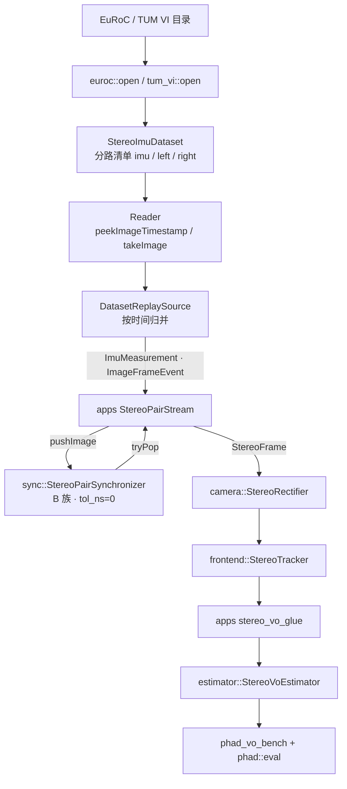

# M3.2 双目配对同步器

设计稿：[Stereo Pair Synchronizer 设计](../research/stereo-pair-synchronizer-design.md)（含 §7 审阅记录）。
根因诊断：[EuRoC 双目 manifest 不等长 handoff](../research/euroc-stereo-manifest-asymmetry-handoff.md)。
开源对照：[EuRoC stereo manifest asymmetry open source refs](../research/euroc-stereo-manifest-asymmetry-open-source-refs.md)。
基线来源：[M3.1 VO 回归 Benchmark](2026-07-31_m3.1_vo_regression_benchmark_7c4e91a2.plan.md)
（MH_01 ATE translation RMSE ≈ 0.150155 m，3682/3682 `kOk`，8/11 序列可打开）。
Issue：[#22](https://github.com/Nothand0212/phad-vio/issues/22)（沿用 `#20` / `#21` 的形式，commit subject 带该号）。

## 切片划分

- **Slice ①（本次）**：`phad::sync` 库 + `sensor` 新类型 + 纯内存单测。完全不碰 `io`。
- **Slice ②（本次）**：dataset 分路清单与 per-camera API、replay 归并、`joinStereo` 删除、测试迁移。
- **Slice ③（本次）**：`apps/StereoPairStream` 与全部调用点迁移、MH_01 逐字节回归。
- **Slice ④（本次）**：三条原失败序列 + 11 序列 bench、文档一致性。

四片都在本计划内，按顺序分别提交；Slice ② 的公共 API 破坏与 Slice ③ 的调用点
迁移必须在同一个可编译状态内落地（同一提交或紧邻两提交），不留中间不可构建版本。

## 已对齐的决策

| 决策点 | 结论 |
|---|---|
| 配对位置 | `phad::sync`，不在 adapter；`joinStereo` 直接删除，不留「仅诊断」降级版 |
| 同步族 | B 族两队列比较 front，偏早且不可配对的一侧丢弃并计数 |
| 默认容差 | `tol_ns = 0`（exact）；soft 仅显式配置，且只有 smoke test |
| 输出 stamp | Left（`tol_ns = 0` 时两侧相同，此项只在 soft 下有意义） |
| 输出获取 | 只有 `tryPop()`，不提供回调 |
| `pushImage` 返回值 | 只表达校验结果；丢弃/溢出进计数器；配对经 `tryPop()` 观察 |
| 单调性判定 | **按单相机**判定逆序与重复，且 sticky（与 dataset reader 的 terminal error 同构） |
| `flush()` | 两侧队列**全部剩余**计入 `dropped_*`，不只是 front |
| 新类型归属 | `CameraId`、`ImageFrameEvent` 进 `phad::sensor` |
| dataset 公共 API | `peekImageTimestamp(CameraId)` / `takeImage(CameraId)`；`summary` 拆 `imu/left/right` |
| 错误码 | 删除 `DatasetErrorCode::kStereoTimestampMismatch` |
| 调用点收敛 | `apps/StereoPairStream`（composition root 侧）；`io` 与 `sync` 互不依赖 |
| payload | 已解码 `Image`；接受 orphan 帧先解码再丢（V2_03 约 415 张） |
| 队列上界 | API 支持有界；offline 用很大的上界，避免与溢出策略搅在一起 |
| 本片非目标 | `pushImu` / IMU 边界插值 / `StereoImuPacket`；ROS adapter；默认 soft；frontend/estimator 算法 |
| `summary.json` sync 段 | `schema_version` 保持 1；新增可选 `"sync"` 对象（与 `StereoPairDiagnostics` 字段一一对应）；`bench_table.py` 不读 |
| 首次 drop / overflow warning | `sync` 只计数；`StereoPairStream`/session 各追加一条进 `warnings`，并入 `summary`/`meta`；可选 `cerr` 一行；库不接日志 |
| emit=0 | `StereoPairStream::next()` 仍返 `EndOfStream`；零配对由 session「无位姿」与 `summary.sync` 体现 |
| MH_01 逐字节参考 | `/home/lin/Projects/data/phad-bench/MH_01_easy/2b28616/default_0885385a/{est.tum,diag.csv}`（不另拷贝、不开工前重跑） |

## 步骤 1：`phad::sync` 库（Slice ①）

新增文件：

```text
phad/sensor/camera_id.hpp          # CameraId、ImageFrameEvent
phad/sync/stereo_pair_synchronizer.hpp/.cpp
phad/sync/README.md
tests/sync/stereo_pair_synchronizer_test.cpp
```

CMake：新增 `phad_sync`（alias `phad::sync`），PUBLIC 依赖 `phad::sensor`、
`phad::common`，**不依赖** `phad::io`；新增 `phad_sync_tests` 挂 `-L unit`。

### 类型草图

```cpp
namespace phad::sensor
{
  enum class CameraId : std::uint8_t
  {
    kLeft  = 0,
    kRight = 1
  };

  struct ImageFrameEvent
  {
    CameraId          camera;
    common::Timestamp timestamp;
    Image             image;
  };
}  // namespace phad::sensor
```

`CameraId` 用 `enum class` 而非索引：两目以上属 roadmap 暂缓项，不预留维度。

```cpp
namespace phad::sync
{
  enum class PushStatus : std::uint8_t
  {
    kOk           = 0,
    kOutOfOrder   = 1,   // 同一相机 stamp 回退
    kDuplicate    = 2,   // 同一相机 stamp 重复
    kInvalidStamp = 3    // 非正常 stamp / 非法 CameraId
  };

  struct StereoPairSynchronizerOptions
  {
    std::int64_t tol_ns        = 0;
    std::size_t  max_queue     = 4096;  // offline 实际用不到
  };

  struct StereoPairDiagnostics
  {
    std::uint64_t pushed_left            = 0;
    std::uint64_t pushed_right           = 0;
    std::uint64_t emitted_stereo         = 0;
    std::uint64_t dropped_left           = 0;
    std::uint64_t dropped_right          = 0;
    std::uint64_t dropped_left_overflow  = 0;
    std::uint64_t dropped_right_overflow = 0;
    std::size_t   max_left_queue         = 0;
    std::size_t   max_right_queue        = 0;
  };

  class StereoPairSynchronizer
  {
  public:
    explicit StereoPairSynchronizer( StereoPairSynchronizerOptions options = {} );

    [[nodiscard]] PushStatus pushImage( sensor::ImageFrameEvent event );
    [[nodiscard]] std::optional<sensor::StereoFrame> tryPop();
    void                                            flush();

    [[nodiscard]] const StereoPairDiagnostics& diagnostics() const noexcept;
    [[nodiscard]] std::optional<PushStatus>    stickyError() const noexcept;
  };
}  // namespace phad::sync
```

`pushImage` 取值传入（内含 `Image`），内部 move 进队列；一旦 sticky error 置位，
后续 `pushImage` 直接返回同一状态且不入队，`tryPop()` 仍可取出已配好的对（不吞掉
已经合法产出的数据）。

### 配对循环

```text
pushImage(event):
  校验 → 失败置 sticky 并返回
  enqueue；若超 max_queue，drop-oldest 并计 dropped_*_overflow
  更新 max_*_queue
  drain()

drain():
  while 两侧非空:
    dt = tL - tR
    if |dt| <= tol_ns: 两侧 pop，产出 StereoFrame{ tL, left, right } 入 ready 队列
    else if dt < 0:    pop 左，dropped_left++
    else:              pop 右，dropped_right++

flush():
  两侧剩余全部 pop 并计入 dropped_*（不产生 pair）
```

### 单测（`tests/sync`，不读磁盘）

| 用例 | 断言 |
|---|---|
| 等长 exact（N=5） | emit=5，drop=0，两侧 `max_*_queue <= 1` |
| MH_04 式：左多一个首 orphan | emit = 右侧全部，`dropped_left = 1` |
| V1_02 式：右多一个尾 orphan | `flush()` 后 `dropped_right = 1`（验证尾部也被算上） |
| V2_03 式：右大量多余且散布在中段 | emit 的 stamp 集合 == 两侧交集，逐个核对 left/right 内容不错配 |
| 交错 push（LLRR、RRLL、LRLR） | 三种顺序 emit 集合一致 |
| `tol_ns = 0` + 1 ns 差 | 不配对，偏早一侧被丢 |
| soft tol（显式 3 ms） | 3 ms 内配对成功，输出 stamp 为 left |
| 单相机逆序 / 重复 | 返回 `kOutOfOrder` / `kDuplicate` 且 sticky |
| `max_queue = 2` 只 push 左 | `dropped_left_overflow` 递增，`max_left_queue = 2` |

## 步骤 2：dataset 分路清单与 per-camera API（Slice ②）

改动文件：

```text
phad/io/dataset/stereo_imu_dataset.hpp/.cpp
phad/io/dataset/internal/stereo_imu_dataset_builder.hpp
phad/io/dataset/internal/dataset_adapter_utils.hpp/.cpp   # 删 joinStereo
phad/io/dataset/dataset_error.hpp                          # 删 kStereoTimestampMismatch
phad/io/dataset/euroc/euroc_dataset.cpp
phad/io/dataset/tum_vi/tum_vi_dataset.cpp
phad/io/dataset/dataset_replay_source.cpp
phad/io/sensor_source.hpp
```

### 合同变化

```cpp
// 旧
DatasetReaderResult<common::Timestamp>  peekStereoTimestamp();
DatasetReaderResult<sensor::StereoFrame> takeStereo();
struct StereoImuDatasetSummary { DatasetStreamSummary imu, stereo; };

// 新
DatasetReaderResult<common::Timestamp>      peekImageTimestamp( sensor::CameraId );
DatasetReaderResult<sensor::ImageFrameEvent> takeImage( sensor::CameraId );
struct StereoImuDatasetSummary { DatasetStreamSummary imu, left, right; };
```

- 单路清单的既有校验**一条不减**：严格递增、无重复、PNG 存在且不逃出目录、
  header/列数、像素类型。左右不等长从此不是错误。
- `peekImageTimestamp` 仍不触发图像 I/O；`takeImage` 才解码（惰性解码合同在
  per-camera 粒度上保持）。
- reader 仍是 move-only、single-pass，两路各自独立消费位置与 sticky terminal error。
- `SensorEvent` 变为 `std::variant<sensor::ImuMeasurement, sensor::ImageFrameEvent>`。
- `DatasetReplaySource` 维护 IMU lookahead + 左右各一条 timestamp lookahead，
  每次取全局最早；同 stamp 顺序 IMU → Left → Right。

### 测试迁移

- `tests/io/dataset/euroc/euroc_dataset_test.cpp:972,985` 与
  `tests/io/dataset/tum_vi/tum_vi_dataset_test.cpp:535` 现在断言
  `kStereoTimestampMismatch`：改为「不等长 fixture `open` 成功，且 `summary.left`
  / `summary.right` 分别等于两路行数」。
- 所有 `summary.stereo.*` 断言改为 `summary.left.*` / `summary.right.*`；
  等长 fixture 两者相同。
- `dataset_replay_source_test.cpp` 的事件序列断言改为单路图像事件，并新增一条
  不等长 fixture 上的归并顺序断言。
- `euroc_mh01_test.cpp`：`left.count == right.count == 3682`。

## 步骤 3：`StereoPairStream` 与调用点迁移（Slice ③）

新增 `apps/stereo_pair_stream.hpp/.cpp`（编进现有 apps 静态库，与
`offline_vo_session` 同一层）：

```cpp
namespace phad::apps
{
  class StereoPairStream
  {
  public:
    StereoPairStream( io::SensorSource& source,
                      sync::StereoPairSynchronizerOptions options = {} );

    // 拉到下一对；耗尽时 flush 并返回 EndOfStream。IMU 事件本片先计数后丢弃。
    [[nodiscard]] StereoPairReadResult next();

    [[nodiscard]] const sync::StereoPairDiagnostics& diagnostics() const noexcept;
  };
}  // namespace phad::apps
```

`StereoPairReadResult` 用 `std::variant<sensor::StereoFrame, io::EndOfStream, StreamError>`，
把「读失败」「同步 sticky error」「正常耗尽」区分开，不用 `optional` 混淆。

迁移清单（每处应只改事件循环取帧那几行）：

| 调用点 | 改动 |
|---|---|
| `apps/offline_vo_session.cpp` | `reader.takeStereo()` → `StereoPairStream::next()`；结束时把同步诊断并入 `OfflineVoSessionResult` |
| `apps/phad_stereo_frontend_probe.cpp` | 同上；probe CSV 列不变 |
| `apps/phad_euroc_runner.cpp` | 走 `DatasetReplaySource` + `StereoPairStream`，GUI 行为不变 |
| `apps/phad_euroc_inspect.cpp` | 打印 `cam0_frames` / `cam1_frames` 与交集帧数（诊断用，直接在 inspect 内算，不复活 `joinStereo`） |
| `tests/camera/euroc_mh01_rectify_test.cpp`、`tests/frontend/euroc_mh01_frontend_test.cpp` | 改用 `StereoPairStream`；断言的帧数与内容不变 |
| `tests/io/dataset/tum_vi/tum_vi_corridor1_test.cpp`、`tests/apps/offline_vo_session_test.cpp` | 随 per-camera / `StereoPairStream` API 迁移 |

`OfflineVoSessionResult` 的 `counts.image_frames` 语义保持「配对成功并进入
pipeline 的帧数」，因此 `phad_vo_bench` 的 `completion_rate` / `coverage_rate`
定义不动（两者本来就只用 session 自己的计数与时间跨度，不读 `dataset.summary()`）。
`summary.json` 在 `schema_version=1` 下新增可选对象（字段与
`StereoPairDiagnostics` 对齐）：

```json
"sync": {
  "pushed_left": 0, "pushed_right": 0, "emitted_stereo": 0,
  "dropped_left": 0, "dropped_right": 0,
  "dropped_left_overflow": 0, "dropped_right_overflow": 0,
  "max_left_queue": 0, "max_right_queue": 0
}
```

既有字段名与含义不变；`scripts/bench_table.py` 不读 `sync`，无需改动。
首次 drop / 首次 overflow 各一条字符串进入 `summary.warnings` /
`meta.warnings`（由 stream/session 观察诊断计数后写入，不在 `phad::sync` 内打日志）。

`StereoPairStream::next()` 在源耗尽时一律 `EndOfStream`（含 `emitted_stereo==0`）；
零配对由 session 既有「无 accepted pose」路径与 `summary.sync` 体现，不升格为
stream error。

### 验收（本地 MH_01，人工执行）

```bash
cmake -S . -B build -DCMAKE_EXPORT_COMPILE_COMMANDS=ON && cmake --build build -j
cd build && ctest --output-on-failure -L unit && cd ..

./build/phad_vo_bench /home/lin/Projects/data/thidparty/euroc/native/MH_01_easy \
  --bench-root /home/lin/Projects/data/phad-bench --force
REF=/home/lin/Projects/data/phad-bench/MH_01_easy/2b28616/default_0885385a
# 新产物路径随当前 commit/config_hash 变化；diff 必须为空
diff <新 est.tum> "$REF/est.tum"
diff <新 diag.csv> "$REF/diag.csv"
```

## 步骤 4：真序列 bench 与文档（Slice ④）

三条原失败序列（clean 树需 `--force` 或换 commit）：

| 序列 | cam0 / cam1 | emit | drop_left | drop_right |
|---|---|---:|---:|---:|
| MH_04_difficult | 2033 / 2032 | 2032 | 1 | 0 |
| V1_02_medium | 1710 / 1711 | 1710 | 0 | 1 |
| V2_03_difficult | 1922 / 2336 | 1921 | 1 | 415 |

11 序列全量重跑后 `python3 scripts/bench_table.py /home/lin/Projects/data/phad-bench`
刷表；序列本身的 ATE / completion 差归 M3.3，本计划不修算法。

文档：

- `docs/architecture.md` §3.1–§3.2：`pushStereo` → `pushImage`，补 StereoOnly
  模式与 `SensorEvent` 的单路图像事件合同，并写明 synchronizer 在 M3.2 落地、
  M4 只加 IMU 侧；
- `phad/io/README.md`：数据流图（`takeStereo` → `takeImage`）、`summary` 字段、
  `SensorEvent` 合同、删掉的错误码；
- `phad/sync/README.md`：新建；
- 设计稿 §4.4 完成清单勾选。

## 数据流



## 风险与对策

| 风险 | 对策 |
|---|---|
| API 破坏范围外溢，中途留下不可构建状态 | Slice ② / ③ 连续落地；先改 `io` 与其测试，再一次性改 apps 与真序列测试 |
| MH_01 出现字节级差异 | 差异一定来自配对顺序或解码时机，而非算法：先比对 `est.tum` 首个不同行的 timestamp，回到 `drain()` 的相等分支查 |
| orphan 帧解码浪费被误读成内存问题 | 诊断里同时给 `max_*_queue`，证明队列深度是个位数 |
| V2_03 的 415 帧丢弃掩盖真实缺帧问题 | 丢弃数进 `summary.json` 且 warning 一次，表里可见；缺帧是数据事实，不做插值 |
| soft tol 被误当默认 | 默认 0，只有显式配置才生效；README 与设计 §5.1 都标注贪心限制 |

## 后续切片概要（不在本计划）

- M3.3 VO 加固：几何验证、PnP 初值、关键帧策略、landmark 生命周期，逐项用
  `phad_vo_bench` 出前后数字；
- M4：在同一 `StereoPairSynchronizer` 上加 `pushImu`、图像边界线性插值与
  `StereoImuPacket`，`StereoPairStream` 升级为 packet 流；
- ROS / 实机输入：只新增 `push*` 的调用方，同步算法不动。
