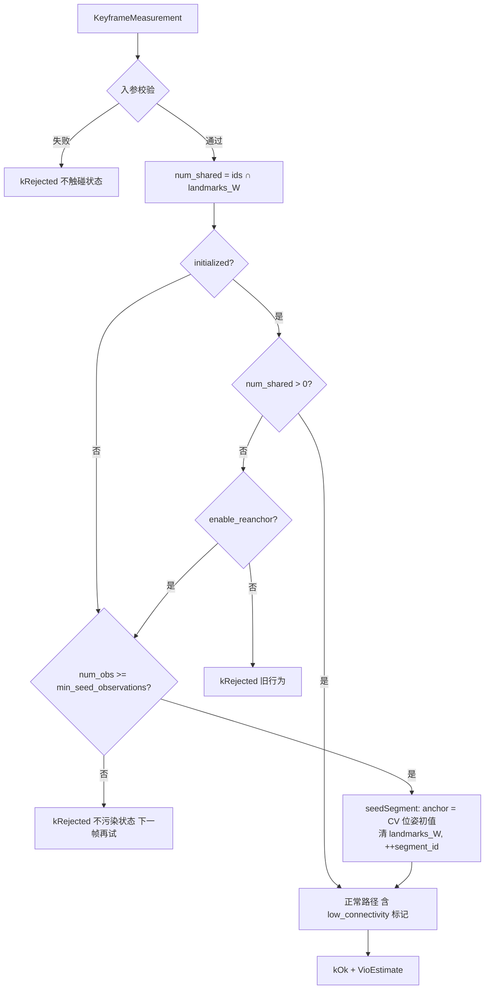

# M3.3 VO 加固

Issue：[#23](https://github.com/Nothand0212/phad-vio/issues/23)。
设计见 [M3.3 VO 加固设计](../research/m3.3-vo-hardening-design.md)，
根因诊断见 [M3.3 VO 崩溃根因诊断](../research/m3.3-vo-collapse-diagnosis.md)，
开源对照见 [M3.3 VO 加固：开源实现对照](../research/m3.3-vo-hardening-open-source-refs.md)。
对照基线为 [M3.2 EuRoC 全序列基线](../research/m3.2-euroc-baseline.md)（`4780660`）。

## 切片划分

- **Slice ①（本次）**：消除拒帧吸收态。估计器内部完成段生命周期与 re-anchor，
  新增 seed 观测门限，`segment_id` / `reanchors` / `segments` 进产物。
- **Slice ②**：前端右目匹配加固。目标是减少 re-anchor 次数与提高每帧观测数，
  不是修崩溃。三个已知洞：约 25% `no_right_match` 的全局常态；坏视差在 epipolar
  门限之前就写回 `last_disp_px` 造成种子中毒；新 track 以 `last_disp_px = 0` 起搜。
- **Slice ③**：`solvePnPRansac` 位姿初值取代恒速初值 + 几何验证剔时序外点。
- **Slice ④**：优化后 chi2 外点剔除与 landmark 生命周期（需决定「本帧」还是「永久」）。
- **Slice ⑤**：关键帧策略。会改 `est.tum` 的输出语义且与 M4 的 IMU 预积分边界耦合，
  开工前单独对齐。

Slice ② 之后的范围等 Slice ① 的 bench 数字出来再定。

## 已对齐的决策

| 决策点 | 结论 |
|---|---|
| 触发形式 | 去掉 `num_shared == 0` 拒帧门；不引入失败检测器与计时器（Basalt 路线） |
| gauge | 新段最老帧 prior 打在最后一个被接受的位姿上，输出仍是单条连续 TUM；不分段 |
| anchor 位姿 | 复用现有 `use_constant_velocity_init` 的位姿初值规则，不写第二套外推 |
| prior 噪声 | 沿用 1e-4 rad / m；它是 gauge 而非信息 |
| seed 门限 | 新增 `min_seed_observations`（默认 10），初始化与 re-anchor 共用；不足则 `kRejected` 且不写位姿 |
| 归属 | 决策在 `StereoVoEstimator::update()` 内部；契约仍是「喂测量、拿位姿」 |
| 状态枚举 | `UpdateStatus` 不加新值；re-anchor 帧就是 `kOk`，段边界靠 `segment_id` 跳变 |
| 诊断 | `diag.csv` 加列 `segment_id`（13 → 14 列，有意变更）；`summary.json` 加 `robustness.reanchors` 与 `trajectory.segments` |
| 评估 | ATE 仍为整条轨迹单次 SE3 对齐，`phad::eval` 不动 |
| 出口门控 | 只门控 completion 与 MH_01 不回归；**ATE 只记录不门控** |
| 配置身份 | 两个新字段进 `flattenConfig()`，`config_hash` 从 `0885385a` 变更，新产物落新目录；`enable_reanchor=false` 用于 A/B |

## 步骤 1：seedSegment 行为保持型重构

`phad/estimator/stereo_vo_estimator.cpp` 的 `Impl` 加：

```cpp
// 返回 false 表示 backproject 失败（调用方回滚并 kRejected）
bool seedSegment( const Eigen::Isometry3d& anchor_T_W_B,
                  const KeyframeMeasurement& measurement );
```

把 `update()` 中 `if ( !m_impl->initialized )` 分支的逻辑整体搬进去：窗口只留本帧、
逐观测 backproject、cheirality/有限性检查失败即返回 false、写 `landmarks_W` 与
`track_times`。本步**不改任何行为**，`anchor` 传 `Identity()`。

验收：`ctest -L unit` 全绿；`phad_stereo_vo_probe` 在 MH_01 上的 `est.tum` 与
`diag.csv` 相对当前 commit 逐字节相同（按仓库惯例：先在改前产出仓库外参考产物，
再逐字节 diff）。

提交：`refactor(estimator): extract seedSegment from update (#23)`

## 步骤 2：选项与诊断字段

`phad/estimator/types.hpp`：

```cpp
struct EstimatorOptions
{
  // …既有字段…
  int  min_seed_observations = 10;    // 初始化与 re-anchor 共用
  bool enable_reanchor       = true;  // false 复现 M3.2 的永久拒帧行为
};

struct UpdateDiagnostics
{
  // …既有字段…
  std::uint32_t segment_id = 0;  // 每次 re-anchor 递增；0 为首段
};
```

`Impl` 构造函数补校验：`min_seed_observations < 1` → `std::invalid_argument`
（与既有 `window_size < 1` 的写法一致）。

提交：`feat(estimator): add reanchor options and segment_id diagnostic (#23)`

## 步骤 3：re-anchor 路径

`update()` 中把

```cpp
if ( m_impl->initialized && num_shared == 0 ) { /* kRejected */ }
```

替换为：

```cpp
const bool overlap_broken = m_impl->initialized && num_shared == 0;
if ( overlap_broken && !m_impl->options.enable_reanchor )
{
  // 旧行为：kRejected（A/B 复现用）
}
if ( overlap_broken &&
     static_cast<int>( measurement.observations.size() ) <
         m_impl->options.min_seed_observations )
{
  // kRejected：观测不足以 seed 新段，不污染状态，下一帧再试
}
```

否则走 re-anchor：`anchor = poseInitialValue()`（即现有恒速规则的输出）→
`seedSegment( anchor, measurement )` → `++segment_id` → 正常收尾为 `kOk`。

`landmarks_W` 在 `seedSegment` 里清空；`track_times` 继续累积；`next_frame_index`
继续单调；回滚快照新增 `segment_id`。

`segment_id` 写入 `result.diagnostics`（所有返回路径都要写，含拒帧路径，便于
diag.csv 连续可读）。

提交：`fix(estimator): reanchor window on landmark overlap break (#23)`

## 步骤 4：初始化共用 seed 门限

未初始化路径同样检查 `min_seed_observations`，不足即 `kRejected`。V2_03 现状是
第 0 帧 `num_obs=0`、第 1 帧用 1 个观测完成初始化，属同一个洞。

提交：`fix(estimator): gate first-segment seed on min observations (#23)`

## 步骤 5：单元测试

`tests/estimator/stereo_vo_reanchor_test.cpp`（新文件，沿用既有 inline scene
builder 风格）：

| 用例 | 断言 |
|---|---|
| `RecoversAfterLandmarkIdTurnover` | 正常 N 帧 → 一帧 id 全新且观测充足 → `kOk`、`segment_id == 1`、位姿 ≈ CV 预测 anchor；**再喂正常帧仍 `kOk`** |
| `SeedGateRejectsWithoutPoisoningState` | 断裂帧观测不足 → `kRejected` 无 estimate；下一帧充足 → 成功 seed |
| `ReanchorDisabledReproducesLegacyReject` | `enable_reanchor = false` → 断裂后永久 `kRejected` |
| `FirstSegmentSeedGate` | 首帧观测不足 → `kRejected`；补足后成功 |
| `AnchorFollowsConstantVelocityOption` | CV 开 → anchor 为外推位姿；关 → anchor 为上一位姿 |

既有 `stereo_vo_estimator_test.cpp` / `stereo_vo_diagnostics_test.cpp` 不得回归。

提交：`test(estimator): cover overlap-break recovery (#23)`

## 步骤 6：session 诊断与日志

`apps/offline_vo_session.cpp`：

- `writeDiagCsv` 表头追加 `,segment_id`，行尾追加该帧 `segment_id`（整数，无小数）；
- `FrameCounts` / result 增加 `segments`、`reanchors`、`seed_rejected`；
- 首次 re-anchor 记一条 warning（含 timestamp 与新 `segment_id`），结束时一条
  summary（段数、re-anchor 次数、seed 拒帧数）——沿用 M3.2 sync 的日志节奏，不每帧刷屏。

`tests/apps/offline_vo_session_test.cpp` 的 diag CSV 字节契约用例同步更新为 14 列。

提交：`feat(apps): record segment_id in vo diagnostics (#23)`

## 步骤 7：bench summary 与 config

- `phad/bench/run_summary.{hpp,cpp}`：`robustness.reanchors`、`trajectory.segments`
  （`schema_version` 保持 1，只加字段）；`tests/bench/run_summary_test.cpp` 补用例。
- `apps/phad_vo_bench.cpp` 的 `flattenConfig()` 追加
  `estimator.min_seed_observations` 与 `estimator.enable_reanchor`；跑一次记录新
  `config_hash`（会取代 `0885385a`）。

提交：`feat(bench): report segments and reanchors in summary (#23)`

## 步骤 8：文档合同

- `phad/estimator/README.md`：段生命周期、seed 门限、`segment_id` 语义、
  diag 列表更新；明确「re-anchor 帧的位姿是预测值」；
- `phad/bench/README.md`：summary 新字段；
- `apps/AGENTS.md`：diag.csv 由 13 列变 14 列，标注为有意的契约变更。

提交：`docs(m3.3): update estimator and bench contracts (#23)`

## 步骤 9：全序列验收

```bash
export PHAD_BENCH_ROOT=/home/lin/Projects/data/phad-bench
for s in MH_01_easy MH_02_easy MH_03_medium MH_04_difficult MH_05_difficult \
         V1_01_easy V1_02_medium V1_03_difficult \
         V2_01_easy V2_02_medium V2_03_difficult; do
  ./build/phad_vo_bench /home/lin/Projects/data/thidparty/euroc/native/$s \
    --gt-euroc /home/lin/Projects/data/thidparty/euroc/native/$s
done

# MH_01 不回归锚：位姿输出必须逐字节相同
diff $PHAD_BENCH_ROOT/MH_01_easy/4780660/default_0885385a/est.tum \
     $PHAD_BENCH_ROOT/MH_01_easy/<new_commit>/default_<new_hash>/est.tum

.venv/bin/python scripts/bench_table.py $PHAD_BENCH_ROOT
```

门控：

| 项 | 要求 |
|---|---|
| MH_01_easy | `segments == 1`、`reanchors == 0`、`est.tum` 逐字节相同、ATE 0.150155 m |
| MH_02 / V1_03 / V2_02 / V2_01 | `completion_rate` 显著上升；具体数字跑完后写入 roadmap 出口 |
| V2_03_difficult | 不门控（sync 丢 415 右帧 + 场景退化） |
| ATE | 只记录不门控；跨 coverage 不可直接比较 |

产出 `docs/research/m3.3-slice1-baseline.md`（钉新 commit 与新 `config_hash`），
并回填 roadmap M3.3 出口。

提交：`docs(m3.3): record slice-1 baseline and mark scope (#23)`

## 数据流



## 后续切片概要

Slice ②–⑤ 的边界见设计稿第 8 节。共同约束：每片以 `phad_vo_bench` 的前后数字收尾，
无法测量的改动不进入本阶段；MH_01 作为不回归锚（至少不劣于 0.150155 m）。
