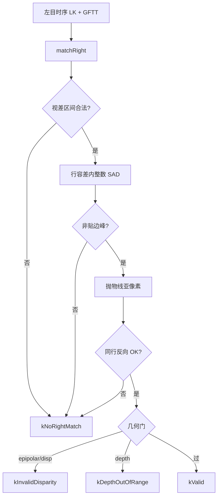

# M3.3 Slice ② 右目匹配加固

> **For agentic workers:** REQUIRED SUB-SKILL: Use superpowers:subagent-driven-development (recommended) or superpowers:executing-plans to implement this plan task-by-task. Steps use checkbox (`- [ ]`) syntax for tracking.

**Goal:** 用一维 SAD 右目匹配压低 `no_right_match`、提高每帧 `valid` 观测，并减少 `reanchors`。

**Architecture:** 只改 `phad::frontend` 的 `matchRight()`；左目时序 LK 不动；对外
`FrameTracks` / `StereoStatus` / probe CSV 列不变；新旋钮进 `flattenConfig`。

**Tech Stack:** C++17、OpenCV（仅图像访问；立体匹配自研 SAD，不再对右目用
`calcOpticalFlowPyrLK`）、GTest、`phad_vo_bench`。

Issue：[#23](https://github.com/Nothand0212/phad-vio/issues/23)。  
设计见 [M3.3 Slice ② 设计](../research/m3.3-slice2-right-match-design.md)，  
开源对照见 [Slice ② 开源对照](../research/m3.3-slice2-right-match-open-source-refs.md)，  
对照基线 [Slice ①](../research/m3.3-slice1-baseline.md)（`0b0cd34` / `default_030a0197`）。

## Global Constraints

- C++ 命名 / 风格遵循 `docs/agents/cpp-naming.md` 与 `docs/agents/cpp-style.md`（Allman、2 空格、`m_` 成员）。
- 不新增库；不改 `phad::estimator` / `phad::eval`；不动 `FrameTracks` 字段契约。
- 不做 R2（右目时序 track）、R3（`last_disp_px` LK 初值）、NCC、ORB 中位数批剔。
- 提交 subject 带 `(#23)`；本仓库惯例短生命周期分支 `m3.3`。
- MH_01：**不再**要求 `est.tum` 逐字节相同；门控 ATE ≤ 0.150155 m 且 `reanchors=0`。

## 切片划分

- **Slice ②（本次）**：一维 SAD 右目匹配 + 选项/测试/bench/文档/基线。
- Slice ③–⑤：见父设计；本计划不展开。

## 已对齐的决策

| 决策点 | 结论 |
|---|---|
| 主路线 | R1 一维 SAD（非 2D LK） |
| 亚像素 | 抛物线拟合；δ 超出 ±1 则弃 |
| 行容差 | `stereo_row_tol_px` 默认 0，进 `config_hash` |
| 双向 | 同行反向一维 SAD，阈值 `stereo_bidir_px`（默认 0.5） |
| 半宽 | `stereo_sad_half_win_px` 默认 5 |
| 视差记忆 | 删除 `last_disp_px` |
| 搜索区间 | `[max(min_disparity_px, fx·b/max_depth), fx·b/min_depth]` |
| 立体 FB-LK | 删除；`forward_backward_rejected` 只计左目时序 |
| 配置 | 三个新字段进 `flattenConfig` |

## 文件地图

| 文件 | 职责 |
|---|---|
| `phad/frontend/stereo_tracker.hpp` | 新选项字段与注释 |
| `phad/frontend/stereo_tracker.cpp` | 校验、删 `last_disp_px`、重写 `matchRight` |
| `tests/frontend/stereo_tracker_test.cpp` | 更新/新增用例 |
| `apps/phad_vo_bench.cpp` | `flattenConfig` |
| `phad/frontend/README.md` | 算法与选项合同 |
| `docs/research/m3.3-slice2-baseline.md` | 出口数字（新建） |
| `docs/roadmap.md` | Slice ② 出口回填 |

---

### Task 1: 选项、校验、删除 `last_disp_px`

**Files:**
- Modify: `phad/frontend/stereo_tracker.hpp`
- Modify: `phad/frontend/stereo_tracker.cpp`（`LiveTrack`、`Impl` 构造校验；`matchRight` 暂留旧逻辑但去掉对 `last_disp_px` 的读写）
- Test: `tests/frontend/stereo_tracker_test.cpp`

**Interfaces:**
- Produces: `StereoTrackerOptions::{stereo_sad_half_win_px, stereo_row_tol_px, stereo_bidir_px}`
- Produces: `LiveTrack` 无 `last_disp_px`

- [ ] **Step 1: 写失败用例（非法选项）**

在 `stereo_tracker_test.cpp` 增加：

```cpp
TEST( StereoTrackerTest, RejectsNonPositiveStereoBidir )
{
  auto options = testOptions( 4 );
  options.stereo_bidir_px = 0.0;
  EXPECT_THROW(
      ( StereoTracker{ makeRectifiedCalibration(), options } ),
      std::invalid_argument );
}

TEST( StereoTrackerTest, RejectsNegativeRowTol )
{
  auto options = testOptions( 4 );
  options.stereo_row_tol_px = -1;
  EXPECT_THROW(
      ( StereoTracker{ makeRectifiedCalibration(), options } ),
      std::invalid_argument );
}

TEST( StereoTrackerTest, RejectsNonPositiveSadHalfWin )
{
  auto options = testOptions( 4 );
  options.stereo_sad_half_win_px = 0;
  EXPECT_THROW(
      ( StereoTracker{ makeRectifiedCalibration(), options } ),
      std::invalid_argument );
}
```

- [ ] **Step 2: 跑测试确认失败**

```bash
cmake --build build --target phad_frontend_tests -j
./build/phad_frontend_tests --gtest_filter='StereoTrackerTest.Rejects*'
```

Expected: 编译失败或运行失败（字段尚不存在 / 未校验）。

- [ ] **Step 3: 改头文件与 `LiveTrack`**

`StereoTrackerOptions` 追加：

```cpp
int    stereo_sad_half_win_px = 5;
int    stereo_row_tol_px      = 0;
double stereo_bidir_px        = 0.5;
```

`LiveTrack` 删除 `last_disp_px`。`matchRight` 中删除 `right_seed` 构造与
`track.last_disp_px = …` 写回；暂时仍可用 2D LK（`right_pts` 初值直接用
`left_pts`），保证本步其它既有测试仍可编译运行。

`Impl` 构造补校验：

```cpp
if ( options.stereo_sad_half_win_px < 1 )
{
  throw std::invalid_argument( "stereo_sad_half_win_px must be >= 1" );
}
if ( options.stereo_row_tol_px < 0 )
{
  throw std::invalid_argument( "stereo_row_tol_px must be >= 0" );
}
if ( !( options.stereo_bidir_px > 0.0 ) )
{
  throw std::invalid_argument( "stereo_bidir_px must be positive" );
}
```

- [ ] **Step 4: 跑相关测试**

```bash
./build/phad_frontend_tests --gtest_filter='StereoTrackerTest.*'
```

Expected: 全绿（含新的 Rejects*）。

- [ ] **Step 5: Commit**

```bash
git add phad/frontend/stereo_tracker.hpp phad/frontend/stereo_tracker.cpp \
  tests/frontend/stereo_tracker_test.cpp
git commit -m "$(cat <<'EOF'
feat(frontend): add stereo SAD options and drop last_disp_px (#23)

EOF
)"
```

---

### Task 2: 重写 `matchRight` 为一维 SAD

**Files:**
- Modify: `phad/frontend/stereo_tracker.cpp`（`matchRight`；可在匿名命名空间加
  `sadAt` / `searchDisparity1d` / `parabolicRefine` 辅助函数）

**Interfaces:**
- Consumes: Task 1 的选项与无 `last_disp_px` 的 `LiveTrack`
- Produces: 与设计 §4 一致的 status / `disparity_px` / `FrameStats` 行为

- [ ] **Step 1: 实现 SAD 辅助（匿名命名空间）**

建议签名（可微调命名，保持短缩写）：

```cpp
[[nodiscard]] int sadPatch( const cv::Mat& left, const cv::Mat& right,
                            int u_l, int v_l, int u_r, int v_r, int half );

// 在固定 v_r 上对 u ∈ [u_lo, u_hi] 搜最小 SAD；返回是否找到非贴边峰
struct SadPeak
{
  int u   = 0;
  int sad = 0;
  bool ok = false;
};

[[nodiscard]] SadPeak searchRow( const cv::Mat& left, const cv::Mat& right,
                                 int u_l, int v_l, int v_r, int u_lo, int u_hi,
                                 int half );

[[nodiscard]] bool refineSubpixel( const cv::Mat& left, const cv::Mat& right,
                                   int u_l, int v_l, int u_r, int v_r, int half,
                                   double& u_r_sub );
```

`refineSubpixel`：取 `sad(u-1), sad(u), sad(u+1)` 做抛物线，
`delta = 0.5*(s0-s2)/(s0-2*s1+s2)`；若分母≈0 或 `|delta|>1` 返回 false。

`searchRow`：若最优 `u` 等于 `u_lo` 或 `u_hi`（搜索区间端点）则 `ok=false`
（对齐 ORB「贴边放弃」）。

- [ ] **Step 2: 重写 `matchRight` 主循环**

伪代码（必须落实到源码）：

```text
for each track:
  status = kNoRightMatch; disparity = 0
  d_min = max(min_disparity_px, fx*b/max_depth_m)
  d_max = fx*b/min_depth_m
  if d_max < d_min: continue

  u_l = round(pixel.x); v_l = round(pixel.y)
  best over v_r in [v_l - row_tol, v_l + row_tol]:
      searchRow on u in [u_l - floor(d_max), u_l - ceil(d_min)]
  if no peak: continue
  if !refineSubpixel → continue

  // 反向：在同一 v_r，以右峰为中心、用同样 half，在左图搜回
  // 往返 |u_back - u_l| > stereo_bidir_px → continue

  abs_dy = |v_l - v_r|   // 用整数行；亚像素只修 x
  push abs_dy into epipolar_errors
  disparity = u_l_f - u_r_sub   // 左用亚像素像素坐标 pixel.x 更一致：
                                // disparity = pixel.x - u_r_sub

  if abs_dy > max_epipolar_px → kInvalidDisparity; ++epipolar_rejected
  else if disparity <= min_disparity_px → kInvalidDisparity; ++disparity_rejected
  else if depth 门外 → kDepthOutOfRange; ++depth_rejected
  else → kValid; track.disparity_px = disparity
```

注意：

- 立体路径**不得**再调用 `calcOpticalFlowPyrLK`。
- 反向失败 → `kNoRightMatch`，**不要** `++forward_backward_rejected`。
- 边界：patch 越界的 `(u,v)` 直接跳过该候选。

- [ ] **Step 3: 编译并跑既有前端单测，记录需改的语义**

```bash
cmake --build build --target phad_frontend_tests -j
./build/phad_frontend_tests --gtest_filter='StereoTrackerTest.*'
```

Expected：`VerticalRightOffsetBecomesInvalidDisparity` 很可能失败——`row_tol=0`
时右点偏移 4px 变 `kNoRightMatch` 而非 `kInvalidDisparity`。其它合成用例应仍绿
或仅需微调容差。

- [ ] **Step 4: Commit**

```bash
git add phad/frontend/stereo_tracker.cpp
git commit -m "$(cat <<'EOF'
feat(frontend): replace right-match LK with 1D SAD (#23)

EOF
)"
```

---

### Task 3: 前端测试对齐新语义

**Files:**
- Modify: `tests/frontend/stereo_tracker_test.cpp`

**Interfaces:**
- Consumes: Task 2 的 `matchRight` 行为

- [ ] **Step 1: 改 `VerticalRightOffsetBecomesInvalidDisparity`**

`row_tol=0` 且 `right_v_offset_px=4` 时期望变为 `kNoRightMatch`（搜不到同行峰），
或在显式设 `stereo_row_tol_px=0` 下断言：

```cpp
// 同行搜索找不到偏移 4px 的右点
EXPECT_EQ( hit->status, StereoStatus::kNoRightMatch );
```

可拆成两个用例：

1. `VerticalOffsetWithZeroRowTolIsNoRightMatch`
2. `VerticalOffsetWithinRowTolCanBeValid`（`stereo_row_tol_px=4`，
   `max_epipolar_px=4.5`，期望至少一个 `kValid`）

- [ ] **Step 2: 补反向一致性失败用例**

构造方式（任选其一，优先简单）：

- 合成右图在正确视差处放弱纹理/恒定强度，使正向偶然命中但反向不稳定；或
- 若难构造，用较小 `stereo_bidir_px`（如 `1e-3`）+ 已知亚像素往返误差，断言
  严格阈值下出现 `kNoRightMatch`。

至少保证：默认参数下健康网格仍大量 `kValid`（既有
`MatchesRightWithExpectedDisparity` 类用例不回归）。

- [ ] **Step 3: 跑全前端单测 + unit 标签（若耗时允许）**

```bash
./build/phad_frontend_tests
ctest --test-dir build --output-on-failure -L unit
```

Expected: 全绿。

- [ ] **Step 4: Commit**

```bash
git add tests/frontend/stereo_tracker_test.cpp
git commit -m "$(cat <<'EOF'
test(frontend): cover 1D stereo match semantics (#23)

EOF
)"
```

---

### Task 4: `flattenConfig` 与文档合同

**Files:**
- Modify: `apps/phad_vo_bench.cpp`（`flattenConfig`）
- Modify: `phad/frontend/README.md`
- 可选：若 `tests/bench` / apps 测断言了 tracker 键集合，同步更新

- [ ] **Step 1: flattenConfig**

在既有 `tracker.max_depth_m` 之后追加：

```cpp
snap.set( "tracker.stereo_sad_half_win_px",
          static_cast<std::int64_t>( tracker.stereo_sad_half_win_px ) );
snap.set( "tracker.stereo_row_tol_px",
          static_cast<std::int64_t>( tracker.stereo_row_tol_px ) );
snap.set( "tracker.stereo_bidir_px", tracker.stereo_bidir_px );
```

- [ ] **Step 2: 更新 README**

- 「右目每帧从当前左目重匹配」改为「一维 SAD（行容差 + 视差区间）+ 亚像素 +
  同行反向一致性」；
- `kNoRightMatch` 含义改为「无峰 / 贴边 / 亚像素失败 / 反向失败」；
- 删除任何 `last_disp_px` 叙述；
- 选项表增加三个 `stereo_*` 默认值。

- [ ] **Step 3: 编译 bench / 相关测试**

```bash
cmake --build build --target phad_vo_bench phad_frontend_tests phad_bench_tests -j
```

- [ ] **Step 4: Commit**

```bash
git add apps/phad_vo_bench.cpp phad/frontend/README.md
git commit -m "$(cat <<'EOF'
docs(frontend): document 1D SAD right match and config hash fields (#23)

EOF
)"
```

（若 flatten 与 docs 分成两次 commit 也可：`feat(bench): …` + `docs(frontend): …`。）

---

### Task 5: 全序列 bench 与基线文档

**Files:**
- Create: `docs/research/m3.3-slice2-baseline.md`
- Modify: `docs/roadmap.md`（M3.3 Slice ② 出口）
- 可选：父设计 [`m3.3-vo-hardening-design.md`](../research/m3.3-vo-hardening-design.md) 状态行改为 Slice ② 已对齐/已落地

- [ ] **Step 1: 跑 11 条 EuRoC**

```bash
export PHAD_BENCH_ROOT=/home/lin/Projects/data/phad-bench
for s in MH_01_easy MH_02_easy MH_03_medium MH_04_difficult MH_05_difficult \
         V1_01_easy V1_02_medium V1_03_difficult \
         V2_01_easy V2_02_medium V2_03_difficult; do
  ./build/phad_vo_bench /home/lin/Projects/data/thidparty/euroc/native/$s \
    --gt-euroc /home/lin/Projects/data/thidparty/euroc/native/$s
done
.venv/bin/python scripts/bench_table.py $PHAD_BENCH_ROOT
```

可选：对 MH_01 / MH_02 跑 `phad_stereo_frontend_probe` 对照
`no_right_match_rate` / `valid`。

- [ ] **Step 2: 门控检查**

| 项 | 要求 |
|---|---|
| MH_01 | ATE ≤ 0.150155 m；`segments=1`；`reanchors=0` |
| 健康单段（MH_03/04/05、V1_01） | ATE 不劣于 Slice ① |
| 全序列 | `reanchors` 不增（目标下降） |
| V2_03 | 不门控 |

若 MH_01 ATE 劣化或 `reanchors` 全局上升：停下来诊断（半宽/双向阈值/`row_tol`），
不要直接放宽门控写进 roadmap。

- [ ] **Step 3: 写 `m3.3-slice2-baseline.md`**

结构对齐 `m3.3-slice1-baseline.md`：commit、新 `config_hash`、全序列表、相对
Slice ① 的 completion / ATE / `reanchors` 对照、frontend 指标（若有）。

- [ ] **Step 4: 回填 roadmap M3.3**

标注 Slice ② 已完成；写入关键出口数字；指向新基线文档。

- [ ] **Step 5: Commit**

```bash
git add docs/research/m3.3-slice2-baseline.md docs/roadmap.md
git commit -m "$(cat <<'EOF'
docs(m3.3): record slice-2 right-match baseline (#23)

EOF
)"
```

---

## 数据流



## 后续

- Slice ③：`solvePnPRansac` 初值 + 几何剔外点。
- 若 Slice ② 后 `no_right_match` 仍高：再评估独立切片做 R2（Basalt 右目 track）。
