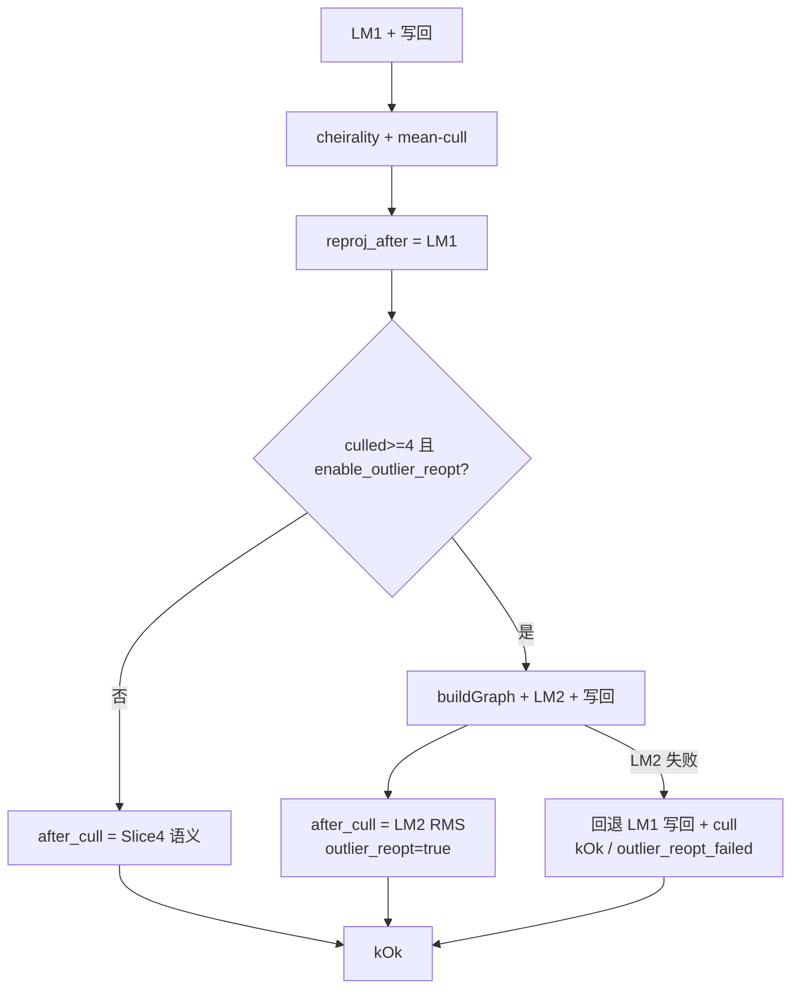

# M3.3 Slice ④b 剔点后重建图二次 LM

> **For agentic workers:** REQUIRED SUB-SKILL: Use superpowers:subagent-driven-development (recommended) or superpowers:executing-plans to implement this plan task-by-task. Steps use checkbox (`- [ ]`) syntax for tracking.

**Goal:** 在 Slice ④ mean-cull 永久删点之后，当本帧 `outliers_culled >= 4` 时重建 factor graph 并跑一趟 LM₂，消化「只删不重优」在 MH_05 上的不足（ATE 43.29 m）。

**Architecture:** 只改 `phad::estimator` 热路径后缀（cull 之后）；LM₂ 失败时局部回退到「LM₁ 写回 + cull」状态并仍返回 `kOk`。诊断经 session → bench 落盘；`diag.csv` 列数不变。`phad::frontend` / `phad::eval` 不动。

**Tech Stack:** C++20、GTSAM `LevenbergMarquardtOptimizer`、GTest、`phad_vo_bench`。

Issue：[#24](https://github.com/Nothand0212/phad-vio/issues/24)（续；本片称 Slice ④b；Part of [#23](https://github.com/Nothand0212/phad-vio/issues/23)）。  
设计见 [M3.3 Slice ④b 设计](../research/m3.3-slice4b-outlier-reopt-design.md)，  
对照基线 [Slice ④ 部分 / needs-reopt](../research/m3.3-slice4-baseline.md)
（`b6fbcb6` / `default_bc8b10e2`，MH_05 ATE ≈ 43.29 m）。

## Global Constraints

- C++ 命名 / 风格遵循 `docs/agents/cpp-naming.md` 与 `docs/agents/cpp-style.md`（Allman、2 空格、`m_` 成员）。
- 不新增库；不改 `phad::frontend` / `phad::eval`；公开头不暴露 GTSAM。
- **不**多轮 cull↔LM；**不** LM₂ 后再 mean-cull / cheirality；**不**仅 cheirality（`outliers_culled==0`）触发 reopt；**不**扩 `diag.csv`（保持 **18** 列）。
- 触发硬门槛：`outliers_culled >= 4`（剔 1–3 点不重优）。
- 提交 subject 带 `(#24)`；短生命周期分支（续 `m3.3`）。
- MH_01：ATE ≤ **0.099263** m，`segments=1` / `reanchors=0`。
- 健康序列（MH_01–04、V1_01/02、V2_01/02）`reanchors` 相对 Slice ③ **不增**；MH_05 `reanchors` **豁免**并记录。
- A/B：`enable_outlier_reopt=false` 复现 `b6fbcb6`（只 cull）；新键进 `flattenConfig` 会换 `config_hash`，不可与 `bc8b10e2` 按目录并表。
- **出口顺序强制**：编码完成后 **先 MH_05 诊断门**（Task 4），判定「够」后再 Task 5 全序列；「不够」则停、标明部分完成。

## 切片划分

- **Task 1–3（本次编码）**：选项/快照 → reopt 热路径 + 单测 → session/bench/合同。
- **Task 4（强制门）**：仅 `MH_05_difficult`；够/不够见设计 §6。
- **Task 5**：全序列基线（仅 Task 4「够」后执行）。
- Slice ⑤：关键帧；本计划不展开。

## 已对齐的决策

| 决策点 | 结论 |
|---|---|
| 主动作 | cull 后 `buildGraph` → LM₂ → 写回 |
| 触发 | `outliers_culled >= 4` **且** `enable_outlier_reopt` |
| 轮次 | 只重优一次，不再 cull |
| 开关 | `enable_outlier_reopt` 默认 `true`；`false` → ④ |
| `lm_iterations` | LM₁ + LM₂ 累加 |
| 诊断 | `outlier_reopt` / `outlier_reopt_failed`（bool，**不**进 diag.csv） |
| summary | `robustness.outlier_reopts`（仅成功 LM₂ 计数） |
| `reproj_after` | 仍为 LM₁ 后、mean-cull **前** 全图 RMS |
| `reproj_after_cull` | 有 reopt：LM₂ 后 graph RMS；无 reopt：Slice ④ 语义 |
| LM₂ 失败 | 回退到 LM₁+cull → `kOk`、`outlier_reopt=false`、`outlier_reopt_failed=true` |
| 快照 | `culled_ids_` **进**事务快照（修正 ④ 即插即不回滚） |
| warnings | cull / reopt **不**进 session `warnings` |
| MH_05 门 | 够 = ATE **&lt; 1 m** 且 cheirality 不失控；reopt 帧 LM₂ 后 `reproj_after_cull` 仍 **&gt; 10 px** → 不够 |

## 文件地图

| 文件 | 职责 |
|---|---|
| `phad/estimator/types.hpp` | `enable_outlier_reopt`；`outlier_reopt` / `outlier_reopt_failed` |
| `phad/estimator/stereo_vo_estimator.cpp` | 快照含 `culled_ids_`；cull 后 LM₂；失败局部回退 |
| `phad/estimator/README.md` | reopt 语义、阈值 ≥4、diag 仍 18 列 |
| `tests/estimator/stereo_vo_outlier_cull_test.cpp` | 扩 reopt 用例（可同文件或拆 `stereo_vo_outlier_reopt_test.cpp`） |
| `apps/offline_vo_session.{hpp,cpp}` | `FrameCounts.outlier_reopts`；累计；probe 打印 |
| `apps/phad_vo_bench.cpp` | `flattenConfig` + summary 映射 |
| `phad/bench/run_summary.{hpp,cpp}` | `robustness.outlier_reopts` |
| `tests/apps/`、`tests/bench/` | 契约（diag 18 列不变；summary 新字段） |
| `apps/AGENTS.md`、`phad/bench/README.md` | 合同 |
| `docs/research/m3.3-slice4-baseline.md` | 追加 ④b 节 |
| `docs/roadmap.md` | ④b 出口；触发条件改为 `>= 4`；链本计划 |

---

### Task 1: 选项字段 + `culled_ids_` 事务快照

**Files:**
- Modify: `phad/estimator/types.hpp`
- Modify: `phad/estimator/stereo_vo_estimator.cpp`（快照 / `restore`）
- Modify: `tests/estimator/stereo_vo_outlier_cull_test.cpp`（字段默认 + 既有用例仍绿）

**Interfaces:**
- Produces: `EstimatorOptions::enable_outlier_reopt`（默认 `true`）
- Produces: `UpdateDiagnostics::{outlier_reopt, outlier_reopt_failed}`（默认 `false`）
- Produces: 事务快照含 `culled_ids_`；`restore()` 一并回滚

- [ ] **Step 1: 写失败用例（字段存在性 / 默认 + 快照行为骨架）**

在 `stereo_vo_outlier_cull_test.cpp`（或新建 `stereo_vo_outlier_reopt_test.cpp` 并登记 CMake）追加：

```cpp
TEST( StereoVoOutlierReoptTest, DefaultsEnableReoptAndDiagFlagsOff )
{
  EstimatorOptions options;
  EXPECT_TRUE( options.enable_outlier_reopt );
  UpdateDiagnostics d;
  EXPECT_FALSE( d.outlier_reopt );
  EXPECT_FALSE( d.outlier_reopt_failed );
}
```

- [ ] **Step 2: 跑测确认失败 / 缺字段**

```bash
cmake -S . -B build -DCMAKE_EXPORT_COMPILE_COMMANDS=ON
cmake --build build --target phad_estimator_tests -j$(nproc)
./build/phad_estimator_tests --gtest_filter='StereoVoOutlierReoptTest.*'
```

Expected: 因缺字段而失败。

- [ ] **Step 3: 加字段；`culled_ids_` 进快照**

`types.hpp`：

```cpp
// EstimatorOptions（紧挨 enable_outlier_cull）:
bool enable_outlier_reopt = true;  // false → 复现 b6fbcb6 只 cull

// UpdateDiagnostics:
bool outlier_reopt        = false;  // 本帧是否成功跑了 LM₂
bool outlier_reopt_failed = false;  // LM₂ 失败已回退；不进 diag.csv
```

无额外构造校验（bool）。

`stereo_vo_estimator.cpp` 事务快照（约 L802–821）改为：

```cpp
const auto window_backup      = m_impl->window;
const auto landmarks_backup   = m_impl->landmarks_W;
const auto track_times_backup = m_impl->track_times;
const auto last_backup        = m_impl->last_accepted_T_W_B;
const auto prev_backup        = m_impl->prev_accepted_T_W_B;
const auto next_index_backup  = m_impl->next_frame_index;
const bool initialized_backup = m_impl->initialized;
const auto segment_id_backup  = m_impl->segment_id;
const auto culled_ids_backup  = m_impl->culled_ids_;

auto restore = [ & ]() {
  m_impl->window                = window_backup;
  m_impl->landmarks_W           = landmarks_backup;
  m_impl->track_times           = track_times_backup;
  m_impl->last_accepted_T_W_B   = last_backup;
  m_impl->prev_accepted_T_W_B   = prev_backup;
  m_impl->next_frame_index      = next_index_backup;
  m_impl->initialized           = initialized_backup;
  m_impl->segment_id            = segment_id_backup;
  m_impl->culled_ids_           = culled_ids_backup;
  result.diagnostics.segment_id = m_impl->segment_id;
};
```

**本步不实现 LM₂**（`outlier_reopt` 保持默认 false）。

- [ ] **Step 4: 既有 cull 用例全绿**

`PoseEqualsFirstLmWithoutReopt`：当前毒点通常只剔 **1** 个 → `outliers_culled < 4` → 即使日后默认 reopt 开也不触发；本步确认仍绿。若本地出现同帧剔 ≥4，给该用例显式：

```cpp
options_cull.enable_outlier_reopt = false;
options_off.enable_outlier_reopt  = false;
```

```bash
./build/phad_estimator_tests --gtest_filter='StereoVoOutlierCullTest.*:StereoVoOutlierReoptTest.*'
```

Expected: PASS

- [ ] **Step 5: Commit**

```bash
git add phad/estimator/types.hpp phad/estimator/stereo_vo_estimator.cpp \
  tests/estimator/stereo_vo_outlier_cull_test.cpp \
  tests/estimator/stereo_vo_outlier_reopt_test.cpp CMakeLists.txt  # 若新建
git commit -m "$(cat <<'EOF'
feat(estimator): add outlier-reopt options and snapshot culled_ids (#24)

EOF
)"
```

---

### Task 2: reopt 热路径 + 合成单测

**Files:**
- Modify: `phad/estimator/stereo_vo_estimator.cpp`（约 L1133–1159，cull / RMS 之后、`last_accepted` 之前）
- Modify: `tests/estimator/stereo_vo_outlier_*_test.cpp`

**Interfaces:**
- Consumes: Task 1 字段 / 快照
- Produces: 条件 LM₂；诊断三字段有意义；失败局部回退

- [ ] **Step 1: 实现 cull 后条件重优（插在写完 `outliers_culled*` / `reproj_rms_after*` 初值之后、更新 `last_accepted_*` 之前）**

现有尾部（约 L1133–1159）改为：

```text
diagnostics.outliers_culled / unique = …
diagnostics.reproj_rms_after_px = stereoReprojRms(graph, optimized)  // LM₁ 全图；语义不变

// 先按 Slice ④ 写 after_cull 初值（无 reopt 时即最终值）
if enable_outlier_cull:
  after_cull = stereoReprojRmsSkippingMissingLandmarks(graph, optimized, landmarks_W)
else:
  after_cull = after

outlier_reopt = false
outlier_reopt_failed = false

if enable_outlier_reopt && outliers_culled >= 4:
  // 局部快照：LM₂ 失败时回退到「LM₁ 写回 + cull」
  window_after_cull    = window
  landmarks_after_cull = landmarks_W

  graph2, values2 = empty
  buildGraph(graph2, values2, prior_key2, num_landmarks2)  // 已无被删 id
  try:
    LM₂ = LevenbergMarquardtOptimizer(graph2, values2)
    optimized2 = LM₂.optimize()
    // 与 LM₁ 相同的有限性 / 缺 key 检查；失败 → 走 catch 回退
    写回 window / landmarks_W from optimized2
    lm_iterations += LM₂.iterations()
    outlier_reopt = true
    after_cull = stereoReprojRms(graph2, optimized2)   // 全图₂
  catch IndeterminantLinearSystemException | std::exception:
    window = window_after_cull
    landmarks_W = landmarks_after_cull
    outlier_reopt = false
    outlier_reopt_failed = true
    // 保持 after_cull = Slice ④ 初值；不调外层 restore()；不改 outliers_culled*
    // 继续 kOk

diagnostics.reproj_rms_after_cull_px = after_cull
diagnostics.outlier_reopt / outlier_reopt_failed = …

// 之后才更新 last_accepted / prev_accepted（有 reopt 则为 LM₂ 位姿）
initialized = true
prev_accepted = last_accepted
last_accepted = window.back().T_W_B
status = kOk
estimate = window.back().T_W_B
```

要点：

- LM₂ **不再** `dropCheirality` / mean-cull。
- LM₂ 失败 **禁止** 调用外层 `restore()`（那会撤销 cull 与 `culled_ids_`）。
- `max_window_pose_shift_m` **仍**为 LM₁ 位移，不反映 LM₂。
- `num_landmarks` / `prior_key` / `reproj_before` / `reproj_after` 保持 LM₁ 图诊断；不因 graph₂ 改写。

写回循环可复制 LM₁ 块（L1040–1071）；失败时与 LM₁ 相同判据（缺 key / 非有限）→ 局部回退 + `outlier_reopt_failed`，**不是** `kFailed`。

- [ ] **Step 2: 合成单测**

| 用例 | 断言 |
|---|---|
| `ReoptsWhenAtLeastFourCulled` | 同帧毒化 ≥4 个 landmark → `outliers_culled≥4`、`outlier_reopt==true`、`lm_iterations` 大于孪生 `enable_outlier_reopt=false`；`estimate.T_W_B` 与关 reopt 孪生**不必**逐字节相同（允许 LM₂ 移动） |
| `SkipsReoptWhenCulledOneToThree` | 只毒 1 个 id → `outliers_culled`∈[1,3]、`outlier_reopt==false`、`lm_iterations` 与关 reopt 孪生相等 |
| `DisabledSkipsReopt` | `enable_outlier_reopt=false` 且 culled≥4 → `outlier_reopt==false` |
| `NoCullSkipsReopt` | 干净场景 → 不二次 LM |
| `CheiralityOnlySkipsReopt` | `outliers_culled==0`（仅 cheirality）→ `outlier_reopt==false` |
| `Lm2FailureFallsBackToLm1Cull` | 见下：`kOk`、`outlier_reopt==false`、`outlier_reopt_failed==true`、位姿=LM₁ 写回（与关 reopt 孪生一致）、`outliers_culled≥4` 保留 |
| `NoSecondCullAfterLm2` | reopt 帧 `outliers_culled` 只来自 LM₁ 后那一轮（可用固定毒点场景断言计数） |
| 既有 `StereoVoOutlierCullTest.*` | 不回归 |

**LM₂ 失败场景草图：** 稀疏场景仅 4 个 landmark，全部以交替大偏移毒化；窗口填满后 mean-cull 一次删光（`outliers_culled≥4`）→ `buildGraph` 只剩 Prior → LM₂ 抛 `IndeterminantLinearSystemException`。孪生关掉 reopt：同帧仍 `kOk`、位姿相同。

毒化 ≥4 个 id 的成功 reopt 场景：复用 `makeDenseLandmarks()`，对 id 1..4 施加 `poisonDeltaPx`。

- [ ] **Step 3: 跑测**

```bash
cmake --build build --target phad_estimator_tests -j$(nproc)
./build/phad_estimator_tests --gtest_filter='StereoVoOutlier*Test.*'
ctest --test-dir build -R phad_estimator_tests --output-on-failure
```

Expected: PASS

- [ ] **Step 4: Commit**

```bash
git add phad/estimator/stereo_vo_estimator.cpp \
  tests/estimator/stereo_vo_outlier_cull_test.cpp \
  tests/estimator/stereo_vo_outlier_reopt_test.cpp
git commit -m "$(cat <<'EOF'
feat(estimator): rebuild graph and re-run LM after outlier cull (#24)

EOF
)"
```

---

### Task 3: session / bench / 文档合同

**Files:**
- Modify: `apps/offline_vo_session.hpp`（`FrameCounts::outlier_reopts`）
- Modify: `apps/offline_vo_session.cpp`（累计；probe 打印；**不**进 `warnings`）
- Modify: `apps/phad_vo_bench.cpp`（`flattenConfig` + summary）
- Modify: `phad/bench/run_summary.{hpp,cpp}`
- Modify: `tests/apps/offline_vo_session_test.cpp`、`tests/bench/run_summary_test.cpp`
- Modify: `phad/estimator/README.md`、`phad/bench/README.md`、`apps/AGENTS.md`

**Interfaces:**
- Produces: `robustness.outlier_reopts`（`schema_version` 仍为 1）
- Produces: `flattenConfig` 键 `estimator.enable_outlier_reopt`
- Produces: diag **仍 18 列**（断言表头不变）

- [ ] **Step 1: session 累计**

每帧（与 cull 计数同路径）：

```cpp
if ( d.outlier_reopt )
{
  result.counts.outlier_reopts += 1U;
}
```

仅成功 LM₂ 计数；`outlier_reopt_failed` **不**计入、**不**进 warnings。  
probe stdout 可追加 `outlier_reopts=`（对齐其它计数行）。

`VoDiagRow` **不**加列。

- [ ] **Step 2: bench**

`RobustnessSummary`：

```cpp
std::uint64_t outlier_reopts = 0;
```

`toJson` 写入 `robustness.outlier_reopts`；`phad_vo_bench` 从 `session.counts` 赋值。

`flattenConfig`：

```cpp
snap.set( "estimator.enable_outlier_reopt", estimator.enable_outlier_reopt );
```

- [ ] **Step 3: 契约测试 + 文档**

- `tests/bench/run_summary_test.cpp`：仿 `OutlierCullCountersSerialize` 加 `OutlierReoptCounterSerialize`。
- `tests/apps/offline_vo_session_test.cpp`：`FrameCounts` 默认含 `outlier_reopts==0`；diag 表头仍含且**仅**以
  `…,pnp_success,pnp_inliers,outliers_culled,reproj_rms_after_cull_px` 结尾（18 列）。
- estimator README：触发 `>=4`、LM₂ 失败回退、`lm_iterations` 语义、`reproj_after_cull` 有/无 reopt 分母不同。
- bench README：`outlier_reopts`。
- `apps/AGENTS.md`：注明 diag **保持 18 列**；reopt 仅 summary / probe。

```bash
ctest --test-dir build -R 'phad_apps_tests|phad_bench_tests' --output-on-failure
```

- [ ] **Step 4: Commit**

```bash
git add apps/offline_vo_session.hpp apps/offline_vo_session.cpp \
  apps/phad_vo_bench.cpp phad/bench/run_summary.hpp phad/bench/run_summary.cpp \
  tests/apps tests/bench phad/estimator/README.md phad/bench/README.md apps/AGENTS.md
git commit -m "$(cat <<'EOF'
feat(apps): record outlier-reopt counts in vo session and bench (#24)

EOF
)"
```

---

### Task 4: MH_05 诊断门（可停）

**Files:**
- Update: `docs/research/m3.3-slice4-baseline.md`（追加 ④b 节；保留 ④「不够」节）

**前置：** Task 1–3 已落到将要验收的 commit。

- [ ] **Step 1: 只跑 MH_05**

```bash
export PHAD_BENCH_ROOT=/home/lin/Projects/data/phad-bench
./build/phad_vo_bench \
  /home/lin/Projects/data/thidparty/euroc/native/MH_05_difficult \
  --gt-euroc /home/lin/Projects/data/thidparty/euroc/native/MH_05_difficult
```

记录：`ate.trans.rmse`、`cheirality`、`outliers_culled` / `unique`、`outlier_reopts`、
`reanchors` / `segments`、completion；以及 `diag.csv` 上大剔帧的
`lm_iterations` 抬升与 `reproj_rms_after_cull_px`（对照 ④ 的 60/154/337）。

- [ ] **Step 2: 按预定义判据判定**

| 判据 | 够 | 不够 |
|---|---|---|
| ATE | **&lt; 1 m** | ≥ 1 m（含仍数十米） |
| cheirality | 不失控回升到发散水平 | 回升接近 ④ 前 / ③ 水平 |
| reopt 有效性 | 大剔帧 LM₂ 后 `reproj_after_cull` **≤ 10 px**（或显著压到个位数） | 仍 **&gt; 10 px** → 病根不在被剔点 |
| reanchors | 可为 >0（豁免）；暴增→不够 | 暴增掏空窗口 |

- [ ] **Step 3: 分支**

- **够** → 写基线 ④b 草稿 → Task 5。  
- **不够** → **停止扩 scope**：基线 / roadmap 标明「④b 不够 / 需多轮或其它手段」；**不**跑其余 10 条。

```bash
git add docs/research/m3.3-slice4-baseline.md
git commit -m "$(cat <<'EOF'
docs(m3.3): record slice-4b MH_05 outlier-reopt diagnose gate (#24)

EOF
)"
```

---

### Task 5: 全序列验收与基线（仅 Task 4「够」）

**Files:**
- Update: `docs/research/m3.3-slice4-baseline.md`（完整 ④b 节 + 全序列表）
- Modify: `docs/roadmap.md`

- [ ] **Step 1: 跑其余 10 条 + 表**

```bash
export PHAD_BENCH_ROOT=/home/lin/Projects/data/phad-bench
for s in MH_01_easy MH_02_easy MH_03_medium MH_04_difficult \
         V1_01_easy V1_02_medium V1_03_difficult \
         V2_01_easy V2_02_medium V2_03_difficult; do
  ./build/phad_vo_bench /home/lin/Projects/data/thidparty/euroc/native/$s \
    --gt-euroc /home/lin/Projects/data/thidparty/euroc/native/$s
done
.venv/bin/python scripts/bench_table.py $PHAD_BENCH_ROOT
```

- [ ] **Step 2: 门控检查**

| 项 | 要求 |
|---|---|
| MH_01 ATE | ≤ **0.099263** m（硬） |
| MH_01 segments / reanchors | 1 / 0（硬） |
| 健康序列 reanchors | 相对 `b712c91` **不增**（硬） |
| MH_05 reanchors | 豁免；写入基线 |
| 其余 ATE | 只记录 |
| 新 config 键 | `enable_outlier_reopt` 进 `config_canonical_text`（相对 `bc8b10e2` 增量） |

- [ ] **Step 3: 写基线文档**

在同一 `m3.3-slice4-baseline.md`：

- 保留 §④「不够」与 `b6fbcb6` / `bc8b10e2`；
- 新节 ④b：commit、新 `config_hash`、完整 `config_canonical_text`（标出增量键）、MH_05 对照表、全序列表、reopts / cull 统计。

- [ ] **Step 4: 回填 roadmap**

- M3.3 标题：Slice ①–③ 完成；④/④b 状态；⑤ 待做  
- ④b 触发描述改为 `outliers_culled >= 4`（替换现有 `> 0`）  
- 链本计划；写入关键出口数字  

- [ ] **Step 5: Commit**

```bash
git add docs/research/m3.3-slice4-baseline.md docs/roadmap.md
git commit -m "$(cat <<'EOF'
docs(m3.3): record slice-4b outlier-reopt baseline (#24)

EOF
)"
```

---

## 数据流



## 后续

- 若 Task 4「不够」：讨论多轮 cull↔LM、拒绝名单、或其它前端/几何手段；不自动扩 scope。
- Slice ⑤：关键帧（改 `est.tum` 输出语义，与 M4 IMU 边界耦合，开工前单独对齐）。

## Spec coverage（自检）

| 设计要求 | 任务 |
|---|---|
| cull 后 rebuild + LM₂ | Task 2 |
| 触发 `>=4` 且开关 | Task 1–2 |
| 只重优一次、不再 cull | Task 2 |
| LM₂ 失败回退 LM₁+cull / kOk | Task 2 |
| `lm_iterations` 累加 | Task 2 |
| `reproj_after` / `after_cull` 语义 | Task 2–3 |
| diag 仍 18 列；reopt 不进 CSV | Task 3 |
| summary `outlier_reopts` | Task 3 |
| `culled_ids_` 进快照 | Task 1 |
| `enable_outlier_reopt` → config_hash | Task 3 |
| warnings 不含 reopt | Task 3 |
| 先 MH_05 再全序列 | Task 4→5 |
| MH_01 / 健康序列 reanchors 门控 | Task 5 |
| 不碰 frontend / eval / 多轮 | Global Constraints |
