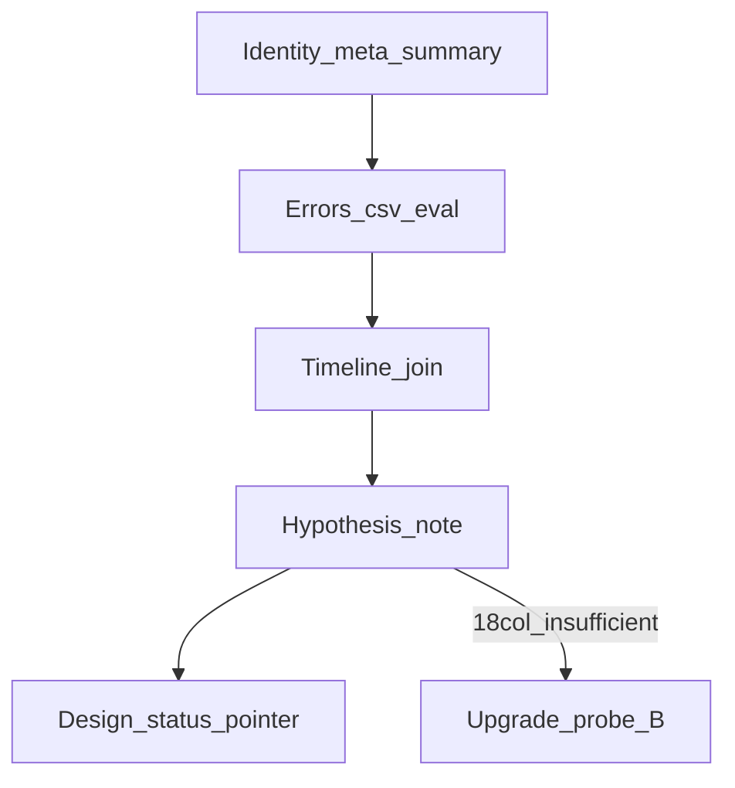

# M3.3 MH_05 诊断（④f 后）

> **For agentic workers:** REQUIRED SUB-SKILL: Use superpowers:subagent-driven-development (recommended) or superpowers:executing-plans to implement this plan task-by-task. Steps use checkbox (`- [ ]`) syntax for tracking.

**Goal:** 用现有 bench 产物解释 MH_05 在 ④f（ATE ≈3.06 m）上相对 ④b（≈3.45 m）仍未 &lt;1 m 的剩余失败形态，并给出**唯一推荐下一刀**（或明确升级探针 B）。

**Architecture:** 纯离线诊断。`phad_traj_eval --errors-csv` + 一次性 Python join `diag.csv`；不改 `phad/` / `apps/` / 默认配置。机制片编码计划在本笔记审阅后再开。

**Tech Stack:** 已有 `./build/phad_traj_eval`；会话内一次性 Python；无新依赖。

Issue：续 [#24](https://github.com/Nothand0212/phad-vio/issues/24)（称 **MH_05 诊断（④f 后）**；Part of [#23](https://github.com/Nothand0212/phad-vio/issues/23)）。

设计权威：[`docs/research/m3.3-mh05-post4f-diagnosis-design.md`](../research/m3.3-mh05-post4f-diagnosis-design.md)。

前序诊断：[`docs/research/m3.3-mh05-failure-diagnosis.md`](../research/m3.3-mh05-failure-diagnosis.md)（④b vs ④e → ④c 路径）。

对照锚：

| 锚 | 值 |
|---|---|
| ④f | `c446ac5` / `default_a5e90dc7` ATE **≈3.056878**；`drops_skipped=1` |
| ④b | `3855395` / `default_65273570` ATE **≈3.44877** |
| ④e（旁注） | `0ced28b` / `default_3a21162e` ATE **≈4.565** |

## Global Constraints

- **只读**：无 `phad/` / `apps/` / `diag.csv` 合同 / 默认配置改动；不入库长期 `scripts/`
- 临时文件放 `/tmp` 或未跟踪目录；不提交 `errors.csv` / 一次性脚本（除非另请）
- 不开 Slice ⑤；不跑全序列；不改阈值蒙混过门
- 诊断前**不预定**「去 Huber / 观测级」为结论
- 提交 subject 带 `(#24)`（本计划落库 commit 可与设计同批）
- 出口：笔记含唯一推荐刀 + 否决，或明确 B 升级清单

## 已对齐的决策

| 决策点 | 结论 |
|---|---|
| 节奏 | 先诊断 → 再选刀 |
| 深度 | 现有产物（A）；不够再升级探针 B |
| 对照 | MH_05：**④f** vs **④b**（必要时旁注 ④e） |
| 方法 | `phad_traj_eval --errors-csv` + 一次性 Python join |
| 命名 | 笔记 `m3.3-mh05-post4f-diagnosis.md`；不占 ④g |
| 票务 | 续 #24 |

## 文件地图

| 文件 | 职责 |
|---|---|
| `docs/research/m3.3-mh05-post4f-diagnosis-design.md` | 设计合同（已对齐） |
| `docs/research/m3.3-mh05-post4f-diagnosis.md` | **本片产出**诊断笔记 |
| `docs/roadmap.md` / 基线（可选一句） | 下游指针；非本片硬门 |
| 只读产物 ④f | `/home/lin/Projects/data/phad-bench/MH_05_difficult/c446ac5/default_a5e90dc7/` |
| 只读产物 ④b | `/home/lin/Projects/data/phad-bench/MH_05_difficult/3855395/default_65273570/` |
| GT | `/home/lin/Projects/data/thidparty/euroc/native/MH_05_difficult` |



---

### Task 1: 身份核对

**Files:**
- Read: ④f/④b `meta.json` / `summary.json`
- Read: [`m3.3-slice4-baseline.md`](../research/m3.3-slice4-baseline.md) §6 / §11

- [ ] **Step 1: 核对 commit / config_hash / ATE**

确认：

| 侧 | commit | hash | ATE（summary） |
|---|---|---|---|
| ④f | `c446ac5` | `a5e90dc7` | ≈3.056878 |
| ④b | `3855395` | `65273570` | ≈3.44877 |

- [ ] **Step 2: 列出相对增量键**

从两边 `meta.json` 的 `config` / `config_canonical_text` 抽出 ④b→④f 增量（含
`block_culled_rebirth`、`outlier_avg_reproj_px`、`max_outlier_reopts`、
`drop_culled_tracks`、`skip_drop_min_culled` 等）；写入笔记 §1 对照表。

**验收:** summary ATE 与基线一致；增量键表可复述。

---

### Task 2: 逐位姿 errors.csv

**Files:**
- Read: 两边 `est.tum`
- Tool: `./build/phad_traj_eval`

- [ ] **Step 1: 确保二进制存在**

```bash
cmake --build build --target phad_traj_eval
```

- [ ] **Step 2: 生成 errors.csv**

```bash
SEQ=/home/lin/Projects/data/thidparty/euroc/native/MH_05_difficult
EVAL=./build/phad_traj_eval
ROOT=/home/lin/Projects/data/phad-bench/MH_05_difficult
OUT=/tmp/mh05_post4f_diag
mkdir -p "$OUT"
$EVAL --est "$ROOT/c446ac5/default_a5e90dc7/est.tum" --gt-euroc "$SEQ" \
  --max-dt-ms 2.5 --errors-csv "$OUT/errors_4f.csv"
$EVAL --est "$ROOT/3855395/default_65273570/est.tum" --gt-euroc "$SEQ" \
  --max-dt-ms 2.5 --errors-csv "$OUT/errors_4b.csv"
```

- [ ] **Step 3: 检查 match rate**

与前序诊断同类数量级（约 2216/2268、rate≈0.977）；异常则先修关联，不硬猜。

**验收:** 两边 errors.csv 写出；match rate 正常。

---

### Task 3: 时间线 join 与事件表

**Files:**
- Read: 两边 `diag.csv`
- Scratch: `/tmp/mh05_post4f_diag/` 一次性 Python（不入库）

- [ ] **Step 1: join on timestamp_ns**

`errors.csv` ⋈ `diag.csv`；无缺失或解释缺失。

- [ ] **Step 2: 对照关注点**

比较平移误差、`reproj_rms_after(_cull)`、`outliers_culled`、`num_cheirality`、
pnp、`segment_id`、`low_connectivity`；重点：

1. i≈425 大剔 + ④f `drops_skipped` 之后；
2. 是否仍有「高 RMS / culled≈0」平台；
3. 相对 ④b 谁先分叉、谁有二次自救。

- [ ] **Step 3: 事件表**

分叉点与 cull / skip-drop 峰值帧簇，数字进笔记（不强制出图）。

**验收:** 有可引用的帧簇表支撑后续假说。

---

### Task 4: 假说检验 + 诊断笔记

**Files:**
- Create: `docs/research/m3.3-mh05-post4f-diagnosis.md`

- [ ] **Step 1: 按设计 §4 写笔记结构**

元信息 → 汇总表（含 ④f `drops_skipped`）→ 时间线/事件 → 假说表 → 结论。

- [ ] **Step 2: 假说逐条判定**

每条 **支持 / 反对 / 不足**：

| 假说 | 说明 |
|---|---|
| 末轮 Huber 遮罩 | 外点被压低但不 cull |
| mean-cull 盲区 | 高图 RMS、单点毒、culled≈0 → 观测级 / max |
| skip-drop 后仍丢二次自救 | 相对 ④b 连通性/二次大剔 |
| 前端 / PnP 外点 | 非 estimator cull |
| 其它 | 写清 |

- [ ] **Step 3: 必填结论**

- **唯一推荐下一刀** + 否决项；或  
- **升级探针 B** 清单（per-landmark mean vs max 等）— 18 列不够时**不得**硬选刀。

**验收:** 笔记可直接作为机制片对齐输入；无预定结论伪装成证据。

---

### Task 5: 设计状态与下游指针

**Files:**
- Modify: `docs/research/m3.3-mh05-post4f-diagnosis-design.md`（状态 → 已执行）
- Optional: `docs/roadmap.md` / `docs/research/m3.3-slice4-baseline.md` 一句下游指针

- [ ] **Step 1: 设计状态**

设计头改为：**已执行** — 链到诊断笔记。

- [ ] **Step 2: 可选指针**

roadmap / 基线仅加「下一刀待笔记结论」类一句；**不**扩全序列、**不**开 ⑤。

**验收:** 设计与笔记互链；本片无编码 diff。

---

## 后续（本计划外）

- 笔记审阅通过后：按结论开机制片对齐（模块边界 → 数据流 → 错误与诊断 → 验收）→ 再写编码计划。
- 候选刀（诊断前不预定）：末轮去 Huber；观测级 / max 判据；探针 B；`max_outlier_reopts` 预否决倾向；⑤ 不开。
