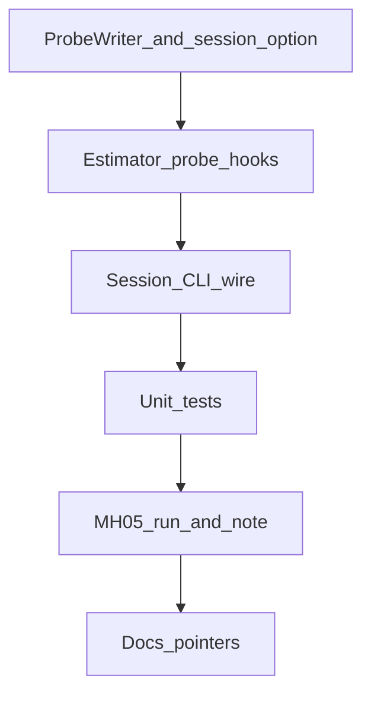

# M3.3 MH_05 探针 B

> **For agentic workers:** REQUIRED SUB-SKILL: Use superpowers:subagent-driven-development (recommended) or superpowers:executing-plans to implement this plan task-by-task. Steps use checkbox (`- [ ]`) syntax for tracking.

**Goal:** 在 MH_05 ④f 默认路径上采到 zombie×block / i=427–429 计数 / i=429 残差·位移证据，写出诊断笔记并给出唯一推荐下一刀（或明确不足）。

**Architecture:** CLI `--probe-b <path>`（不进 `config_hash`）打开旁路 `probe_b.jsonl`。Session 维护 `lifetime_culled` 并与 `FrameTracks` 求交得 zombie；estimator 在 probe 开时填充拒复生计数与残差/位移分解。默认关时 VO 与 ④f bit-identical。不改 18 列 `diag.csv`。

**Tech Stack:** 现有 C++17 / nlohmann_json（若 apps 已用）或手写最小 json 行；GTest；`phad_vo_bench`；会话 Python 汇总。

Issue：续 [#24](https://github.com/Nothand0212/phad-vio/issues/24)（称 **MH_05 探针 B**；Part of [#23](https://github.com/Nothand0212/phad-vio/issues/23)）。

设计权威：[`docs/research/m3.3-mh05-probe-b-design.md`](../research/m3.3-mh05-probe-b-design.md)。

前序：[`m3.3-mh05-post4f-diagnosis.md`](../research/m3.3-mh05-post4f-diagnosis.md)。

## Global Constraints

- 默认关：`est.tum` / `diag.csv` 相对探针前同 commit **逐字节相同**
- **不**改 `diag.csv` 18 列；**不**改 skip-drop / block / cull / Huber 默认
- `--probe-b` **不**进 `flattenConfig` / `config_hash`
- 只跑 MH_05 ④f 归因；旁注 ④b；不跑全序列；不开 ⑤
- 不预定 Huber / 观测级结论；提交 subject 带 `(#24)`
- 探针代码保留在树内（默认关）；不占 ④g
- 临时产物 `/tmp` 或不入库；一次性 Python 不强制入库

## 已对齐的决策

| 决策点 | 结论 |
|---|---|
| 深度 | 最小 instrumentation |
| 对照 | 仅 ④f；旁注 ④b |
| 覆盖 | B 清单 1–3 |
| 输出 | `probe_b.jsonl` |
| 生命周期 | 默认关，保留代码 |
| 帧窗 | 重字段 i∈[420,450] 或 culled>0 / lm≥100 / shift>0.5 |

## 文件地图

| 文件 | 职责 |
|---|---|
| `docs/research/m3.3-mh05-probe-b-design.md` | 设计合同 |
| `docs/research/m3.3-mh05-probe-b-diagnosis.md` | **本片产出**笔记 |
| `apps/offline_vo_session.hpp/.cpp` | `probe_b_path`、lifetime_culled、写行 |
| `apps/probe_b_writer.hpp/.cpp`（或同名薄文件） | jsonl 打开/写/关 |
| `apps/phad_vo_bench.cpp` / `phad_stereo_vo_probe.cpp` | `--probe-b <path>` |
| `phad/estimator/types.hpp` | 旁路 probe 字段（**不**进 diag） |
| `phad/estimator/stereo_vo_estimator.cpp` | 填 rejected_block / res / shift_top |
| `tests/apps/…` | 开关与 path 失败 |
| `phad/frontend` | **预期零改动** |



---

### Task 1: ProbeB writer + session 选项

**Files:**
- Create: `apps/probe_b_writer.hpp`, `apps/probe_b_writer.cpp`
- Modify: `apps/offline_vo_session.hpp`（加 `std::filesystem::path probe_b_path;` 默认空）
- Modify: 根 `CMakeLists.txt`（若需把新 cpp 链进 `phad_offline_vo_session`）

**Interfaces:**
- Produces: `class ProbeBWriter` with `explicit ProbeBWriter(path)`, `void write(const ProbeBFrame&)`, dtor flush/close；空 path → session 不构造
- `struct ProbeBFrame` 字段对齐设计 §4 json 草图（可用 `std::optional` 表示轻/重）

- [ ] **Step 1: 定义 `ProbeBFrame` + writer**

最小可写一行 `{"i":0,"ts_ns":0}\n`；打开失败抛或返回 error 供 session 映射为 `SessionError`。

- [ ] **Step 2: 在 `OfflineVoSessionOptions` 增加 `probe_b_path`（默认 `{}`）**

- [ ] **Step 3: 编译 `phad_offline_vo_session` 目标通过**

```bash
cmake --build build --target phad_offline_vo_session -j$(nproc)
```

- [ ] **Step 4: Commit**

```bash
git add apps/probe_b_writer.hpp apps/probe_b_writer.cpp apps/offline_vo_session.hpp CMakeLists.txt
git commit -m "$(cat <<'EOF'
feat(apps): add ProbeB jsonl writer and session path option (#24)

EOF
)"
```

---

### Task 2: Estimator 探针钩子

**Files:**
- Modify: `phad/estimator/types.hpp` — `UpdateDiagnostics` 增加旁路字段（**注释写明不进 diag.csv**），例如：

```cpp
std::uint32_t probe_rejected_block_n = 0;
std::uint32_t probe_new_lm_n         = 0;
// 仅当调用方请求 probe 细节时填充；默认保持 0/空
std::vector<std::pair<std::uint64_t, double>> probe_shift_top;  // key, |Δt|
double        probe_res_mean_px = 0.0;
double        probe_res_max_px  = 0.0;
LandmarkId    probe_res_max_id{};
bool          probe_detail_valid = false;
```

- Modify: `phad/estimator/stereo_vo_estimator.hpp/.cpp`
- Modify: `phad/estimator/types.hpp` `EstimatorOptions` 增加 `bool enable_probe_b = false;`（仅 session 在 path 非空时置 true；**不**进 bench flattenConfig）

**Interfaces:**
- Consumes: 现有 `culled_ids_` 拒绝分支（`seedSegment` / new-landmark backproject 的 `continue`）
- Produces: 上述 diagnostics 字段；`enable_probe_b==false` 时零额外分配（不填 `probe_shift_top`）

- [ ] **Step 1: 在两处 `block_culled_rebirth` 跳过处 `++probe_rejected_block_n`**

- [ ] **Step 2: 统计本帧新成功 backproject 的 landmark 数 → `probe_new_lm_n`**

- [ ] **Step 3: 当 `enable_probe_b`：在已有 `max_window_pose_shift_m` 计算处保留 top-K（K=3）`(symbol_index, dt_m)`**

- [ ] **Step 4: 当 `enable_probe_b`：对当前窗口观测算 per-landmark 平均重投影，填 mean/max/max_id；`probe_detail_valid=true`**

复用现有 stereo reproj 工具函数；若只在最终 values 上算一次即可（与 `reproj_rms_after_*` 同快照）。

- [ ] **Step 5: 现有 estimator 单测全绿**

```bash
ctest --test-dir build -R 'estimator|stereo_vo' --output-on-failure
```

- [ ] **Step 6: Commit**

```bash
git commit -m "$(cat <<'EOF'
feat(estimator): fill optional ProbeB diagnostics behind enable_probe_b (#24)

EOF
)"
```

---

### Task 3: Session 编排 + CLI

**Files:**
- Modify: `apps/offline_vo_session.cpp`
- Modify: `apps/phad_vo_bench.cpp`
- Modify: `apps/phad_stereo_vo_probe.cpp`（若仍暴露同等会话选项）
- Modify: `apps/AGENTS.md`（一行：`--probe-b` CLI-only，不进 hash，不改 diag）

**Interfaces:**
- Consumes: Task 1 writer；Task 2 diagnostics；`FrameTracks::observations`
- Produces: 每帧条件 `ProbeBFrame`；`lifetime_culled` 跨帧集合

- [ ] **Step 1: session 开头若 `!probe_b_path.empty()`：构造 writer；`estimator` options.`enable_probe_b=true`**

打开失败 → `SessionError` 立即返回。

- [ ] **Step 2: 每帧 `process` 后算 `zombie_track_n`**

```cpp
std::uint32_t zombie = 0;
for (const auto& obs : tracks.observations) {
  if (lifetime_culled.count(obs.id)) ++zombie;
}
```

- [ ] **Step 3: `update` 后：`lifetime_culled.insert` 本帧 `culled_landmark_ids`；组装 `ProbeBFrame`；按窗/触发写行**

`i` = `image_frames` 写入前的索引（与 diag 行序一致：0-based 已处理帧号）。  
`drops_skipped_this_frame` 与现有 skip 分支一致。

- [ ] **Step 4: CLI 解析 `--probe-b <path>` → `session_options.probe_b_path`；usage 一行**

**不要**写入 `flattenConfig`。

- [ ] **Step 5: 构建 bench + probe**

```bash
cmake --build build --target phad_vo_bench phad_stereo_vo_probe -j$(nproc)
```

- [ ] **Step 6: Commit**

```bash
git commit -m "$(cat <<'EOF'
feat(apps): wire --probe-b jsonl through OfflineVoSession (#24)

EOF
)"
```

---

### Task 4: 单元测试

**Files:**
- Modify or Create: `tests/apps/offline_vo_session_test.cpp`（或新 `probe_b_test.cpp`）
- Modify: `tests/apps/phad_vo_bench_cli_test.cpp`（usage / 解析 smoke，若有统一 CLI 测）

- [ ] **Step 1: 测试 probe path 空 → 不创建文件（可用临时目录断言无 `probe_b.jsonl`）**

- [ ] **Step 2: 测试合法 path + 短序列/`max_frames` → 文件存在且至少 1 行合法 JSON**

- [ ] **Step 3: 测试非法父目录 / 不可写 path → session 失败**

- [ ] **Step 4: 断言既有 diag 列数测试未改（18）**

```bash
ctest --test-dir build -R 'offline_vo_session|phad_vo_bench_cli' --output-on-failure
```

- [ ] **Step 5: Commit**

```bash
git commit -m "$(cat <<'EOF'
test(apps): cover ProbeB enable/disable and bad path (#24)

EOF
)"
```

---

### Task 5: MH_05 归因跑 + 诊断笔记

**Files:**
- Create: `docs/research/m3.3-mh05-probe-b-diagnosis.md`
- Scratch: `/tmp/mh05_probe_b/`（不入库）

- [ ] **Step 1: 开关关对拍（短跑或全长，按墙钟选）**

同 commit、无 `--probe-b`，对拍 `diag.csv`/`est.tum` 与探针前参考（或两次连续默认跑 diff）。必须 identical。

- [ ] **Step 2: 归因跑**

```bash
SEQ=/home/lin/Projects/data/thidparty/euroc/native/MH_05_difficult
OUT=/tmp/mh05_probe_b
mkdir -p "$OUT"
./build/phad_vo_bench "$SEQ" \
  --bench-root "$OUT" --config-label probe_b \
  --probe-b "$OUT/probe_b.jsonl"
# 或 probe CLI 等价选项；确保默认 estimator/session 与 ④f 一致
```

确认 jsonl 含 i=425 与 i=429 重字段行。

- [ ] **Step 3: 一次性 Python 汇总**（不入库）

聚焦：425 cull ids → 426–450 zombie / rejected_block；427–429 new_lm/shared/zombie；429 shift_top + res_max。

- [ ] **Step 4: 写笔记**（结构）

1. 元信息 / 命令 / 身份  
2. §1 zombie×block 表  
3. §2 i=427–429 计数表  
4. §3 i=429 位移与残差  
5. 假说判定（支持/反对/不足）  
6. **唯一推荐下一刀 + 否决**（或「仍不足」清单）  
旁注 ④b 用 [`m3.3-mh05-post4f-diagnosis.md`](../research/m3.3-mh05-post4f-diagnosis.md) 数字，不复跑。

- [ ] **Step 5: Commit 笔记（勿提交 `/tmp` 产物）**

```bash
git add docs/research/m3.3-mh05-probe-b-diagnosis.md
git commit -m "$(cat <<'EOF'
docs(m3.3): record MH_05 Probe B diagnosis (#24)

EOF
)"
```

---

### Task 6: 设计状态与下游指针

**Files:**
- Modify: `docs/research/m3.3-mh05-probe-b-design.md`（状态 → **已执行**，链笔记）
- Modify: `docs/research/m3.3-mh05-post4f-diagnosis.md` §6 下游一句
- Modify: `docs/roadmap.md` / `docs/research/m3.3-slice4-baseline.md` §11.5 / `AGENTS.md` — 下一刀改为笔记结论（替换「升级探针 B」占位）

- [ ] **Step 1: 互链与状态**

- [ ] **Step 2: Commit**

```bash
git commit -m "$(cat <<'EOF'
docs(m3.3): point roadmap to Probe B diagnosis exit (#24)

EOF
)"
```

---

## 后续（本计划外）

- 笔记审阅通过 → 机制片对齐 → ④g+ 编码计划  
- 清单第 4 项（局部尺度）仅当 1–3 仍不足以选刀时再开  
- 探针代码清理或收编正式 diag：机制片之后另议

## 验收总表

| 项 | 标准 |
|---|---|
| 默认关 bit-identical | PASS |
| diag 18 列 | PASS |
| jsonl 覆盖 425/429 | PASS |
| 笔记唯一出口 | 有推荐刀+否决，或明确不足 |
| 无全序列 / 无 ⑤ / 无默认阈值改动 | PASS |
