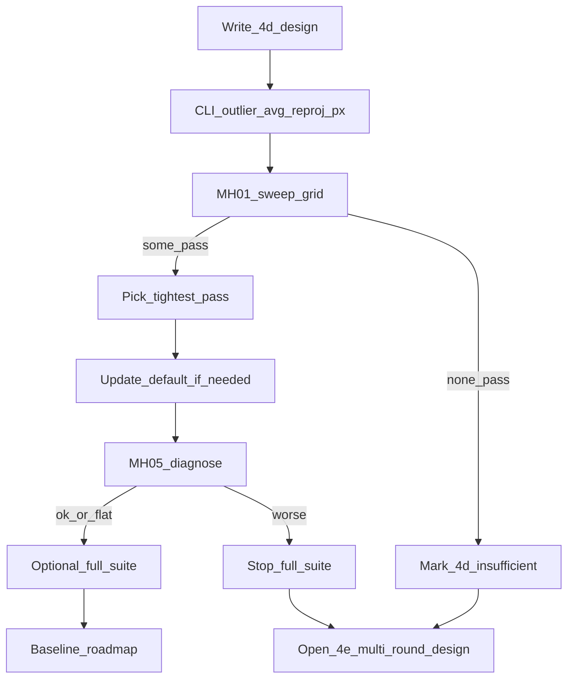

# M3.3 Slice ④d Mean-cull 阈值片

> **For agentic workers:** REQUIRED SUB-SKILL: Use superpowers:subagent-driven-development (recommended) or superpowers:executing-plans to implement this plan task-by-task.

**Goal:** 在保持 ④c 机制（`block_culled_rebirth` + `dropTracks`）不变的前提下，用可控阈值 A/B 把 MH_01 ATE 拉回 ≤ **0.099263** m，再判断 MH_05 是否相对 ④b/④c 可接受。

**Architecture:** 不改 cull 算法形态；唯一旋钮是已有的 `EstimatorOptions::outlier_avg_reproj_px`（默认 3.0，已进 `flattenConfig` / `config_hash`）。本片补 CLI 注入以便扫参，按门控选定新默认（或判定不够）。**不做**多轮 cull↔LM、ORB 去 Huber、改 `n_factors < 4` 硬编码、拆 `TrackId≠LandmarkId`、关键帧（⑤）。

**Tech Stack:** 既有 C++20 / GTSAM / GTest / `phad_vo_bench`；无新依赖。

Issue：续 [#24](https://github.com/Nothand0212/phad-vio/issues/24)（称 Slice ④d；Part of [#23](https://github.com/Nothand0212/phad-vio/issues/23)）。

对照锚：

- MH_01 硬锚：Slice ③ / `no_cull` **0.099263** m，`seg/re=1/0`
- ④c tip：`de32bd7` / `default_9da4ccd2` — MH_01 ATE **0.120247**；MH_05 ATE **4.565**
- ④b MH_05：`3855395` / `default_65273570` — ATE **3.449** m（软对照上界）

## Global Constraints

- 命名/风格：`docs/agents/cpp-naming.md`、`docs/agents/cpp-style.md`
- 不新增库；不改 `phad::eval`；`diag.csv` 仍 **18** 列
- **禁止**为过门放宽后仍用文档话术掩盖：候选必须有 bench 数字
- 硬编码 `n_factors < 4`（mean-cull 跳过）本片**不动**（留给不够时的 ④e / 另键）
- Slice ⑤ 仍暂停，直至本片 MH_01 硬门通过（或明确标 ④d 不够并开 ④e）
- 提交 subject 带 `(#24)`；短生命周期分支（续 `m3.3` 或新建 `m3.3-slice4d`）
- **出口顺序**：设计对齐 → CLI/契约 → **MH_01 扫参硬门** → **MH_05 诊断** → 条件全序列 / 改定默认 → roadmap

## 已对齐的决策

| 决策点 | 结论 |
|---|---|
| 顺序 | **先 A（本片阈值）后 B（④e 多轮 LM）**；B 不进本 todos |
| 旋钮 | 仅 `outlier_avg_reproj_px` |
| 扫参网格（MH_01） | `{3.0, 3.5, 4.0, 5.0, 6.0}`（3.0=④c 对照；放宽方向优先，因疑删过猛） |
| 选默认规则 | 在通过 MH_01 硬门（ATE≤0.099263、seg/re=1/0、failed 不构成吸收态）的候选中，选 **最小**（最紧）阈值，保留尽量强的剔点 |
| 若无一过 MH_01 | ④d **不够**；默认保持 3.0；**不开**全序列；开 ④e 设计（多轮 cull↔LM），不改 ⑤ |
| MH_05 | MH_01 选定候选后只跑该默认；软判定：不劣于 ④c 4.565，且尽量接近/优于 ④b 3.449；**不**硬门 &lt;1 m；若相对 ④c 明显恶化（ATE↑或 completion/failed 崩）→ 停全序列，记录后进 ④e 讨论 |
| CLI | `phad_vo_bench` 增加 `--outlier-avg-reproj-px <float>`（覆盖默认；进 session options → hash） |
| 代码默认 | 仅当选中候选 ≠ 3.0 时改 `EstimatorOptions` 默认并更新单测/文档 |

## 文件地图

| 文件 | 职责 |
|---|---|
| [docs/research/m3.3-slice4d-cull-threshold-design.md](../research/m3.3-slice4d-cull-threshold-design.md) | 新建：目标/非目标、扫参协议、门控、与 ④e 边界 |
| [apps/phad_vo_bench.cpp](../../apps/phad_vo_bench.cpp) | `--outlier-avg-reproj-px` 解析与注入 |
| [phad/estimator/types.hpp](../../phad/estimator/types.hpp) | 可能改定 `outlier_avg_reproj_px` 默认 |
| [tests/apps/](../../tests/apps/) / [tests/bench/](../../tests/bench/) | CLI/契约：新 flag 改变 hash；非法值拒收 |
| [docs/research/m3.3-slice4-baseline.md](../research/m3.3-slice4-baseline.md) | 新增 §9 ④d 扫参表 + 选定默认 run |
| [docs/roadmap.md](../roadmap.md)、父设计链 | 状态：④d / ⑤ 暂停条件 |



---

### Task 1: 设计稿对齐并落盘

**Files:** Create `docs/research/m3.3-slice4d-cull-threshold-design.md`；链到 roadmap / ④c 设计 / 基线。

- [ ] 写清唯一目标、非目标（含「不做 ORB 多轮」「不动 n_factors&lt;4」）
- [ ] 写扫参网格、选默认规则、MH_01/MH_05 门控、不够→④e
- [ ] 用户确认设计稿后才进 Task 2（本仓库里程碑对齐习惯）

### Task 2: CLI + 契约（编码最小片）

**Files:** `apps/phad_vo_bench.cpp`；相关 apps/bench 测试；必要时 README 一行。

- [ ] 增加 `--outlier-avg-reproj-px <float>`；解析后写入 `session_options.estimator.outlier_avg_reproj_px`
- [ ] 非法值（≤0）与构造校验一致：失败则非 0 退出 / 明确错误（对齐既有 `outlier_avg_reproj_px > 0`）
- [ ] 契约：带 flag 的 run `config_hash` ≠ 默认 `9da4ccd2`；`meta.json` / canonical text 含新值
- [ ] 单测或现有 parse 测试覆盖 flag
- [ ] Commit：`feat(apps): allow outlier_avg_reproj_px override for cull sweep (#24)`

### Task 3: MH_01 扫参硬门

**Files:** 更新 `docs/research/m3.3-slice4-baseline.md` §9（表格）；不改默认直到本任务结束判定。

对网格每个 `T ∈ {3.0, 3.5, 4.0, 5.0, 6.0}`：

```bash
# 示例：T=4.0 → 独立 config_hash 目录
cmake --build build -j"$(nproc)" --target phad_vo_bench
# phad_vo_bench … --outlier-avg-reproj-px 4.0
# 记录 ATE / seg / re / failed / outliers_culled / completion
```

- [ ] 填扫参表（含 3.0=④c 复现对照，允许数值噪声）
- [ ] 应用选默认规则；若无一过门 → 标 **不够**，跳过 Task 4–5 的「改定默认/全序列」，直接 Task 6 文档收口 + ④e 边界
- [ ] 若有过门候选：记下选定 `T*` 与完整 `config_hash` / commit

### Task 4: 改定默认（仅当 T* ≠ 3.0）+ MH_05 诊断

**Files:** `phad/estimator/types.hpp`；依赖默认的单测期望；`phad/estimator/README.md` 若写了默认值。

- [ ] 将默认改为 `T*`；全量相关单测绿
- [ ] 默认 config 跑 MH_05；对照 ④b 3.449 / ④c 4.565
- [ ] 软判定：可进全序列 / 停全序列（见决策表）
- [ ] Commit：`fix(estimator): raise outlier_avg_reproj_px default to <T*> (#24)`（若未改默认则本 commit 省略）

### Task 5: 条件全序列 + 基线收口

- [ ] 仅当 MH_01 硬门过且 MH_05 软判定未停：跑其余 EuRoC；ATE 只记录；`reanchors` 健康序列不增为观察项
- [ ] 基线 §9 写选定身份（commit / hash / `config_canonical_text` 增量键：仅当默认变化）
- [ ] Commit：`docs(m3.3): record slice-4d cull threshold baseline (#24)`

### Task 6: roadmap / 父设计 / ⑤ 门控更新

- [ ] [`docs/roadmap.md`](../roadmap.md) M3.3：④d 状态（够/不够）；⑤ 暂停条件更新为「④d MH_01 硬门或 ④e…」
- [ ] 链 ④d 设计与计划；父设计 [`m3.3-vo-hardening-design.md`](../research/m3.3-vo-hardening-design.md) 一行
- [ ] **后续切片概要（非本片实现）④e**：若 ④d 不够或 MH_05 仍差——ORB 式多轮（cull↔LM 或观测级可翻转外点 + 可选去 Huber）；开工前单独设计+开源对照；仍不做 ⑤

## 验收摘要

| 门 | 标准 |
|---|---|
| MH_01 | ATE ≤ 0.099263；seg/re=1/0；无吸收态 failed |
| 默认选择 | 过门候选中最小 `outlier_avg_reproj_px` |
| MH_05 | 诊断；不硬门 &lt;1 m；恶化则停全序列 |
| 不够 | 默认保持 3.0；文档标不够；下一片 ④e 而非 ⑤ |
