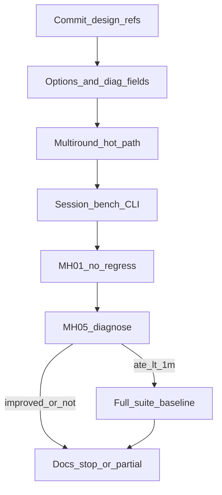

# M3.3 Slice ④e 多轮 cull↔LM

> **For agentic workers:** REQUIRED SUB-SKILL: Use superpowers:subagent-driven-development (recommended) or superpowers:executing-plans to implement this plan task-by-task. Steps use checkbox (`- [ ]`) syntax for tracking.

**Goal:** 将 ④b 单次「cull→LM₂」扩展为有界多轮永久 mean-cull ↔ rebuild+LM，在不破坏 MH_01（④d 锚）的前提下压低 MH_05 / 发散债。

**Architecture:** 只改 `StereoVoEstimator::update` 在 LM₁ 写回之后的后缀：把一次性 LM₂ 换成 `while`（`enable_outlier_reopt && rounds < max_outlier_reopts && culled_round >= 4`）。每轮成功 LM 后用**该轮** graph+values 再跑 cheirality+mean-cull。诊断经 session→bench；`diag.csv` 仍 18 列。

**Tech Stack:** C++20、GTSAM `LevenbergMarquardtOptimizer`、GTest、`phad_vo_bench`。

Issue：[#24](https://github.com/Nothand0212/phad-vio/issues/24)（续；称 Slice ④e；Part of [#23](https://github.com/Nothand0212/phad-vio/issues/23)）。  
设计：[m3.3-slice4e-multiround-reopt-design.md](../research/m3.3-slice4e-multiround-reopt-design.md)  
开源对照：[m3.3-slice4e-multiround-open-source-refs.md](../research/m3.3-slice4e-multiround-open-source-refs.md)  
对照锚：④d `79505f8` / `default_85c97158`（MH_01 ATE **0.098784**；MH_05 **4.565**）。

## Global Constraints

- 命名/风格：`docs/agents/cpp-naming.md`、`docs/agents/cpp-style.md`（Allman、2 空格、`m_`）
- 不新增库；不改 `phad::frontend` / `phad::eval`；公开头不暴露 GTSAM
- **不**观测级可翻转外点；**不**去 Huber；**不**改 `outlier_avg_reproj_px` 默认 4.0
- 触发仍硬编码 `culled_round >= 4`；mean-cull `n_factors < 4` 跳过不动
- `diag.csv` 仍 **18** 列；Slice ⑤ 不开
- 提交 subject 带 `(#24)`；分支 `m3.3-slice4e`；合入 `main` 必须 `--no-ff`
- **出口顺序**：编码 → **MH_01** → **MH_05 诊断** → 条件全序列 / 文档

## 已对齐的决策

| 决策点 | 结论 |
|---|---|
| 形态 | 多轮永久 mean-cull ↔ rebuild+LM |
| `max_outlier_reopts` | 默认 **3**；`≥0`；进 hash；CLI |
| `enable_outlier_reopt` | 保留；`false` 忽略 max；`max=0` 同效不重优 |
| 复现 ④b | `enable=true` + `max=1` |
| 每轮清理 | cheirality + mean-cull（用**该轮** graph+values） |
| 达顶 | 第 N 次 LM 后仍 cull；若仍 `≥4` 不再 LM |
| summary | `outlier_reopts` = Σ `outlier_reopt_rounds`（**次数**） |
| MH_01 | ATE ≤ **0.098784**；seg/re=1/0 |
| MH_05 | 软：相对 4.565 改善；硬方向 &lt;1 m；未达停全序列 |

## 文件地图

| 文件 | 职责 |
|---|---|
| `docs/research/m3.3-slice4e-multiround-*.md` | 设计 + 开源对照（已写） |
| `phad/estimator/types.hpp` | `max_outlier_reopts`；`outlier_reopt_rounds` |
| `phad/estimator/stereo_vo_estimator.cpp` | 校验；有界循环；cull helper |
| `phad/estimator/README.md` | 多轮语义、summary 次数、diag 18 |
| `tests/estimator/stereo_vo_outlier_reopt_test.cpp` | 多轮/max/达顶 cull；改掉 `NoSecondCullAfterLm2` |
| `apps/offline_vo_session.cpp` | `counts.outlier_reopts += rounds` |
| `apps/phad_vo_bench.cpp` | `flattenConfig` + `--max-outlier-reopts` |
| `phad/bench/run_summary.{hpp,cpp}` | 字段注释：次数语义 |
| `tests/apps/`、`tests/bench/` | CLI/hash/diag 18 |
| `apps/AGENTS.md`、相关 README | 合同一句 |
| `docs/research/m3.3-slice4-baseline.md` | §10 ④e |
| `docs/roadmap.md`、父设计 §8 | 状态链 |



---

### Task 1: 提交设计 / 开源对照

**Files:**  
`docs/research/m3.3-slice4e-multiround-reopt-design.md`  
`docs/research/m3.3-slice4e-multiround-open-source-refs.md`  
（本计划文件可同 commit 或下一 commit）

- [ ] **Step 1: 确认工作区仅含预期文档**（勿把无关 `AGENTS.md` 脏改带进本 commit）

```bash
git status -sb
git diff --stat
```

- [ ] **Step 2: Commit**

```bash
git add docs/research/m3.3-slice4e-multiround-reopt-design.md \
  docs/research/m3.3-slice4e-multiround-open-source-refs.md \
  docs/plans/2026-08-02_m3.3_slice4e_multiround_reopt_e0517b9a.plan.md
git commit -m "$(cat <<'EOF'
docs(m3.3): align slice-4e multiround reopt design (#24)

EOF
)"
```

---

### Task 2: 选项 / 诊断字段 + 构造校验

**Files:**
- Modify: `phad/estimator/types.hpp`
- Modify: `phad/estimator/stereo_vo_estimator.cpp`（构造校验，约 L325 附近）
- Modify: `tests/estimator/stereo_vo_outlier_reopt_test.cpp`

**Interfaces:**
- Produces: `EstimatorOptions::max_outlier_reopts`（`int`，默认 `3`，须 `≥ 0`）
- Produces: `UpdateDiagnostics::outlier_reopt_rounds`（`std::uint32_t`，默认 `0`）
- `outlier_reopt == (outlier_reopt_rounds > 0)`（热路径任务保证；本任务先加字段）

- [ ] **Step 1: 写失败单测**

```cpp
TEST( StereoVoOutlierReoptTest, DefaultsMaxReoptsThreeAndRoundsZero )
{
  EstimatorOptions options;
  EXPECT_EQ( options.max_outlier_reopts, 3 );
  UpdateDiagnostics d;
  EXPECT_EQ( d.outlier_reopt_rounds, 0U );
}

TEST( StereoVoOutlierReoptTest, RejectsNegativeMaxOutlierReopts )
{
  EstimatorOptions options;
  options.max_outlier_reopts = -1;
  EXPECT_THROW( StereoVoEstimator( makeCalibration(), options ),
                std::invalid_argument );
}
```

- [ ] **Step 2: 跑测确认失败**

```bash
cmake -S . -B build -DCMAKE_EXPORT_COMPILE_COMMANDS=ON
cmake --build build --target phad_estimator_tests -j"$(nproc)"
./build/phad_estimator_tests --gtest_filter='StereoVoOutlierReoptTest.DefaultsMaxReoptsThree*:StereoVoOutlierReoptTest.RejectsNegative*'
```

Expected: 缺字段 / 无校验 → FAIL。

- [ ] **Step 3: 加字段与校验**

`types.hpp`（紧挨 `enable_outlier_reopt`）：

```cpp
bool enable_outlier_reopt = true;  // false → 只 cull
int  max_outlier_reopts   = 3;     // ≥0；0 → 不重优；进 flattenConfig
```

`UpdateDiagnostics`：

```cpp
bool          outlier_reopt         = false;  // rounds > 0
bool          outlier_reopt_failed  = false;
std::uint32_t outlier_reopt_rounds  = 0;      // 不进 diag.csv
```

构造校验（与 `outlier_avg_reproj_px` 同段）：

```cpp
if ( options.max_outlier_reopts < 0 )
{
  throw std::invalid_argument(
      "EstimatorOptions.max_outlier_reopts must be >= 0" );
}
```

**本步不改 LM₂ 循环。**

- [ ] **Step 4: 单测绿 + commit**

```bash
./build/phad_estimator_tests --gtest_filter='StereoVoOutlierReoptTest.*'
git add phad/estimator/types.hpp phad/estimator/stereo_vo_estimator.cpp \
  tests/estimator/stereo_vo_outlier_reopt_test.cpp
git commit -m "$(cat <<'EOF'
feat(estimator): add max_outlier_reopts and reopt_rounds fields (#24)

EOF
)"
```

---

### Task 3: 多轮热路径 + estimator 单测

**Files:**
- Modify: `phad/estimator/stereo_vo_estimator.cpp`（约 L1100–1252：cull + 单次 LM₂ → 循环）
- Modify: `tests/estimator/stereo_vo_outlier_reopt_test.cpp`
- Modify: `phad/estimator/README.md`（多轮语义一段）

**关键实现约束（必读）：**

1. 每轮 mean-cull / cheirality 必须使用**该趟 LM 的** `graph` + `optimized` values，禁止用 LM₁ 的旧图去评 LM₂ 后的状态。
2. 建议在 `Impl` 内抽局部 lambda / private helper，例如：

```cpp
// Returns culled_round (mean-cull count this pass; cheirality ids also
// appended to frame_culled but do not count toward reopt trigger — same as
// today: outliers_culled is mean-cull only).
std::uint32_t runCheiralityAndMeanCull(
    const gtsam::Values& optimized,
    gtsam::NonlinearFactorGraph& graph_for_scoring,
    std::vector<LandmarkId>& frame_culled,
    std::uint32_t& outliers_culled_total,
    std::uint32_t& outliers_culled_unique_total );
```

（cheirality 今日不经过 `enable_outlier_cull`；mean-cull 仍受该开关控制——保持现状。）

3. 循环骨架（写在 LM₁ 写回、首次 `reproj_after` 语义保持之后）：

```cpp
std::uint32_t outliers_culled        = 0;
std::uint32_t outliers_culled_unique = 0;
std::uint32_t culled_round =
    runCheiralityAndMeanCull( optimized, graph, frame_culled,
                              outliers_culled, outliers_culled_unique );
// reproj_after: keep current contract (full-graph RMS on LM₁ graph/values)
result.diagnostics.reproj_rms_after_px = stereoReprojRms( graph, optimized );
double after_cull = /* Slice ④ skip-missing or == after */;

std::uint32_t rounds              = 0;
bool          outlier_reopt_failed = false;
gtsam::Values last_reopt_values;  // for after_cull when rounds>0
gtsam::NonlinearFactorGraph last_reopt_graph;

while ( m_impl->options.enable_outlier_reopt &&
        rounds < static_cast<std::uint32_t>( m_impl->options.max_outlier_reopts ) &&
        culled_round >= 4U )
{
  const auto window_snap    = m_impl->window;
  const auto landmarks_snap = m_impl->landmarks_W;

  gtsam::NonlinearFactorGraph g_r;
  gtsam::Values               v_r;
  std::uint64_t               prior_key_r = 0;
  std::uint32_t               n_lm_r      = 0;
  m_impl->buildGraph( g_r, v_r, prior_key_r, n_lm_r );

  try
  {
    gtsam::LevenbergMarquardtOptimizer opt( g_r, v_r );
    const gtsam::Values optimized_r = opt.optimize();
    // validate finite poses/landmarks; write back window + landmarks_W
    // (same checks as current LM₂ block)
    result.diagnostics.lm_iterations +=
        static_cast<std::uint32_t>( opt.iterations() );
    ++rounds;
    last_reopt_graph  = g_r;
    last_reopt_values = optimized_r;
    after_cull        = stereoReprojRms( g_r, optimized_r );
    culled_round      = runCheiralityAndMeanCull(
        optimized_r, g_r, frame_culled, outliers_culled,
        outliers_culled_unique );
  }
  catch ( ... )
  {
    m_impl->window      = window_snap;
    m_impl->landmarks_W = landmarks_snap;
    outlier_reopt_failed = true;
    break;
  }
}

result.diagnostics.outliers_culled        = outliers_culled;
result.diagnostics.outliers_culled_unique = outliers_culled_unique;
result.diagnostics.outlier_reopt_rounds   = rounds;
result.diagnostics.outlier_reopt          = ( rounds > 0U );
result.diagnostics.outlier_reopt_failed   = outlier_reopt_failed;
result.diagnostics.reproj_rms_after_cull_px = after_cull;
```

4. **删除/替换** `NoSecondCullAfterLm2`：④e **允许**重优后再 cull。

- [ ] **Step 1: 改/增单测（先红）**

- 既有 `ReoptsWhenAtLeastFourCulled`：断言 `outlier_reopt_rounds == 1`（单波毒点）；可选显式 `max_outlier_reopts = 3`（默认即可）。
- 新增 `MaxZeroSkipsReopt`：`max_outlier_reopts = 0`，毒 4 点 → `rounds==0`、`outlier_reopt==false`。
- 新增 `MaxOneCapsReoptRounds`：`max=1`，毒 4+ → `rounds==1`（即使理论上还能再 cull）。
- **替换** `NoSecondCullAfterLm2` → `CullsAfterReoptLm`：`max=1`，毒 ≥4；重优开时允许 `outliers_culled` **≥** reopt-off 对照（达顶后再 cull）；若合成场景第二波为 0，至少断言 `rounds==1` 且重优后仍 `kOk`。
- `Lm2FailureFallsBackToLm1Cull`：保持失败→`kOk`/`failed`；若曾成功 rounds>0 再失败，保留前序（本片合成可能仍只有一轮失败）。
- **说明：** 合成场景常在一轮内剔光毒点，`rounds≥2` 不作为单测硬门；多轮有效性以 Task 6 MH_05 的 `outlier_reopts`（次数）与大剔帧 `lm_iterations` 为证。

- [ ] **Step 2: 跑测确认新断言失败 / 旧 `NoSecondCull` 语义冲突**

```bash
cmake --build build --target phad_estimator_tests -j"$(nproc)"
./build/phad_estimator_tests --gtest_filter='StereoVoOutlierReoptTest.*'
```

- [ ] **Step 3: 实现循环；更新 README**

- [ ] **Step 4: 全 estimator 单测绿**

```bash
./build/phad_estimator_tests --gtest_filter='StereoVoOutlier*Test.*'
ctest --test-dir build -L unit --output-on-failure
```

（若全量 unit 过慢，至少 `phad_estimator_tests` 全绿。）

- [ ] **Step 5: Commit**

```bash
git commit -m "$(cat <<'EOF'
feat(estimator): multi-round outlier cull and reopt loop (#24)

EOF
)"
```

---

### Task 4: session / bench / CLI / 契约

**Files:**
- Modify: `apps/offline_vo_session.cpp`（约 L245：按帧布尔 +1 → 加 `rounds`）
- Modify: `apps/phad_vo_bench.cpp`（`flattenConfig`、CLI、usage）
- Modify: `phad/bench/run_summary.hpp`（注释：次数）
- Modify: `tests/apps/`、`tests/bench/`（hash / 非法 CLI / summary）
- Modify: `apps/AGENTS.md`、`phad/bench/README.md`、`phad/estimator/README.md` 若需

**Interfaces:**
- `FrameCounts.outlier_reopts` 语义：累计成功重优**次数**
- CLI：`--max-outlier-reopts <int>`，`≥0`；非法非 0 退出
- `flattenConfig`：`estimator.max_outlier_reopts`

- [ ] **Step 1: session 累加**

```cpp
// offline_vo_session.cpp — replace bool increment
result.counts.outlier_reopts += d.outlier_reopt_rounds;
```

- [ ] **Step 2: CLI + flattenConfig**

对齐既有 `--outlier-avg-reproj-px` 模式：

```text
--max-outlier-reopts <int>   # ≥ 0；写入 session_options.estimator.max_outlier_reopts
```

`flattenConfig`：

```cpp
snap.set( "estimator.max_outlier_reopts", estimator.max_outlier_reopts );
```

默认跑将产生**新** `config_hash`（相对 `85c97158` 增量键
`estimator.max_outlier_reopts=3`）。

- [ ] **Step 3: 契约测试**

- diag 仍 18 列
- 带 `--max-outlier-reopts 1` 的 hash ≠ 默认
- `max_outlier_reopts=-1` → 非 0 退出
- bench summary 含 `outlier_reopts`（次数语义在测试注释写明）

```bash
cmake --build build --target phad_apps_tests phad_bench_tests -j"$(nproc)"
./build/phad_apps_tests --gtest_filter='*Outlier*:*Bench*:*Diag*:*Config*'
./build/phad_bench_tests
```

- [ ] **Step 4: Commit**

```bash
git commit -m "$(cat <<'EOF'
feat(apps): wire max_outlier_reopts and count reopt rounds (#24)

EOF
)"
```

---

### Task 5: MH_01 不回归门

**对照：** `79505f8` / `default_85c97158`，ATE **0.098784**。

```bash
cmake --build build -j"$(nproc)" --target phad_vo_bench
# 默认 config（含 max_outlier_reopts=3）跑完整 MH_01_easy
# 记录：ATE、seg/re、failed、outliers_culled、outlier_reopts、config_hash
```

- [ ] ATE ≤ **0.098784**；`segments=1`、`reanchors=0`、`failed=0`
- [ ] 失败 → **停**，先查回归（可临时 ` --max-outlier-reopts 1` 对照是否回到 ④d 行为）再改代码；不进 MH_05 装过门
- [ ] 通过则记下新 `default_<hash>` 身份，供 Task 6/7 使用

无单独 commit（数字进后续 docs commit）；若仅修回归 bug 则 `fix(estimator): … (#24)`。

---

### Task 6: MH_05 诊断门

```bash
# 同一 commit / 默认 hash 跑 MH_05_difficult
```

| 判定 | 标准 | 动作 |
|---|---|---|
| 有效 | ATE 相对 **4.565** 明显下降（且 completion/failed 不崩） | 记「有效」 |
| 硬够 | ATE **&lt; 1 m** | 可进 Task 7 全序列 |
| 有效但不够 | 有改善但 ≥1 m | **停全序列**；基线写部分完成 |
| 无效/恶化 | ATE≥4.565 或健康崩 | 停；讨论去 Huber / 其它续片，不改 T 蒙混 |

附加记录：`outlier_reopts`（次数）、是否出现 `reopt_rounds>1` 的帧（probe/session diagnostics）、大剔帧 `reproj_after_cull`。

- [ ] 按上表判定；写进基线草稿要点（正式落盘在 Task 7）

---

### Task 7: 条件全序列 + 基线 §10 + roadmap

- [ ] **仅** Task 6「硬够」（&lt;1 m）或用户明示放行时跑其余 EuRoC；否则跳过
- [ ] 更新 [`m3.3-slice4-baseline.md`](../research/m3.3-slice4-baseline.md) **§10**：身份（commit / `config_hash` / `config_canonical_text` 增量键 `max_outlier_reopts`）、MH_01/05 表、全序列或「未跑」原因、`outlier_reopts` 次数语义说明
- [ ] [`docs/roadmap.md`](../roadmap.md) M3.3：④e 状态；链设计/计划；⑤ 仍「先 ④e / 单独对齐」
- [ ] 父设计 [`m3.3-vo-hardening-design.md`](../research/m3.3-vo-hardening-design.md) §8 一行
- [ ] 设计稿状态改为已编码 / 够或不够
- [ ] Commit：`docs(m3.3): record slice-4e multiround reopt baseline (#24)`

---

## 验收摘要

| 门 | 标准 |
|---|---|
| 单测 | max=0/1、rounds、失败回滚、达顶可再 cull；旧 `NoSecondCull` 移除 |
| 契约 | diag 18；`max_outlier_reopts` 进 hash；summary 计次 |
| MH_01 | ATE ≤ 0.098784；seg/re=1/0 |
| MH_05 | 软改善；硬方向 &lt;1 m 才全序列 |
| 非目标 | 不改 T；不去 Huber；不开 ⑤ |

## 后续切片概要（非本计划 todos）

- ④e 不够：去 Huber 末轮 / 观测级外点续片（单独设计+开源对照）
- Slice ⑤ 关键帧：与 M4 预积分 / `est.tum` 语义耦合，单独对齐后再开
