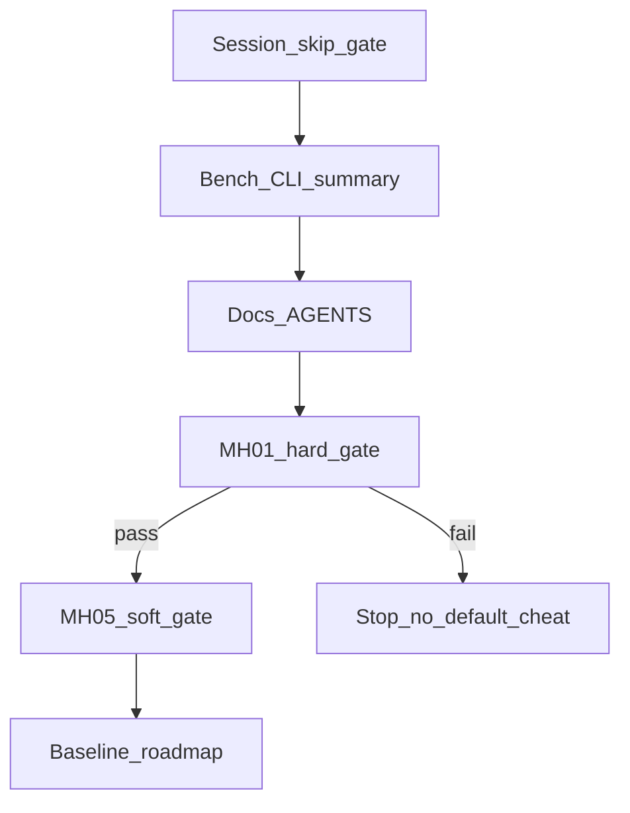

# M3.3 Slice ④f 大剔跳过 dropTracks

> **For agentic workers:** REQUIRED SUB-SKILL: Use superpowers:subagent-driven-development (recommended) or superpowers:executing-plans to implement this plan task-by-task. Steps use checkbox (`- [ ]`) syntax for tracking.

**Goal:** 默认在 `outliers_culled ≥ 4` 时跳过本帧 `dropTracks`，保持 `block_culled_rebirth=true`，使 MH_05 相对必-drop 默认（ATE 4.565）明显改善，且 MH_01 不回归（ATE ≤ 0.098784）。

**Architecture:** 策略只在 `apps/offline_vo_session`：两级门（`drop_culled_tracks` ∧ 阈值 N）。`phad::estimator` / `frontend` 不感知。N 与 bool 进 `flattenConfig`；`drops_skipped` 进 `FrameCounts` → `summary.robustness`。

**Tech Stack:** 既有 C++20 / GTest / `phad_vo_bench`；无新依赖。

Issue：续 [#24](https://github.com/Nothand0212/phad-vio/issues/24)（称 Slice ④f；Part of [#23](https://github.com/Nothand0212/phad-vio/issues/23)）。

设计权威：[`docs/research/m3.3-slice4f-skip-drop-design.md`](../research/m3.3-slice4f-skip-drop-design.md)。

对照锚：

| 锚 | 值 |
|---|---|
| MH_01（④e） | `0ced28b` / `3a21162e` ATE **0.098784** |
| MH_05 必 drop | 同 hash ATE **4.565** |
| MH_05 no_drop A/B | ATE **3.972**（软方向） |

## Global Constraints

- 命名/风格：`docs/agents/cpp-naming.md`、`docs/agents/cpp-style.md`；缩进 2 空格；Allman 大括号
- `diag.csv` 仍 **18** 列；跳过 drop **不**进 warnings
- `block_culled_rebirth` 默认 **true** 不动；禁止把双关当生产默认
- 判据只用 `diagnostics.outliers_culled`（mean-cull），不用 `culled_landmark_ids.size()`
- 提交 subject 带 `(#24)`；分支续 `m3.3-mh05-ab-no-drop-culled` 或改名 `m3.3-slice4f-skip-drop`
- 出口：单测 → **MH_01 硬门** → **MH_05 软门** → 基线/roadmap；不开 ⑤
- 已有 WIP：`drop_culled_tracks` + `--no-drop-culled-tracks`（本计划在其上完成 N + 默认生产行为）

## 已对齐的决策

| 决策点 | 结论 |
|---|---|
| 默认 | `drop_culled_tracks=true`，`skip_drop_min_culled=4` |
| N=0 | 关闭跳过（凡非空列表必 drop） |
| `drop_culled_tracks=false` | 永不 drop；**不**计入 `drops_skipped` |
| summary | `robustness.drops_skipped` = 跳过帧数 |
| MH_01 | ATE≤0.098784；seg/re=1/0；`drops_skipped=0` |
| MH_05 | 相对 4.565 明显↓；`drops_skipped≥1`；不硬门 &lt;1 m |

## 文件地图

| 文件 | 职责 |
|---|---|
| `apps/offline_vo_session.hpp` | `skip_drop_min_culled`；`FrameCounts::drops_skipped` |
| `apps/offline_vo_session.cpp` | 两级门伪代码（设计 §4） |
| `apps/phad_vo_bench.cpp` | CLI、flattenConfig、summary 映射 |
| `apps/phad_stereo_vo_probe.cpp` | stdout `drops_skipped=` |
| `phad/bench/run_summary.hpp` / `.cpp` | JSON 字段 |
| `tests/apps/offline_vo_session_test.cpp` | 默认与计数契约 |
| `tests/bench/`（若有 hash 测） | 新键改变 hash |
| `apps/AGENTS.md`、设计/基线/roadmap | 文档 |



---

### Task 1: Session 两级门 + 单测

**Files:**
- Modify: `apps/offline_vo_session.hpp`
- Modify: `apps/offline_vo_session.cpp`（dropTracks 调用处）
- Modify: `tests/apps/offline_vo_session_test.cpp`

**Interfaces:**
- Produces: `OfflineVoSessionOptions::skip_drop_min_culled`（default 4）；`FrameCounts::drops_skipped`；session 按设计 §4 伪代码行为

- [ ] **Step 1: 扩展 options / FrameCounts**

在 `OfflineVoSessionOptions` 增加：

```cpp
int skip_drop_min_culled = 4;  // ≥0；0 → 不因阈值跳过
```

在 `FrameCounts` 增加：

```cpp
std::uint64_t drops_skipped = 0;
```

（保留已有 `drop_culled_tracks = true`。）

- [ ] **Step 2: 实现两级门**

替换 `offline_vo_session.cpp` 中无条件 `dropTracks` 为：

```cpp
if ( options.drop_culled_tracks &&
     !update.diagnostics.culled_landmark_ids.empty() )
{
  const bool skip =
      options.skip_drop_min_culled > 0 &&
      update.diagnostics.outliers_culled >=
          static_cast<std::uint32_t>( options.skip_drop_min_culled );
  if ( skip )
  {
    ++result.counts.drops_skipped;
  }
  else
  {
    tracker.dropTracks( update.diagnostics.culled_landmark_ids );
  }
}
```

- [ ] **Step 3: 单测**

在 `offline_vo_session_test.cpp`：

```cpp
TEST( OfflineVoSessionTest, SkipDropMinCulledDefaultsFour )
{
  OfflineVoSessionOptions options;
  EXPECT_EQ( options.skip_drop_min_culled, 4 );
  EXPECT_TRUE( options.drop_culled_tracks );
  FrameCounts counts;
  EXPECT_EQ( counts.drops_skipped, 0U );
}
```

（完整「调用 dropTracks」集成测若无轻量 fixture，契约测默认即可；行为靠 MH_05 `drops_skipped≥1` 验收。）

- [ ] **Step 4: 编译运行**

```bash
cmake --build build --target phad_apps_tests -j$(nproc)
./build/phad_apps_tests --gtest_filter='OfflineVoSessionTest.*'
```

Expected: PASS

- [ ] **Step 5: Commit**（用户要求时）

```bash
git add apps/offline_vo_session.hpp apps/offline_vo_session.cpp tests/apps/offline_vo_session_test.cpp
git commit -m "$(cat <<'EOF'
feat(apps): skip dropTracks when mean-cull count >= N (#24)

Default skip_drop_min_culled=4 keeps small-cull drop for MH_01 while
avoiding post-mass-cull track wipe on MH_05.

EOF
)"
```

---

### Task 2: Bench CLI + summary + probe

**Files:**
- Modify: `apps/phad_vo_bench.cpp`
- Modify: `apps/phad_stereo_vo_probe.cpp`
- Modify: `phad/bench/run_summary.hpp`、`phad/bench/run_summary.cpp`
- Modify: `tests/bench/*` 若存在对 robustness JSON 的断言

**Interfaces:**
- Consumes: Task 1 session fields
- Produces: `--skip-drop-min-culled`；`session.skip_drop_min_culled` in hash；`summary.robustness.drops_skipped`

- [ ] **Step 1: RobustnessSummary 加字段**

`run_summary.hpp`：

```cpp
std::uint64_t drops_skipped = 0;
```

`run_summary.cpp` JSON 对象增加 `{ "drops_skipped", robustness.drops_skipped }`（与 `outlier_reopts` 并列）。

- [ ] **Step 2: bench 解析与 flatten**

- usage 增加 `[--skip-drop-min-culled <n>]`
- `Arguments::skip_drop_min_culled` 为 `std::optional<int>`
- 解析：与 `max-outlier-reopts` 相同，须 `≥ 0`，非法非 0 退出
- `session_options.skip_drop_min_culled = *opt`（若有值）
- `snap.set( "session.skip_drop_min_culled", static_cast<std::int64_t>( session.skip_drop_min_culled ) );`（已有 `session.drop_culled_tracks`）
- `summary.robustness.drops_skipped = session.counts.drops_skipped;`

- [ ] **Step 3: probe stdout**

在现有 `outlier_reopts=` 旁打印：

```cpp
<< "drops_skipped=" << result.counts.drops_skipped << '\n'
```

- [ ] **Step 4: 构建冒烟**

```bash
cmake --build build --target phad_vo_bench phad_stereo_vo_probe phad_bench_tests phad_apps_tests -j$(nproc)
./build/phad_vo_bench --help   # 含 --skip-drop-min-culled
```

- [ ] **Step 5: Commit**（用户要求时）

```bash
git commit -m "$(cat <<'EOF'
feat(bench): expose skip_drop_min_culled and drops_skipped (#24)

EOF
)"
```

---

### Task 3: 文档

**Files:** `apps/AGENTS.md`；`docs/research/m3.3-slice4f-skip-drop-design.md` 状态；必要时 `phad/bench/README.md`

- [ ] 写明两级门、默认 N=4、CLI、`drops_skipped`、与 `--no-drop-culled-tracks` 关系
- [ ] 设计状态改为「已编码」或「实施中」对应进度
- [ ] Commit（用户要求时）：`docs(apps): document Slice ④f skip-drop (#24)`

---

### Task 4: MH_01 硬门

- [ ] 干净树（或注明 dirty）跑：

```bash
./build/phad_vo_bench \
  /home/lin/Projects/data/thidparty/euroc/native/MH_01_easy \
  --bench-root /home/lin/Projects/data/phad-bench \
  --gt-euroc /home/lin/Projects/data/thidparty/euroc/native/MH_01_easy \
  --force
```

- [ ] 门控：ATE ≤ **0.098784**；`seg/re=1/0`；`robustness.drops_skipped == 0`
- [ ] 失败 → **停**，不改阈值蒙混；回诊断

---

### Task 5: MH_05 软门 + 基线

- [ ] 同默认跑 MH_05；对照 `0ced28b`/`3a21162e` ATE 4.565
- [ ] 软够：ATE 明显下降（朝 ~3.97）；`drops_skipped ≥ 1`；记录 i=425 时间线
- [ ] 更新 `docs/research/m3.3-slice4-baseline.md`（新节）、`docs/roadmap.md`、诊断链指针
- [ ] 全序列：仅软够后只记录或另议；不开 ⑤
- [ ] Commit docs（用户要求时）

## Spec 覆盖自检

| 设计要求 | Task |
|---|---|
| 两级门 + N 默认 4 | 1 |
| 判据 outliers_culled | 1 |
| CLI + config_hash | 2 |
| drops_skipped summary/probe | 2 |
| diag 18 列 / 无 warnings | 1–2（不改 diag） |
| MH_01 / MH_05 门 | 4–5 |
| 不改 block 默认 / 不开 ⑤ | Global Constraints |
