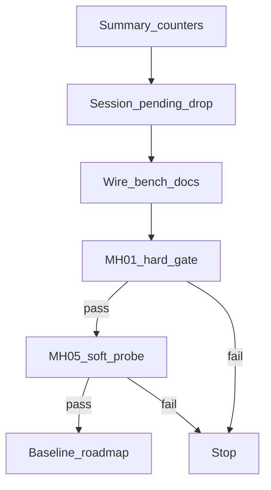

# M3.3 Slice ④g skip-drop 后延后 drop zombie

> **For agentic workers:** REQUIRED SUB-SKILL: Use superpowers:subagent-driven-development (recommended) or superpowers:executing-plans to implement this plan task-by-task. Steps use checkbox (`- [ ]`) syntax for tracking.

**Goal:** 在保留 skip-drop 软门与 `block_culled_rebirth` 的前提下，对 skip 当帧未 drop 的完整 `culled_landmark_ids` 在下一帧 `process` 前精确 `dropTracks`，消除长期 zombie×block。

**Architecture:** 策略只在 `OfflineVoSession`：`pending_drop` 集合；帧首冲刷、skip 时并入、立即路径不变。`phad::bench` 仅序列化新计数。无新 CLI / `config_hash` 键；`diag.csv` 仍 18 列。

**Tech Stack:** 既有 C++20 / GTest / `phad_vo_bench`；无新依赖。

Issue：续 [#24](https://github.com/Nothand0212/phad-vio/issues/24)（称 **Slice ④g**；Part of [#23](https://github.com/Nothand0212/phad-vio/issues/23)）。

设计权威：[`docs/research/m3.3-slice4g-zombie-drop-design.md`](../research/m3.3-slice4g-zombie-drop-design.md)。

前序：[`m3.3-mh05-probe-b-diagnosis.md`](../research/m3.3-mh05-probe-b-diagnosis.md) §6；④f [`m3.3-slice4f-skip-drop-design.md`](../research/m3.3-slice4f-skip-drop-design.md)。

对照锚：

| 锚 | 值 |
|---|---|
| MH_01（④f） | ATE **0.098784**；`drops_skipped=0` |
| MH_05（④f） | `c446ac5` / `a5e90dc7` ATE **3.05688**；`drops_skipped=1` |
| MH_05（④e） | ATE **4.565**（灾难平台，勿回归） |

## Global Constraints

- 命名/风格：`docs/agents/cpp-naming.md`、`docs/agents/cpp-style.md`；缩进 2 空格；Allman；`if ( cond )`
- `diag.csv` 仍 **18** 列；deferred drop **不**进 warnings
- **不**改 `block_culled_rebirth` / `skip_drop_min_culled` / cull / Huber 默认
- **无**新 CLI；**无**新 `flattenConfig` 键（hash 可与 ④f 同；产物靠 commit 区分）
- skip 判据仍只用 `outliers_culled`；pending 集合用完整 `culled_landmark_ids`
- 提交 subject 带 `(#24)`；分支 `m3.3-slice4g-zombie-drop`（已存在；无 worktree）
- 出口：单测 → **MH_01 硬门** → **MH_05 软门 + `--probe-b`** → 基线；不够停全序列；不开 ⑤

## 已对齐的决策

| 决策点 | 结论 |
|---|---|
| 时机 | 下一帧 `tracker.process` **之前** |
| 配置 | 无新旋钮 |
| 计数 | `deferred_drops`（冲刷次数）、`deferred_drop_ids`（累计 id 数） |
| summary | `robustness.deferred_drops` / `deferred_drop_ids` |
| MH_01 | ATE≤0.098784；`reanchors=0`；`drops_skipped=0`；`deferred_drops=0` |
| MH_05 | 改善或不回 4.565；zombie 归零；`drops_skipped≥1` 且 `deferred_drops≥1` |

## 文件地图

| 文件 | 职责 |
|---|---|
| `apps/offline_vo_session.hpp` | `FrameCounts::deferred_drops` / `deferred_drop_ids` |
| `apps/offline_vo_session.cpp` | `pending_drop` + 帧首/退出冲刷 + skip 并入 |
| `phad/bench/run_summary.hpp` / `.cpp` | JSON 两键 |
| `apps/phad_vo_bench.cpp` | summary 映射（**不**改 flattenConfig） |
| `apps/phad_stereo_vo_probe.cpp` | stdout 打印 deferred 计数 |
| `tests/apps/offline_vo_session_test.cpp` | 默认 0；diag 18 列仍过 |
| `tests/bench/run_summary_test.cpp` | JSON 序列化 |
| `apps/AGENTS.md`、设计/基线/roadmap/根 AGENTS | 文档 |
| `phad/frontend` / `phad/estimator` | **零改动** |



---

### Task 1: summary 计数合同（TDD）

**Files:**
- Modify: `apps/offline_vo_session.hpp`（`FrameCounts`）
- Modify: `phad/bench/run_summary.hpp`（`RobustnessSummary`）
- Modify: `phad/bench/run_summary.cpp`（JSON）
- Modify: `tests/bench/run_summary_test.cpp`
- Modify: `tests/apps/offline_vo_session_test.cpp`（默认断言）

**Interfaces:**
- Produces:

```cpp
// FrameCounts / RobustnessSummary
std::uint64_t deferred_drops    = 0;  // 冲刷次数
std::uint64_t deferred_drop_ids = 0;  // 累计 drop 的 id 个数
```

- [ ] **Step 1: 写失败单测（bench JSON）**

在 `tests/bench/run_summary_test.cpp` 的默认序列化测中断言新键为 0；并新增：

```cpp
TEST( RunSummaryTest, DeferredDropCountersSerialize )
{
  RunSummary summary;
  summary.status                        = RunStatus::kCompleted;
  summary.sequence                      = "MH_05_difficult";
  summary.robustness.deferred_drops     = 2;
  summary.robustness.deferred_drop_ids  = 32;

  const json root = json::parse( summary.toJson() );
  EXPECT_EQ( root.at( "robustness" ).at( "deferred_drops" ), 2 );
  EXPECT_EQ( root.at( "robustness" ).at( "deferred_drop_ids" ), 32 );
}
```

在 `SkipDropMinCulledDefaultsFour`（或并列测）加：

```cpp
EXPECT_EQ( counts.deferred_drops, 0U );
EXPECT_EQ( counts.deferred_drop_ids, 0U );
```

- [ ] **Step 2: 跑测确认 RED**

```bash
cmake --build build --target phad_bench_tests phad_apps_tests -j$(nproc)
ctest --test-dir build -R 'DeferredDrop|SkipDropMinCulledDefaults' --output-on-failure
```

Expected: FAIL（字段不存在或 JSON 缺键）。

- [ ] **Step 3: 最小实现字段 + JSON**

`offline_vo_session.hpp` `FrameCounts` 在 `drops_skipped` 后增加两字段（注释：冲刷次数 / 累计 id）。

`run_summary.hpp` `RobustnessSummary` 同样增加。

`run_summary.cpp` 的 `robustness` json 对象追加：

```cpp
{ "deferred_drops", robustness.deferred_drops },
{ "deferred_drop_ids", robustness.deferred_drop_ids },
```

- [ ] **Step 4: 跑测 GREEN**

```bash
ctest --test-dir build -R 'RunSummaryTest|SkipDropMinCulledDefaults|OfflineVoSessionTest.FrameCounts' --output-on-failure
```

Expected: PASS（相关用例）。

- [ ] **Step 5: Commit**

```bash
git add apps/offline_vo_session.hpp phad/bench/run_summary.hpp phad/bench/run_summary.cpp \
  tests/bench/run_summary_test.cpp tests/apps/offline_vo_session_test.cpp
git commit -m "$(cat <<'EOF'
feat(bench): add deferred_drops counters to summary contract (#24)

EOF
)"
```

---

### Task 2: Session `pending_drop` 编排

**Files:**
- Modify: `apps/offline_vo_session.cpp`
- Modify: `tests/apps/offline_vo_session_test.cpp`（若可加行为测；否则文档说明 MH_05 验行为）

**Interfaces:**
- Consumes: Task 1 计数；既有 `dropTracks(std::span<const LandmarkId>)`；④f skip 门
- Produces: skip → `pending_drop ∪= culled_landmark_ids`；下帧 process 前冲刷

- [ ] **Step 1: 在 session 循环内增加 `pending_drop` 与冲刷 lambda**

在 `tracker` / `estimator` 构造之后：

```cpp
std::unordered_set<common::LandmarkId> pending_drop;

const auto flushPendingDrop = [ & ]() {
  if ( pending_drop.empty() )
  {
    return;
  }
  const std::vector<common::LandmarkId> ids( pending_drop.begin(),
                                             pending_drop.end() );
  tracker.dropTracks( ids );
  ++result.counts.deferred_drops;
  result.counts.deferred_drop_ids += static_cast<std::uint64_t>( ids.size() );
  pending_drop.clear();
};
```

- [ ] **Step 2: 帧首、`tracker.process` 之前调用 `flushPendingDrop()`**

放在 `rectify` 成功之后、`frontend_begin` / `tracker.process` 之前：

```cpp
flushPendingDrop();
const auto frontend_begin = ...
const frontend::FrameTracks tracks = tracker.process( ... );
```

- [ ] **Step 3: 改 skip 分支 — 并入 pending，不立即 drop**

替换现有 skip/else：

```cpp
bool drops_skipped_this_frame = false;
if ( options.drop_culled_tracks &&
     !update.diagnostics.culled_landmark_ids.empty() )
{
  const bool skip =
      options.skip_drop_min_culled > 0 &&
      update.diagnostics.outliers_culled >=
          static_cast<std::uint32_t>( options.skip_drop_min_culled );
  if ( skip )
  {
    ++result.counts.drops_skipped;
    drops_skipped_this_frame = true;
    for ( const common::LandmarkId id :
          update.diagnostics.culled_landmark_ids )
    {
      pending_drop.insert( id );
    }
  }
  else
  {
    tracker.dropTracks( update.diagnostics.culled_landmark_ids );
  }
}
```

- [ ] **Step 4: 所有提前 `return` 与正常循环结束后冲刷**

在每个 `finalizeSegmentsAndWarnings(); return result;` 之前（stream error / rectify fail / probe write fail 等）以及 `while` 结束后、算 `wall_s` 之前调用 `flushPendingDrop()`。  
`max_frames` break 走循环结束路径，同样被覆盖。

- [ ] **Step 5: 编译 + 既有 apps 测**

```bash
cmake --build build --target phad_offline_vo_session phad_apps_tests -j$(nproc)
ctest --test-dir build -R 'OfflineVoSession|VoBenchCli' --output-on-failure
```

Expected: PASS。`WriteDiagCsvMatchesProbeContract` 仍 18 列。

- [ ] **Step 6: Commit**

```bash
git commit -m "$(cat <<'EOF'
feat(apps): defer dropTracks after skip-drop via pending_drop (#24)

EOF
)"
```

---

### Task 3: bench/probe 接线 + 文档指针

**Files:**
- Modify: `apps/phad_vo_bench.cpp`（summary 映射两行；**不要**改 `flattenConfig`）
- Modify: `apps/phad_stereo_vo_probe.cpp`（stdout 增加 `deferred_drops=` / `deferred_drop_ids=`）
- Modify: `apps/AGENTS.md`（一行：④g 延后 drop；无新旋钮；summary 两键）
- Modify: `docs/research/m3.3-slice4g-zombie-drop-design.md`（状态 → **已编码**，链本计划）
- Modify: `phad/bench/README.md`（若已列 `drops_skipped`，并列两键）

**Interfaces:**
- Consumes: `session.counts.deferred_*`
- Produces: `summary.robustness.deferred_*`；probe stdout

- [ ] **Step 1: bench 映射**

在 `drops_skipped` 赋值旁：

```cpp
summary.robustness.deferred_drops    = session.counts.deferred_drops;
summary.robustness.deferred_drop_ids = session.counts.deferred_drop_ids;
```

- [ ] **Step 2: probe stdout**

在现有 `drops_skipped=` 行后追加两个字段（同风格空格/`\n`）。

- [ ] **Step 3: 构建**

```bash
cmake --build build --target phad_vo_bench phad_stereo_vo_probe -j$(nproc)
```

- [ ] **Step 4: Commit**

```bash
git commit -m "$(cat <<'EOF'
feat(apps): wire deferred_drops into bench summary and probe (#24)

EOF
)"
```

---

### Task 4: MH_01 硬门

**Files:** scratch `/tmp/mh01_4g/`（不入库）

- [ ] **Step 1: 默认跑 MH_01**

```bash
SEQ=/home/lin/Projects/data/thidparty/euroc/native/MH_01_easy
OUT=/tmp/mh01_4g
mkdir -p "$OUT"
./build/phad_vo_bench "$SEQ" --bench-root "$OUT" --config-label default
```

- [ ] **Step 2: 验收**

- ATE trans RMSE ≤ **0.098784**
- `reanchors=0`；`seg/failed` 健康
- `summary.json`：`drops_skipped=0`，`deferred_drops=0`，`deferred_drop_ids=0`
- `config_hash` 期望仍为 `a5e90dc7`（无新 flatten 键）

失败 → **停**，不改阈值蒙混，不进 MH_05。

- [ ] **Step 3: 记录数字到** `.superpowers/sdd/task-4-mh01-numbers.md`（不入库亦可）或直接进入 Task 5 commit 消息/基线草稿

（本 task 无强制 git commit；若仅数字可与 Task 5 文档一并提交。）

---

### Task 5: MH_05 软门 + 基线 / roadmap

**Files:**
- Create/Modify: `docs/research/m3.3-slice4-baseline.md`（新 §12 ④g）
- Modify: `docs/roadmap.md`（M3.3 标题行 + ④g 条目 + 后续下一刀）
- Modify: `AGENTS.md` Learned Workspace Facts
- Modify: `docs/research/m3.3-slice4g-zombie-drop-design.md`（状态 → 已门控 / 结果）
- Modify: `docs/research/m3.3-slice4f-skip-drop-design.md`（「不做延迟 drop」旁注 → 见 ④g）
- Scratch: `/tmp/mh05_4g/`（含 `--probe-b`）

- [ ] **Step 1: MH_05 默认 + probe-b**

```bash
SEQ=/home/lin/Projects/data/thidparty/euroc/native/MH_05_difficult
OUT=/tmp/mh05_4g
mkdir -p "$OUT"
./build/phad_vo_bench "$SEQ" \
  --bench-root "$OUT" --config-label default \
  --probe-b "$OUT/probe_b.jsonl"
```

- [ ] **Step 2: 软门判定**

| 项 | 标准 |
|---|---|
| ATE | &lt; ④f **3.05688** 改善，或至少不回到 ≈4.565；记录精确值 |
| `drops_skipped` | ≥ 1 |
| `deferred_drops` | ≥ 1；`deferred_drop_ids` ≥ 1（期望 ≈32 量级若单次大剔） |
| probe-b | i=425 skip 后，i=426+ 对 425 cull 集 `zombie_track_n` 迅速归零；427–429 shared 相对 ④f（16/29/34）收窄 |
| MH_01 | Task 4 已 PASS |

不够 → 写明失败原因到基线/设计，**停全序列**，仍可提交文档（状态=门控不够）。

- [ ] **Step 3: 写基线 § + roadmap/AGENTS**

含 `meta.json` 的 `config` / `config_canonical_text` 快照（与 hash 同源）；标相对 ④f 增量（行为变、hash 可不变）。

- [ ] **Step 4: Commit**

```bash
git add docs/research/m3.3-slice4-baseline.md docs/roadmap.md AGENTS.md \
  docs/research/m3.3-slice4g-zombie-drop-design.md \
  docs/research/m3.3-slice4f-skip-drop-design.md
git commit -m "$(cat <<'EOF'
docs(m3.3): record Slice ④g deferred zombie-drop gate (#24)

EOF
)"
```

---

## 后续（本计划外）

- 全序列（仅软门够后另议）
- 探针 B 代码清理 / 收编
- TrackId≠LandmarkId；Slice ⑤ 对齐

## 验收总表

| 项 | 标准 |
|---|---|
| diag 18 列 | PASS |
| 无新 config_hash 键 | PASS |
| skip 当帧不立即 drop | PASS |
| 下帧 process 前 drop pending | PASS |
| MH_01 硬门 | PASS |
| MH_05 软门 + zombie 归零 | PASS 或明确停 |
| 无 ⑤ / 无关 block / 无关 skip | PASS |
