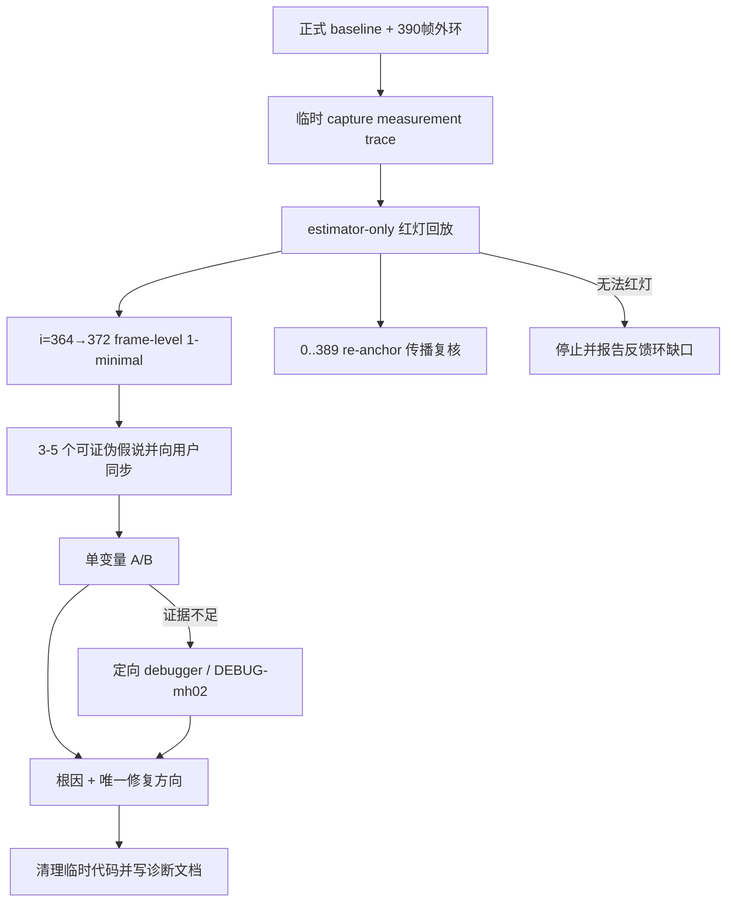

# M3.3 MH_02 首次发散诊断

执行结果：已完成，见
[`m3.3-mh02-divergence-diagnosis.md`](../research/m3.3-mh02-divergence-diagnosis.md)。

**Goal:** 解释 `MH_02_easy` 在当前默认
`4cf55ca/default_773ea011` 上从健康 VO 进入灾难位姿、连续 `kFailed` 与多次
re-anchor 的**首次因果链**，以可重复反事实证据锁定一个根因，并给出唯一推荐
修复切片。

**Architecture:** 使用两层反馈环。外环是当前真实 frontend → session →
estimator 的 390 帧 prefix，只负责确认用户可见症状；内环从 glue 边界临时捕获
自包含 v1 trace（完整 `RectifiedStereoCalibration`、基础 `EstimatorOptions`、
`KeyframeMeasurement[]` 与逐帧 reference verdict），直接回放
`StereoVoEstimator`，用于秒级最小化、A/B 与定向 instrumentation。根因判定以
i=372 裁尾并由 ddmin 决定起点；实测 frame-level 1-minimal 仍为 i=0..372。原始
0..389 trace 单独复核 i=389 re-anchor 传播。生产合同、默认
配置和 `diag.csv` 均不改变；临时代码在本片结束前清除。

**Tech Stack:** 既有 C++20 / GTest / GTSAM / `phad_vo_bench` /
`phad_traj_eval` / `--probe-b`；无新依赖。

Issue：续 [#24](https://github.com/Nothand0212/phad-vio/issues/24)，Part of
[#23](https://github.com/Nothand0212/phad-vio/issues/23)。本次只写本地计划，
不创建或修改远端 Issue；执行时如需更新 Issue，另行获得授权。

权威输入：

- [`docs/roadmap.md`](../roadmap.md) M3.3；
- [`m3.3-full-suite-baseline-773ea011.md`](../research/m3.3-full-suite-baseline-773ea011.md)；
- [`m3.3-mh05-probe-b-design.md`](../research/m3.3-mh05-probe-b-design.md) 及现有
  `--probe-b` 旁路；
- `docs/adr/0001-gtsam-vio-backend.md`；
- `apps/AGENTS.md`、`phad/estimator/AGENTS.md`、`tests/AGENTS.md`。

## 已知事实与准备期证据

以下只作为诊断起点，不提前解释根因：

| 事实 | 证据 |
|---|---|
| 当前正式锚 | `4cf55ca/default_773ea011`；`session.skip_drop_min_culled=4` + `session.zombie_drop_age=5` |
| 全序列症状 | ATE **530013.866966 m**；completion **0.522039**；`failed=1453`；`segments/reanchors=7/6` |
| 最早坏窗 | 现有 `diag.csv` 的 i=364–371 已出现 171–570 px 级 RMS、巨大 window pose shift 与连续 cull/cheirality |
| 首个失败 | i=372，`status=failed` |
| 首次 re-anchor | i=389，`segment_id: 0→1`；它晚于首次灾难状态，不能未经证据直接当根因 |
| 历史边界 | Slice ③ `b712c91/default_8a9236e0`：ATE≈0.298、completion=1；Slice ④d `79505f8/default_85c97158`：ATE≈2.77e5、completion≈0.770 |

准备计划时已在当前 `HEAD=93c65f9`（相对 `4cf55ca` 仅文档变化）实际运行：

```bash
build/phad_vo_bench \
  /home/lin/Projects/data/thidparty/euroc/native/MH_02_easy \
  --bench-root <tmp>/bench \
  --sequence-name MH_02_prefix390 \
  --max-frames 390 \
  --probe-b <tmp>/probe_b.jsonl \
  --force
```

实测：`status=completed_with_failures`、ATE **54787.8 m**、RPE **54956.7 m**、
completion **0.958974**、wall **94.6065 s**。该命令已证明 390 帧 prefix 能命中
真实症状，但 95 s 太慢，只保留为**外环**；代码身份未变化时不得为制造进度重复跑。

## Global Constraints

- **先红灯、后假说**：没有一个确定、agent-runnable、≤15 s 的 estimator replay，
  不进入假说检验。
- 事实、推断、假说、未确认项在诊断笔记中分栏；一次只改变一个变量。
- 首先定位 i=364 前后的首次错误状态；i=372 `kFailed` 与 i=389 re-anchor 是
  下游事件，除非反事实证据证明它们反向构成起因。
- 不改 public API/ABI、默认配置、`config_hash`、`diag.csv` 18 列合同或 bench
  schema；不新增长期 product CLI。
- 临时 instrumentation 全部带唯一标记 `[DEBUG-mh02]`；捕获文件和 replay
  harness 放 `/tmp` 或未跟踪位置，不提交原始 trace。
- 不把关闭 cull、关闭 PnP、放宽门限等 A/B 臂直接产品化；A/B 只用于因果证伪。
- 本片不实现修复、不扫全序列、不做 Slice ⑤、不接 IMU；根因明确后另行按
  模块边界 → 数据流 → 错误与诊断 → 测试与验收对齐修复片。
- 若无法建立 estimator-only 红灯，明确列出已尝试方法与缺口并停止，不靠读代码
  猜根因。
- 执行时建议分支 `m3.3-mh02-divergence-diagnosis`，无 worktree；未经用户明确
  要求不 commit、push 或写远端 Issue。

## 已对齐的决策

| 决策点 | 结论 |
|---|---|
| 唯一目标 | 锁定 MH_02 **首次**发散根因，不以调低最终 ATE 代替归因 |
| 正式对照 | `4cf55ca/default_773ea011` 全序列产物 |
| 外环 | 真实 pipeline 的 390 帧 prefix；仅在代码路径变化后重跑 |
| 内环 | glue 后 `KeyframeMeasurement` estimator-only replay；目标 ≤15 s、3/3 同 verdict |
| trace 合同 | 自包含 v1 JSONL：完整 calibration/options/input + outer reference verdict；整数保型、double 可无损 round-trip |
| 最小化 | i=364→372 做 frame-level 1-minimal；0..389 完整 trace 只作 re-anchor 传播复核 |
| 归因边界 | 先查 i=364–372；再解释 i=389 re-anchor 如何传播，不倒果为因 |
| 方法 | 最小复现 → 3–5 假说排序 → 单变量证伪 → 必要时定向探针 |
| 产出 | `docs/research/m3.3-mh02-divergence-diagnosis.md` + 唯一修复方向 |
| 非目标 | 默认算法修改、关键帧、M4、全序列优化 |

## 文件地图

| 路径 | 本片职责 |
|---|---|
| `apps/offline_vo_session.cpp` | **临时**在 `toKeyframeMeasurement()` 后捕获 replay 输入；结束前恢复 |
| `apps/stereo_vo_glue.hpp` | 捕获边界，只读核对 |
| `apps/probe_b_writer.*` | 复用默认关闭的诊断入口；仅在确有需要时临时扩字段，结束前恢复 |
| `phad/estimator/types.hpp` | measurement / diagnostics 合同，只读；不扩 public 合同 |
| `phad/estimator/stereo_vo_estimator.cpp` | debugger / `[DEBUG-mh02]` 定向探针位置；结束前恢复 |
| `tests/estimator/` + `CMakeLists.txt` | **临时** trace replay GTest；确认正确 seam 前不提交 fixture |
| `docs/research/m3.3-mh02-divergence-diagnosis.md` | 本片唯一新增的持久诊断产物 |
| `docs/roadmap.md`、正式 baseline | 诊断完成后仅补根因与下游指针 |
| `/tmp/phad-mh02-diagnosis-*` | calibration、measurement trace、probe、A/B 输出；不入库 |



---

### Task 1：建立 estimator-only 快速红灯

**输入：** 当前默认真实 pipeline 的前 390 帧；EuRoC rectified calibration；
基础 `EstimatorOptions`；glue 产出的 `KeyframeMeasurement`。

- [x] **身份核对**

  ```bash
  git diff --exit-code 4cf55ca..HEAD -- \
    '*.cpp' '*.hpp' CMakeLists.txt
  ```

  若有运行时代码差异，旧的 95 s 外环证据失效，先重跑一次外环并记录新身份；
  若无差异，直接复用准备期证据。

- [x] **临时捕获真实 estimator 输入**

  用临时环境变量启用默认关闭的 capture（不新增正式 CLI/config 键）。在
  `OfflineVoSession` 的
  `const estimator::KeyframeMeasurement measurement = toKeyframeMeasurement(tracks);`
  之后记录输入，并在同一次 `estimator.update()` 返回后补齐 reference verdict：

  - schema version、code/config/data identity 与完整基础 `EstimatorOptions`；
  - `RectifiedStereoCalibration` 的 `fx/fy/cx/cy/baseline`、
    `image_width/image_height` 与 `T_B_left_rectified` 4×4 matrix；
  - 每帧 `timestamp_ns`；
  - 每个 observation 的 `LandmarkId`、`left_pixel.x/y`、`disparity_px`；
  - source frame index，保证裁剪后仍能与原 `diag.csv` / `probe_b.jsonl` 对齐；
  - outer 的 `status/message` 与用于判定同一内部症状的关键 diagnostics。

  `timestamp_ns` / `LandmarkId` 分别保持 `int64` / `uint64`，所有 double 必须以
  round-trip 精度写出；observations 保持原 vector 顺序。capture 跑不带
  `--probe-b`，避免把诊断旁路选项混入基础 estimator 身份。

  trace 只写 `/tmp`；所有临时代码带 `[DEBUG-mh02]`。不得新增默认 I/O 或正式
  CLI/config 键。

- [x] **建立临时 replay GTest**

  临时 test 从 trace 重建同一 `RectifiedStereoCalibration` 和捕获的基础
  `EstimatorOptions`，按原顺序调用 `update()`。先校验 replay 的关键 verdict 与
  outer reference 一致，再应用健康判定准则。健康断言至少为：

  - i≤371 不得出现 `max_window_pose_shift_m > 0.5`（沿用既有 Probe B heavy
    trigger；当前首次命中为 i=366）；
  - i=372 不得返回 `kFailed`；
  - 所有 estimate 必须 finite。

  当前实现应令该测试 **RED**，并报告实际首次异常 index、timestamp、status/message
  与关键 diagnostics；不要把“成功复现 bug”写成 GREEN。

  目标命令：

  ```bash
  PHAD_MH02_TRACE=<tmp>/measurements.jsonl \
    build/phad_estimator_tests \
      --gtest_filter=StereoVoMh02Replay.FirstDivergence
  ```

- [x] **反馈环验收**

  - 同一 trace 连跑 3 次，首次异常 frame、status/message 与核心 diagnostics 完全一致；
  - 单次 wall ≤ **15 s**；
  - 不读图、不跑 frontend、不算 ATE；
  - 确认命中外环 i=364–372 的同一内部症状，而非另一个失败。

若 estimator-only replay 不红，说明 session/frontend feedback 是 load-bearing；停止
estimator 假说，改为捕获 `FrameTracks + cull/drop feedback` 的最小 session replay，
不得继续臆测 estimator 根因。

---

### Task 2：复现并最小化根因 trace

- [x] **定位三个时间点**

  对齐原始 `diag.csv`、probe 与 replay，固定：

  1. 首个健康不变量破坏点（不是简单阈值越界，而是后续灾难所必需）；
  2. 首个巨幅 optimizer/window shift；
  3. 首个 `kFailed` 及其原始 `message`。

- [x] **根因 prefix 裁尾**

  根因 trace 固定以 source i=372 为末帧；先从原始 0..389 trace 裁掉 i=373..389，
  验证仍保持同一巨幅 shift → `kFailed` 判定。re-anchor 不属于该最小化判定。

- [x] **frame-level 1-minimal 裁剪**

  在保持 source index、timestamp 顺序和单帧 measurement 内容不变的前提下，先按
  连续区块做 hierarchical ddmin，再逐帧删除，直到删除任一剩余 frame 都会使既定
  判定准则 GREEN 或转成不同失败。保留 frame 的 source index，不把裁剪后的 estimator
  内部 key 当作原始 frame index。

  observation-level 最小化不是强制出口；仅当 frame-level 结果仍无法区分竞争假说时，
  才对首次坏窗做定向 observation 裁剪，并明确记录最小化层级。

- [x] **完整传播复核**

  根因候选经单变量证据锁定后，回到未裁剪的 0..389 trace，确认 i=364→372 的首次
  状态破坏如何传播为 i=389 re-anchor。不得要求根因最小 trace 保留下游 re-anchor。

- [x] **最小复现验收**

  - 3/3 同 verdict；
  - 根因 trace 达到 frame-level 1-minimal：删除任一剩余 frame 会 GREEN 或转成不同失败；
  - 记录最小 trace 的 hash、帧范围、运行时间和复现命令；
  - 原始 0..389 trace 仍能复核 i=389 re-anchor 传播；
  - 明确 trace 固定了 frontend 输出，因此哪些 session counterfactual 仍需外环验证。

---

### Task 3：形成并同步可证伪假说

只在 Task 1/2 完成后生成 **3–5 个排序假说**。每条使用固定格式：

> 如果 X 是首次根因，则只改变 Y 会让首次异常消失/后移；同时 Z 指标应按预测变化。

假说集合至少覆盖但不预设结论：

- PnP 成功/回退与恒速初值是否把 LM 带入错误 basin；
- mean-cull / cheirality 后的 graph 与 landmark 生命周期是否形成欠约束或错误连通；
- `block_culled_rebirth` 与 session drop/skip/zombie feedback 是否让可用约束骤减；
- optimizer 数值/图结构是否允许巨大但 finite 的解被接受；
- re-anchor/rollback 是否只传播已有坏状态，还是参与首次状态破坏。

对每条写出：事实依据、反对证据、单变量 probe、预期结果、证伪条件。**试验前**把
排序表发给用户；该同步不阻塞继续执行，但收到领域信息后可重排。

---

### Task 4：单变量证伪与最小 instrumentation

#### 4.1 先用现有开关

在 estimator replay 上每次只改一个 `EstimatorOptions`；至少根据排序选择：

- `enable_pnp_init=false`；
- `enable_outlier_cull=false`（注意 cheirality 清理仍存在）；
- `enable_outlier_reopt=false` / `max_outlier_reopts=0`；
- `block_culled_rebirth=false`；
- `use_constant_velocity_init=false`。

每次记录首次异常 index、status/message、`num_shared`、graph landmarks、PnP
结果、cheirality/cull、LM iterations、RMS 与 max shift。只有预测命中才提升该
假说；“最终没崩”但首次事件换成另一种失败不算支持。

session 选项（`drop_culled_tracks`、`skip_drop_min_culled`、
`zombie_drop_age`）会改变未来 frontend 输出，固定 measurement trace 无法证明其
反事实；仅当 estimator 证据指向该边界时，才用 390 帧外环做**一个变量一次**的
必要 A/B，避免重跑矩阵。

#### 4.2 证据仍不足时才加探针

工具优先级：

1. 在 replay 中用 debugger 停在首次坏帧的 `buildGraph()`、LM 前后与
   `runCheiralityAndMeanCull()`；
2. debugger 不足再加 `[DEBUG-mh02]` 定向字段；
3. 禁止全量逐点日志后再 grep。

探针必须一一对应假说预测，候选边界：

- LM 前 `graph.error(values)`、LM 后 error、pose/landmark/factor 数；
- 每个 window pose 的有效 stereo factor degree、是否存在只靠 prior/弱连通的 pose；
- PnP/恒速初值相对上一接受位姿的 SE(3) 增量；
- 最大 shift 的 pose key 与其有效 factor 支撑；
- 本帧 cull/cheirality 前后被移除 id 及对应观测数；
- `kFailed` 的完整异常类型/message 与 rollback 后状态；
- re-anchor 使用的 anchor 是否已在首次坏窗中被污染。

同一 probe 不得顺带修改优化策略。若需要 Hessian/rank 证据，只对首次坏帧导出，
不把昂贵计算放进正常路径。

#### 4.3 根因判定门

只有同时满足以下条件才称“根因已锁定”：

1. 它解释最早不变量破坏，而不只解释 i=389 之后；
2. 单变量反事实按预测让首次异常消失或确定性后移；
3. 恢复变量后异常恢复；
4. 证据能落到具体状态转换、graph/factor/lifecycle 合同或代码路径；
5. 至少一个竞争假说被同一证据明确证伪。

---

### Task 5：诊断文档与唯一修复方向

**Create:** `docs/research/m3.3-mh02-divergence-diagnosis.md`

文档固定结构：

1. 元信息、commit/config/数据身份；
2. 外环与快速 replay 的复现命令、实际输出、trace hash；
3. 最小复现与 i=364–389 因果时间线；
4. 事实 / 推断 / 假说 / 未确认项分栏；
5. 排序假说及每个 A/B 的预测与实测；
6. 根因：具体不变量、首次破坏点、传播链、影响范围；
7. **唯一推荐修复切片**、明确非目标和否决项；
8. 下一片的回归 seam：应保留何种最小 fixture/test，先 RED 后修复。

诊断片出口是“根因 + 可执行修复边界”，不是 ATE 变好。若证据只能缩小到两个
无法区分的机制，文档状态必须写“未完成”，并列出区分它们所缺的唯一新证据；
不得用最像的解释冒充根因。

---

### Task 6：清理、零差异检查与 handoff

- [x] `rg -n '\[DEBUG-mh02\]' apps phad tests CMakeLists.txt` 必须无输出；
- [x] 删除临时 capture/replay 代码与未决定持久化的 raw trace；不得删除用户现有
  `.reasonix/`、`reasonix.toml` 或其它无关未跟踪内容；
- [x] 运行受影响的 unit tests（若所有临时代码均移除，至少
  `phad_estimator_tests` 与 `phad_apps_tests`）；
- [x] 对默认 `--probe-b` 关闭路径做现有合同测试，确认 `diag.csv` 仍 18 列、
  config/hash/schema 未变；
- [x] `git diff --check`，并审查最终 diff 只含诊断文档及必要的 roadmap/baseline
  指针；
- [x] 在 `docs/roadmap.md` M3.3 与正式 baseline 中各加最小一句：诊断状态、根因
  文档、唯一下一片；不提前宣称修复或 PASS。

## 验收标准

| 类别 | 必须满足 |
|---|---|
| 反馈环 | estimator-only replay ≤15 s，3/3 确定，命中与外环相同的首次内部症状 |
| 最小化 | i=364→372 根因 trace 达 frame-level 1-minimal；0..389 完整 trace 单独复核 re-anchor 传播 |
| 归因 | 3–5 假说有预测；单变量反事实闭环；至少证伪一个竞争假说 |
| 根因 | 落到具体状态转换/合同/代码路径，并解释 i=364→372→389 的顺序 |
| 真实性 | 无法区分时明确未完成，不用参数改善冒充根因 |
| 范围 | 无默认行为、public API、config/hash、diag/schema 变化；不实现修复 |
| 清理 | 无 `[DEBUG-mh02]`、无临时代码/trace 入库、相关 tests 实际通过 |
| 交付 | 诊断文档给出唯一推荐修复切片及下一片正确 regression seam |

## 本计划之外

- 根因修复、失败回归测试转 GREEN、MH_01/MH_05/全序列门控；
- Slice ⑤关键帧与 `est.tum` 输出语义调整；
- M4 IMU packet、预积分与 `X/V/B`；
- 泛化重构、长期 trace 框架或新的通用 estimator interface。

根因诊断经用户审阅后，才为唯一修复切片补设计与新计划；修复片必须把本片确定
的正确 seam 先固化为 RED regression test，再实施最小修复。
