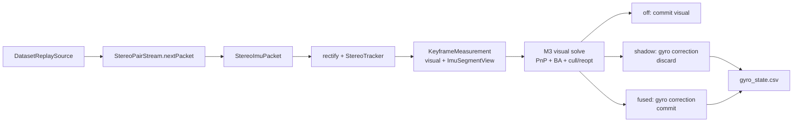

# M4 最小 gyro-aided VO 详细实施计划

状态：**历史计划；已失效；不得执行**

> 本文件只保留旧决策与实施痕迹，不能作为当前 source allowlist、验收门或
> 后续实现授权。当前合同以
> [M4 gyro measurement / factor 资格实验设计（修订版）](../research/2026-08-12-note-m4-minimal-gyro-slice-design.md)
> 和独立的 [Q1 Observe 实施计划](2026-08-12_m4_gyro_q1_observe_7d3a91e6.plan.md)
> 为准；旧实现的“已完成/已编码/已运行”陈述不自动转化为 Q1–Q5 资格证据。

计划 ID：`c4e62b35`

开发分支：`m4-minimal-gyro-slice`

基线：`main@7026ebf`（M3 production VO + M4.1 `StereoImuPacket`）

上位方案：[M4 最小 gyro-aided VO 重启方案](../research/2026-08-12-note-m4-minimal-gyro-slice-proposal.md)

跟踪 issue：[#36](https://github.com/Nothand0212/phad-vio/issues/36)

## 1. 目标、成功定义与边界

本计划只验证一个因果问题：**不更换 M3 视觉系统时，经过视觉对齐的 gyro rotation
constraint 能否改善 production VO。**

交付包含三个互斥运行模式：

| 模式 | 行为 | 输出用途 |
|---|---|---|
| `off` | 走现有 M3 visual-only 路径；不校验、不积分、不读取 IMU 数值 | 冻结控制组 |
| `shadow` | 视觉路径仍是唯一 authoritative path；在同一输入和窗口上额外算 gyro posterior，但不写回 | 固定机制 A/B |
| `fused` | 当前帧视觉 PnP/cull/reopt 完成后，用同一 gyro graph correction 作为最终 posterior | 自然闭环验证 |

本计划完成的必要条件：

1. `off` 的 `est.tum`、`kf.tum`、`diag.csv` 与实施前控制组逐字节一致；
2. `shadow` 的上述三文件与同版本 `off` 逐字节一致，并能证明 segment、bias、noise、
   factor activation 和 posterior 都有效；
3. `fused` 在 MH_01 exact-common support 上 ATE 与 RPE 都严格低于 `off`，且 completion、
   GT association coverage 和失败帧数不退化；
4. 任一门失败即停止后续 slice，保留 `off` 默认值并记录负结果，不扫权重或阈值寻找甜区。

明确不做：

- 不引入 `CandidatePipeline`、`CandidateFixedLagEstimator` 或第二套 tracker/estimator；
- 不改 KF selector、PnP 门槛、landmark lifecycle、mean-reprojection cull/reopt、非 KF 入图策略；
- 不引入 `IncrementalFixedLagSmoother`，不实现 velocity、gravity、accelerometer、per-keyframe
  bias 或 bias random walk；
- 不把 `gyr_nd` 当 `gyr_rw`，也不加入 zero-bias tight prior；
- MH_01 fused 门未通过前不跑 MH_05 或 EuRoC 11/11；
- 本计划不包含“切换 production 默认值”。即使过门，也要另行评审推广范围。

## 2. 已对齐的架构决策

| 决策点 | 结论 |
|---|---|
| 基础 estimator | 保留 `StereoVoEstimator` 的 all-frame fixed-window batch BA |
| 数据入口 | 复用唯一 `StereoVoEstimator::update()`；`KeyframeMeasurement` 增加只在调用期有效的 IMU segment view |
| IMU 数据来源 | `OfflineVoSession` 从 `StereoPairStream::nextPacket()` 取得 M4.1 `StereoImuPacket` |
| 模式表示 | 单一 `enum class GyroMode { kOff, kShadow, kFused }`，避免互相矛盾的布尔组合 |
| 默认模式 | 整个计划期间均为 `kOff` |
| 标定所有权 | dataset 的 `sensor::ImuParameters` 显式传给 estimator；noise 不塞进 `EstimatorOptions` |
| 坐标系 | gyro 已在 body/IMU frame；pose 是 `T_W_B`，不得套用 camera `T_B_left_rectified` 旋转到 gyro 上 |
| bias | 用 visual posterior rotation 离线式累计估计一个 absolute shared gyro bias；达到支持窗后冻结 |
| bias graph state | 无 `B(k)`、无 bias prior、无 RW factor |
| gyro noise | GTSAM continuous-time covariance 只取 `gyr_nd² I`；`gyr_rw` 在本片不用 |
| model discrepancy | factor covariance = PIM sensor covariance + alignment residual 的各向同性 covariance |
| factor state | estimator-private pose-only two-pose factor，只约束 `Pose3` rotation |
| shadow 控制 | 在当前 update 的同一最终 visual window/factors/posterior 上加 gyro 后重优化并丢弃结果；不另建 replay pipeline |
| 当前帧顺序 | 先完成现有 visual PnP、BA、cull/reopt，再做 gyro correction；当前帧 lifecycle 决策不受 gyro 反向影响 |
| 自然闭环 | 仅 `fused` 把 gyro posterior 写回，因此下一帧初值/KF parallax 可以自然分叉；另行报告 |
| diagnostics | 保持现有 18 列 `diag.csv` 不变；新建 `gyro_state.csv`，`off` 不生成该文件 |
| 配置身份 | `estimator.gyro_mode` 与 `estimator.gyro_align_window_s` 进入 canonical config/hash；因此不要求 `meta.json` 或 hash 保持 M3 值 |

这里对上位方案中的“paired replay”作一个收窄：`shadow` 本身就是固定 observations、固定
KF schedule、固定 visual lifecycle 的成对机制实验。因为它与 visual solve 位于同一个 update，
不需要 composition root 保存/重放 tracker 私有数据，也不会形成第二套长期接口。

## 3. 模块边界与数据流



依赖方向保持：

- `phad::sensor` 只提供 `ImuMeasurement` / `ImuParameters` 叶子类型；
- `phad::estimator` 依赖 sensor 类型和 GTSAM，但不知道 dataset、frontend 或文件路径；
- `apps` 负责 packet → estimator glue、CSV 和 CLI；
- `scripts` 只做产物对拍，不反向成为 runtime dependency。

### 3.1 Public seam 草图

在 `phad/estimator/types.hpp` 增加等价于下列最小类型；最终命名按项目 C++ naming 规则：

```cpp
enum class GyroMode : std::uint8_t { kOff, kShadow, kFused };

struct ImuSegmentView {
  common::Timestamp t_prev;
  std::span<const sensor::ImuMeasurement> samples;
  bool gap = true;
};

struct KeyframeMeasurement {
  common::Timestamp timestamp;
  std::vector<StereoObservation> observations;
  ImuSegmentView imu;
};

struct EstimatorOptions {
  // existing fields unchanged
  GyroMode gyro_mode = GyroMode::kOff;
  double gyro_align_window_s = 100.0;
};
```

`ImuSegmentView` 不取得所有权。`update()` 返回前，estimator 必须把后续要保留的 interval
复制到自己的 PIMPL；禁止把 span 存进 window。现有测试未提供 IMU 时，默认 view 等价于
gap。`off` 分支不得解引用这个 view。

构造函数改为显式表达两类标定：

```cpp
StereoVoEstimator(camera::RectifiedStereoCalibration stereo,
                  std::optional<sensor::ImuParameters> imu,
                  EstimatorOptions options = {});
```

不保留旧构造函数兼容层；所有调用方一次性迁移。`shadow/fused + nullopt` 在构造时抛
`std::invalid_argument`；`off + nullopt` 合法，便于纯视觉单测。production session 始终传
dataset calibration 的 `imu()`。

### 3.2 Internal state

只在 `StereoVoEstimator::Impl` 内增加：

- `PendingGyroSegment`：自上一 accepted pose 起累计的原始区间、端点、gap 状态；
- 每个 `WindowFrame` 的可选 incoming gyro edge：连接上一 accepted window pose，并固化
  `factor_eligible`（该 edge 开始前 alignment 已 ready 才为 true）；
- alignment accumulator：visual relative rotations、对应 PIM、有效累计时长；
- frozen alignment result：`bias_radps`、`residual_rms_rad`、rank/condition、edge count；
- shadow/fused 当前帧 diagnostics。

factor 只有在 incoming edge 的两个 pose key 都仍在 window 时才加入。window 从中间或头部弹出
pose 后，所有缺 predecessor 的 orphan edge 直接跳过；本最小片不跨被删 pose 拼接/重积分。
re-anchor/新 segment 不建立跨段 gyro factor；alignment 可保留先前“段内有效 edge”的证据，
但不得加入跨段 visual rotation。

## 4. 逐片实施步骤

每片均使用 RED → GREEN → REFACTOR；只有本片定向测试与门通过后才开始下一片。实施前先按
仓库约定创建 GitHub issue，commit subject 使用该 issue 号。当前用户只授权写计划，因此本轮
不创建 issue、不 commit。

### Slice 0：冻结 main/MH_01 控制组

1. 在 source tree 与 `main@7026ebf` 相同且无代码修改的 clean checkout 上用 Release build 重跑
   MH_01；计划/登记文档可以不同，但必须证明
   `git diff 7026ebf -- CMakeLists.txt apps phad tests scripts` 为空。使用显式 `--out` 目录，
   不覆盖既有 benchmark。
2. 保存完整 `meta.json` 中的 `config`、`config_canonical_text`、`config_hash`，以及
   `summary.json`、`est.tum`、`kf.tum`、`diag.csv`。
3. 核对已知 M3 记录：3681 poses、coverage `1.0`、completion `0.9997284085`、ATE
   `0.0809640579 m`、RPE `0.0177812186 m`。数值不一致则先解释 toolchain/config/input
   差异，本计划停止。
4. 新建 `docs/research/2026-08-12-note-m4-minimal-gyro-mh01-control.md`，记录实际命令、code identity、
   输入路径、参数快照、产物路径与比较结果。已知数值只作核对，文档必须以本次真实产物为准。

这份“实施前控制组”是后续 byte comparison 的权威来源；不依赖 `/tmp` 产物，也不把
不同 commit 的 `summary.json`/timing 当作字节门。

### Slice 1：mode、packet plumbing 与 off 零回归

先写失败测试：

- `GyroMode` 默认值为 off；CLI 只接受 `off|shadow|fused`；非法值非零退出；
- `gyro_align_window_s` 必须 finite 且 `> 0`；
- shadow/fused 缺 IMU calibration 构造失败，off 允许；
- 给 off 喂空段、gap 段或刻意 malformed 段，视觉结果与不带 IMU 的 fixture 完全相同。

再实现：

1. `OfflineVoSession` 从 `stream.next()` 切到 `stream.nextPacket()`，rectify/tracker 仍只消费
   `packet.frame`；
2. `apps/stereo_vo_glue.hpp` 只负责把 packet segment view 附到现有 visual measurement，
   不做预积分或验证；
3. 将 dataset `opened.value().calibration().imu()` 传入 estimator；
4. `phad_vo_bench` 加 `--gyro-mode off|shadow|fused`；mode 与固定 100 s alignment 参数进入
   `flattenConfig` 和 `meta.json`；
5. off 在 estimator 入口直接走现有代码，不能构造 gyro state、改变浮点求值顺序或写 sidecar。

GREEN 后执行 MH_01 off：`est.tum`、`kf.tum`、`diag.csv` 必须与 Slice 0 `cmp` 无差异。
新增配置键会改变 config hash，这是预期行为；不得为保住旧 hash 而隐去真实配置。

### Slice 2：segment ledger 与 shared bias alignment

#### 2.1 Segment 合同

当 mode 非 off 时，在任何 gyro/visual 状态写入前验证：

- 首帧允许 `t_prev == measurement.timestamp`，不形成 edge；
- 非 gap 段至少两个 sample，timestamp 严格递增；
- 首 sample timestamp 等于 `t_prev`，末 sample 等于 measurement timestamp；
- 用整数纳秒累计相邻差，必须精确等于 `timestamp - t_prev`；
- 所有 `gyro_radps` finite；本片不读取 accel，因此不为 accel 建模型；
- 相邻 packet 的共享端点只积分一次。

`gap=true` 是合法缺证据：视觉照常，不积分 partial segment。非 gap 合同违反返回
`UpdateStatus::kFailed` 和具体 message，且不得改变 pending segment、alignment 或 window。

#### 2.2 Accepted-pose edge 账本

- 每个合法 packet 先形成临时候选；visual `kRejected` 时把它并入 pending；
- 下一次 visual `kOk` 时，pending + 当前段组成“上一 accepted pose → 当前 accepted pose” edge；
- pending 中任一 gap 使整条 accepted edge 无效；该 edge 记录 gap 后清空，下一条可恢复；
- 第一个 accepted pose 没有 predecessor，消费并丢弃此前 pending，不建 factor；
- re-anchor 成功时不连接旧 segment，清掉跨段 pending/incoming edge；
- visual `kFailed` 不提交临时候选；
- accepted edge 的 raw samples 复制进当前 `WindowFrame`，供 batch graph 每次 rebuild 重建 PIM。

#### 2.3 Alignment

alignment 只使用已接受、同 visual segment、gyro edge 连续有效的 posterior rotation pair。
累计的是有效 edge 的真实 `dt`，默认达到 `100.0 s` 后求解一次并冻结：

1. 每条 edge 用 `PreintegratedAhrsMeasurements`，`biasHat=0`，
   `gyroscopeCovariance = gyr_nd² I`；
2. residual 与 bias Jacobian 直接复用本机 GTSAM `AHRSFactor::evaluateError(R_i,R_j,b)`
   的约定，禁止手写另一套 rotation direction；
3. 对单个 3D absolute bias 做 batch least squares，不加 zero prior，不使用 `gyr_rw`；
4. 用 rank-revealing decomposition 检查 3 维信息矩阵。rank `< 3`、non-finite bias、optimizer
   failure 均显式 `kFailed`，不回退零 bias；rank tolerance 使用数值库的 machine-epsilon
   相对判定，不增加可调阈值；
5. 在最终 bias 上计算 `r_k`，定义
   `alignment_rms = sqrt(mean(||r_k||²))`，并冻结
   `Sigma_align = (alignment_rms² / 3) I`；
6. alignment 在当前 visual posterior 生成后才可能 ready，因此当前 edge 仍是 pure visual；
   当前 edge 的 `factor_eligible=false`；只有下一条及后续 accepted edge 在开始时看到 frozen
   alignment 才标 true。历史 edge 永不被追溯激活，避免使用同一视觉观测自证。

序列结束前支持时长不足不是伪成功：run 可完成，但 diagnostics/summary 必须明确
`align_ready=false`，该 run 不能通过 shadow gate。达到支持时长却不可解则是显式失败。

### Slice 3：fixed-bias factor、shadow solve 与 sidecar

#### 3.1 Estimator-private factor

在 `phad/estimator/internal/`（或 `.cpp` anonymous/private implementation，按实现可测性选择）
实现 `FixedBiasAhrsFactor : NoiseModelFactor2<Pose3, Pose3>`：

- capture frozen bias 和该 edge 的 `PreintegratedAhrsMeasurements`；
- residual 复用 GTSAM AHRS rotation error，输出 3 维；
- Pose3 translation 对 residual/Jacobian 的列恒为零；
- noise model 使用 `PIM.preintMeasCov() + Sigma_align`；
- 每次 window graph rebuild 都从 stored raw edge 与 frozen bias 重新预积分；
- 不创建 bias key，不读 `gyrRw()`，不改变 existing pose prior。

独立数学测试必须覆盖：零旋转、已知常角速度、已知非零 bias、正反方向、不同 dt，以及
analytic Jacobian 与 numerical derivative。方向测试使用独立构造的闭式旋转，不以待测 helper
生成 expected value。

#### 3.2 Shadow solve

将当前 visual update 最后一次成功 cull/reopt 后的 graph/window 与 visual posterior 作为唯一
基线：

1. 保持现有 visual posterior 和 lifecycle decision；
2. clone/rebuild 同一 visual factors，加入 window 内所有 eligible gyro factors；
3. 以 visual posterior 作为 shadow 初值，运行同一 LM 配置；
4. 只导出 shadow values/cost/factor count，不写回 window、landmarks、last/prev pose、tracker
   feedback、KF selector 或 visual diagnostics；
5. shadow solve 失败返回明确 `kFailed`，不允许静默当 off；有效 MH_01 上这会直接阻断 gate。

这个顺序保证当前帧 visual PnP/cull/reopt 语义不变，同时让 shadow 与未来 fused 共用一条
gyro correction 代码路径。

现有 `update()` 的 rollback snapshot 只覆盖 keyframe，但 M3 已让 non-keyframe 进入 window/BA。
因此 shadow/fused 必须在本帧任何 visual mutable operation 之前做一份 **mode-gated full state
snapshot**，至少包含 window、landmarks、track times、last-stereo poses、last/prev accepted pose、
frame index、segment、culled ids、pending seed 以及全部 gyro state。gyro stage 失败时从这份快照
恢复；off 不增加该快照或改动原执行顺序，以保护 byte gate。这个修正只服务新模式的事务性，
不顺带改变 off 的历史失败语义。

#### 3.3 `gyro_state.csv`

`UpdateDiagnostics` 增加可选、结构化 `GyroUpdateDiagnostics`；estimator 不写文件。
`OfflineVoSessionResult` 收集对应 row，apps writer 只在 shadow/fused 生成 `gyro_state.csv`。
现有 `VoDiagRow` 与 `diag.csv` 的 18 列顺序、格式均不动。

sidecar 至少包含：

| 类别 | 字段 |
|---|---|
| identity | `ts_ns,mode,status,segment_id` |
| input edge | `t_i_ns,t_j_ns,imu_samples,imu_dt_s,imu_gap,edge_valid` |
| alignment | `align_support_s,align_edges,align_rank,align_ready,bg_x,bg_y,bg_z,align_rms_rad` |
| visual state | `visual_init_t* / q*`、`visual_post_t* / q*`，各带 valid flag |
| PIM state | `pim_dt_s,pim_delta_q*,pim_predict_q*`，各带 valid flag |
| gyro state | `gyro_post_t* / q*`、`gyro_factor_count,visual_cost,gyro_cost`，带 valid flag |

四元数统一写 `qw,qx,qy,qz`；pose 统一是 `T_W_B`；PIM delta 明确是 body-i 到 body-j
的相对 rotation。无状态时写 valid=false 和空字段，不写伪造的 identity/zero 值。

#### 3.4 Shadow MH_01 硬门

同一 binary、同一配置除 mode 外各跑一次 off/shadow：

- `cmp` 三主产物全部相同；diag timestamp/status 逐行等于 sidecar identity；
- alignment 从 collecting 单调进入 ready，之后不反复切换；
- 首个 gyro factor 出现在 alignment ready 的下一 accepted edge，而非同一 edge；
- 每条有效 edge 的 `pim_dt_s` 等于 integer-ns interval；gap edge factor count 为 0，下一条可恢复；
- bias、residual、cost、pose/quaternion 均 finite；rank=3；
- 将估计 shared bias 与 MH_01 GT 初始 bias（约
  `(-0.00317, 0.02127, 0.07850) rad/s`）只作诊断报告，不把 GT 调进算法，也不设未经证实的
  hard tolerance；
- shadow posterior 的 ATE/RPE 另算并报告，用于预测 fused 方向，但不替代 byte gate。

任何一项失败：记录失败证据，默认 off，停止，不进入 Slice 4。

### Slice 4：fused 写回与自然闭环 MH_01

`fused` 在 alignment ready 前与 visual-only 相同。ready 后复用 shadow 的 gyro correction；
成功时把 gyro posterior 的 window poses/landmarks 作为最终 candidate 一次性 commit，当前 estimate
取当前 pose。当前帧 PnP、outlier cull/reopt、culled ids 与 tracker feedback 已由 visual stage
决定，不因 gyro correction 回滚重跑；下一帧则正常使用 fused state，形成真实闭环。

事务要求：

- malformed input、alignment solve failure、gyro LM failure 均不得留下部分 pending、bias、window
  或 pose 写入；
- `kRejected` 可以且必须累计合法 IMU interval；
- re-anchor 不跨 segment 加 gyro；
- gyro factor 只改变 rotation residual；纯旋转合成用例中 translation 只允许 solver tolerance
  内变化；
- shadow 与 fused 在相同输入状态上的 gyro posterior 必须数值一致。

MH_01 跑 natural closed-loop off/fused。评估脚本先按 timestamp 取两条 trajectory 与 GT 的精确
交集，再在完全相同 support 上分别计算 ATE/RPE；不得把各自不同匹配集合的 summary 数字直接
相减。若 main 没有可复用工具，则从已验证诊断脚本中只移植 exact-common 计算到
`scripts/vio_vo_common_support.py`，补合成单测和 README，不复制 candidate runtime 代码。

本片 hard gate：

- fused 无新增 `kFailed`，matched poses、completion、GT coverage 均不低于 off；
- exact-common ATE **严格小于** off；
- exact-common RPE **严格小于** off；
- 报告 p50/p95/max translation error、相邻 pose jump、KF schedule 分叉点和 factor coverage；发现
  candidate 式单帧大跳或新的不连续即停止人工审查，不以更低均值掩盖；
- 记录 wall time，但本片不设性能门。

未过门：完成负结果文档，保持默认 off，停止本计划。过门：也保持默认 off，提交结果给用户，
另开推广决策（是否默认 fused、先跑哪条诊断序列、是否进入 full EuRoC）。

## 5. 错误与诊断合同

| 情形 | 行为 | 状态是否变化 |
|---|---|---|
| `off` + 任意 IMU view | 完全忽略 IMU，走原视觉路径 | 仅原视觉状态 |
| shadow/fused 缺 IMU calibration | 构造失败，明确说明缺失字段 | 无 estimator |
| `gyro_align_window_s` 非 finite/≤0 | 构造失败 | 无 estimator |
| `gap=true` | 视觉继续；accepted edge 标 gap，不建 alignment/factor evidence | 合法推进 pending/edge ledger |
| 非 gap 端点/顺序/finite/Σdt 失败 | 当前 update `kFailed`，message 含具体 contract | gyro 状态不变；不提交新增状态 |
| visual `kRejected` | 保留合法 interval，等待下一 accepted pose | 只推进 pending gyro ledger |
| visual `kFailed` | 沿用现有失败并丢弃本帧临时 interval | gyro 状态不变 |
| alignment 支持不足 | 明确 collecting；不建 factor | 只累计有效证据 |
| alignment 已到时但 rank/solve 失败 | `kFailed`，不回退 zero bias | 不提交 alignment |
| shadow LM 失败 | `kFailed`，不伪装 off | authoritative visual state不提交本帧新增候选 |
| fused LM 失败 | `kFailed` | visual/gyro candidate 均不提交 |

message 文本用稳定前缀便于测试，例如 `gyro segment:`、`gyro alignment:`、`gyro shadow:`，
但不把整个英文句子当外部 public API。

## 6. 测试设计

### 6.1 测试 seam

- 数学 seam：estimator-private fixed-bias factor，只测 residual/Jacobian；
- public seam：`StereoVoEstimator::update()`，用 synthetic visual observations + IMU samples 测
  ledger、alignment、shadow/fused 与事务；
- integration seam：`runOfflineVoSession()`，用最小临时 EuRoC fixture 测 packet plumbing、row
  对齐和 off 行为；
- CLI seam：`phad_vo_bench_cli_test` 测 mode parse、config/hash、artifact presence；
- system seam：真实 MH_01 byte/evaluation gate。

不 mock GTSAM optimizer、synchronizer 或 estimator private call graph；expected rotation、bias、dt
均由独立闭式 fixture 构造。

### 6.2 必须覆盖的用例矩阵

| 层 | 用例 | 核心断言 |
|---|---|---|
| options | default/非法 mode/非法 window/missing calibration | fail-fast，无矛盾状态 |
| off | empty/gap/malformed/nonzero gyro | estimate 与 diagnostics 完全等同原 VO |
| segment | 正常两端、共享端点、逆序、重复、非 finite、错误 Σdt | 精确 dt；错误无状态污染 |
| ledger | 连续 rejected→accepted | accepted edge 跨完整时间，端点不重复积分 |
| ledger | gap→accepted→下一 accepted | gap 只阻断包含它的一条 edge，随后恢复 |
| lifecycle | first pose/window eviction/re-anchor | 无孤儿 factor、无跨段 factor |
| alignment | constant angular velocity + known nonzero bias | 回收 absolute bias；不被 zero prior 拉回 |
| alignment | 支持未满/满窗 rank deficient/nonfinite solve | collecting 或显式失败，不静默 |
| factor | known `R_i,R_j,b,dt` | residual≈0；反向构造显著非零 |
| factor | numerical derivative | rotation Jacobian 一致，translation columns=0 |
| shadow | valid synthetic graph | factor_count>0、gyro posterior有效、visual state不变 |
| fused | 同一 synthetic input | 与 shadow posterior一致，rotation 朝 GT 改善 |
| regression | PnP fallback/cull/reopt/non-KF | 当帧 lifecycle 结果与 off 一致 |
| apps | off/shadow artifacts | off无 sidecar；shadow有 sidecar且三主产物相同 |
| script | 不同 timestamp/缺配对/RPE edge | exact-common 集合和分母可审计 |

## 7. 预计修改文件

| 范围 | 文件/目录 | 修改意图 |
|---|---|---|
| build | `CMakeLists.txt` | estimator PUBLIC 增加 `phad::sensor`，接入 private factor source 与新 tests |
| estimator API | `phad/estimator/types.hpp`、`stereo_vo_estimator.hpp` | mode、segment view、optional gyro diagnostics、双标定构造 |
| estimator impl | `phad/estimator/stereo_vo_estimator.cpp`、可选 `internal/fixed_bias_ahrs_factor.*` | ledger、alignment、PIM、factor、shadow/fused transaction |
| composition | `apps/stereo_vo_glue.hpp`、`offline_vo_session.hpp/.cpp` | packet glue、gyro rows、保持原 diag schema |
| CLI/artifacts | `apps/phad_vo_bench.cpp` | mode/config、`gyro_state.csv` 写出；同步修正其他 estimator 构造调用方 |
| tests | `tests/estimator/*gyro*`、现有 estimator regression tests、`tests/apps/offline_vo_session_test.cpp`、`phad_vo_bench_cli_test.cpp` | 按上表 RED/GREEN |
| evaluation | `scripts/vio_vo_common_support.py` 及测试/README（仅在 main 缺少等价工具时） | exact-common 指标与诊断摘要 |
| contracts | `phad/estimator/README.md`、`phad/estimator/AGENTS.md`、必要的 `apps/AGENTS.md` / `scripts/README.md` | 固化 body/noise/bias/sidecar 边界 |
| evidence | `docs/research/2026-08-12-note-m4-minimal-gyro-mh01-control.md`、最终结果文档、必要的 roadmap 状态 | 保存可复现参数与停止结论 |

不预计修改 `phad/frontend`、`phad/sync` 或 `phad/sensor` 的实现；如果实施中发现必须改变 M4.1
packet 合同，视为实质设计冲突，停止并重新评审，而不是顺手扩范围。

## 8. 验证顺序与命令模板

命令在 `.worktree/m4-minimal-gyro` 执行；真实 dataset/output 路径在开工时写入 control 文档。

```bash
cmake -S . -B build \
  -DCMAKE_BUILD_TYPE=Release \
  -DCMAKE_EXPORT_COMPILE_COMMANDS=ON \
  -DPHAD_BUILD_TESTS=ON
cmake --build build --target phad_estimator_tests phad_apps_tests phad_vo_bench -j2

build/phad_estimator_tests --gtest_filter='*Gyro*:*Ahrs*'
build/phad_apps_tests --gtest_filter='*Gyro*:*OfflineVoSession*:*VoBenchCli*'
ctest --test-dir build -L unit --output-on-failure -j2
```

MH_01 模板：

```bash
build/phad_vo_bench <MH_01_ROOT> --gt-euroc <MH_01_ROOT> \
  --out <OFF_OUT> --gyro-mode off --force
build/phad_vo_bench <MH_01_ROOT> --gt-euroc <MH_01_ROOT> \
  --out <SHADOW_OUT> --gyro-mode shadow --force
build/phad_vo_bench <MH_01_ROOT> --gt-euroc <MH_01_ROOT> \
  --out <FUSED_OUT> --gyro-mode fused --force

cmp <CONTROL_OUT>/est.tum <OFF_OUT>/est.tum
cmp <CONTROL_OUT>/kf.tum <OFF_OUT>/kf.tum
cmp <CONTROL_OUT>/diag.csv <OFF_OUT>/diag.csv
cmp <OFF_OUT>/est.tum <SHADOW_OUT>/est.tum
cmp <OFF_OUT>/kf.tum <SHADOW_OUT>/kf.tum
cmp <OFF_OUT>/diag.csv <SHADOW_OUT>/diag.csv
```

最后运行：

```bash
git diff --check
git status --short
```

不把未执行的 full suite、Sanitizer 或 EuRoC 11/11 写成通过。若定向单测或 MH_01 门失败，
交付中列出实际命令、失败点、已保留产物和下一决策，不继续扩大验证。

## 9. 可回滚与提交边界

获得实施授权和 issue 号后，建议按下列可独立审查的边界提交；每个 commit 都应保持 build/tests
可运行：

1. mode + packet plumbing + off byte gate；
2. segment ledger + alignment diagnostics；
3. fixed-bias factor + shadow solve + sidecar；
4. fused writeback + exact-common gate + result docs。

不为 rollback 保留旧函数或兼容开关；rollback 依赖短生命周期 commits 和 runtime `gyro_mode=off`。
未经用户明确要求，不 commit、merge、push 或删除 worktree。

## 10. 本计划结束时的决策输出

最终只允许三类结论：

- **控制组失败**：main/M3 无法复现，停止，先修基线；
- **机制失败**：segment/alignment/shadow 不成立，记录根因，保持 off；
- **机制成立且 fused 过门/不过门**：给出 exact-common 证据。过门才讨论推广；不过门则将“最小
  gyro factor 无法改善 M3”作为负结果，下一步单独评审 full inertial `X/V/B + gravity`，不返回
  P2b candidate 调阈值。

这使“是否继续 M4”由一条可证伪链决定，而不是由 candidate 与 production 两套系统之间的
不可控差异决定。
