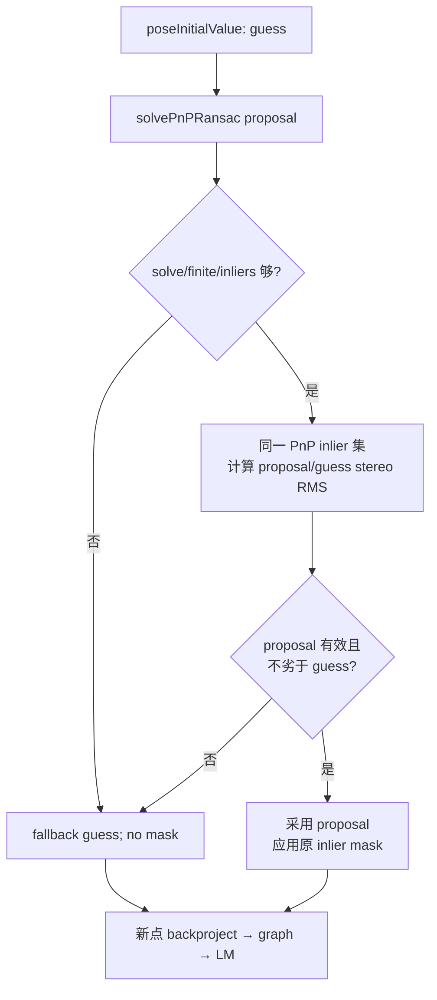

# M3.3 PnP stereo 一致性仲裁设计

日期：2026-08-04

状态：实现已提交；dirty 分阶段验证已完成

相关：

- issue [#25](https://github.com/Nothand0212/phad-vio/issues/25)
- 根因诊断
  [`m3.3-mh02-divergence-diagnosis.md`](m3.3-mh02-divergence-diagnosis.md)
- 开源对照
  [`m3.3-pnp-stereo-consistency-open-source-refs.md`](m3.3-pnp-stereo-consistency-open-source-refs.md)
- 当前正式基线
  [`m3.3-full-suite-baseline-773ea011.md`](m3.3-full-suite-baseline-773ea011.md)
- 实测结果
  [`m3.3-pnp-stereo-arbitration-results.md`](m3.3-pnp-stereo-arbitration-results.md)
- 原 PnP 设计
  [`m3.3-slice3-pnp-design.md`](m3.3-slice3-pnp-design.md)

本文档描述当前约定，不是绝对约束，会随项目开发修订。

## 1. 目标与非目标

**唯一目标**：修复 MH_02 已证实的最早错误授权边界。将左目
`solvePnPRansac` 结果降为 proposal；在任何 current observation mask、新点
backprojection 或后续 landmark lifecycle 变更之前，以同一支持集上的完整
rectified stereo residual 比较 proposal 与既有恒速/上一帧 guess。只有 proposal
在既有观测噪声内不显著劣于 guess 时才采用并应用其 inlier mask，否则完整
fallback。

本片不做：

- 关闭 PnP、放宽/收紧 `pnp_reproj_px` 或 `min_pnp_inliers`；
- 修改 frontend、session feedback、apps/bench 编排；
- 新增 public API、配置、`config_hash`、`diag.csv` 或 `summary.json` 字段；
- 修改 cheirality / mean-cull / reopt 状态机；
- 修复已暴露的 post-cull 零度 pose 安全债；
- Slice ⑤、IMU、边缘化或 M4。

## 2. 已对齐的决策

| 分段 | 结论 |
|---|---|
| 模块边界 | 全部留在 `phad::estimator` PIMPL；测试只走 public `StereoVoEstimator::update()` |
| 数据流 | 在 PnP 的 shared inlier 集上，对 proposal 与 guess 计算同一 `(uL,uR,v)` 未白化 stereo RMS |
| 采用规则 | proposal 有限、支持集足够、投影均有效，且 RMS 不超过 `guess_rms + stereo_sigma_px` 时才采用；复用既有观测噪声，不增加调参项 |
| fallback | 使用 guess、不应用 PnP mask；继续正常 update |
| 错误与诊断 | 复用既有语义：`kOk`、`pnp_success=false`、`pnp_inliers=0`；现有 `pnp_fallbacks` 累计；不加字段 |
| 测试 | public synthetic RED → estimator tests → MH_02 prefix → MH_01 硬门 → MH_05 软比较 → 条件式 11 条全表 |

## 3. 模块边界

唯一生产代码改动位于：

```text
phad/estimator/stereo_vo_estimator.cpp
  StereoVoEstimator::Impl
    tryPnpInit()                    生成并内部仲裁 proposal
    stereoRmsAtPose()              私有纯评分 helper
```

回归位于：

```text
tests/estimator/stereo_vo_pnp_test.cpp
  StereoVoEstimator::update()      唯一测试 seam
```

`landmarks_W`、`body_P_sensor`、rectified calibration、guess 与未来 graph/lifecycle
mutation 均由 estimator 持有。把仲裁移到 frontend/apps 会复制私有地图状态并破坏
现有单向依赖；为测试暴露 scoring API 又会把 GTSAM/OpenCV 实现概念泄漏到公开头，
因此均不采用。

## 4. 数据流

### 4.1 对应与 proposal

`tryPnpInit()` 扫描 current `measurement.observations`，对每个仍在
`landmarks_W` 的 id 建立并行对应：

```text
shared observation pointer/id
world point from landmarks_W
left pixel for solvePnPRansac
```

扫描顺序继续作为 OpenCV `inlier_indices` 的唯一索引合同。RANSAC 求解成功、位姿
finite 且 inliers `>= min_pnp_inliers` 后，结果仍只是 proposal，不立即把
`PnpInitResult::success` 置真。

### 4.2 同支持集 stereo 评分

只对 RANSAC 返回的 shared inlier indices 评分；已被左目 RANSAC 排除的 outlier
不参与 proposal-vs-guess 比较，避免已知外点反向污染仲裁。

对每个候选 `T_W_B`：

1. 计算 `T_W_left = T_W_B * body_P_sensor`；
2. 将对应 `point_W` 变换到 left camera，要求坐标 finite 且 `z > 0`；
3. 用既有 GTSAM `StereoCamera` / calibration 投影为 `(uL,uR,v)`；
4. 与 `toStereoPoint(observation)` 求未白化三维 pixel residual；
5. 汇总 `sqrt(sum(residual.squaredNorm()) / count)`。

使用未白化 RMS 的原因：两候选使用同一 calibration、support 和
`stereo_sigma_px`，白化只会同倍缩放；原 MH_02 因果证据也用该口径。评分不应用
Huber，以免候选采用前先把要识别的灾难 disparity 残差降权。

非法 inlier index、非有限 point/projection/residual 或 cheirality 令该候选 score
无效。只捕获明确的 GTSAM stereo cheirality 异常，不吞掉其它编程错误。

### 4.3 仲裁表

| proposal score | guess score | 动作 |
|---|---|---|
| 有效 | 有效，proposal ≤ guess + `stereo_sigma_px` | 采用 proposal；随后应用原 PnP inlier mask |
| 有效 | 有效，proposal 更差 | fallback；保留 measurement 全部观测 |
| 有效 | 无效 | 采用 proposal |
| 无效 | 任意 | fallback |

同分带复用既有 `stereo_sigma_px`（默认 `1 px`），表达“差异仍在单次观测噪声内”，
不是新配置。准备期曾采用 `1e-4 px` 纯数值容差，但 MH_01 实测三个健康 proposal
只差 `0.000551 / 0.000711 / 0.009798 px`，误拒后由状态累积使 ATE 从
`0.098784 m` 回归到 `0.102762 m`；合成坏例差 `1.437 px`，而 MH_02 i=364
proposal 因 cheirality 无有效 score。`stereo_sigma_px` 单变量臂同时保留两项坏例
拒绝并消除健康误拒，因此取代准备期容差；不能按后续 EuRoC ATE 任意调大。



## 5. 错误与诊断

- 仲裁拒绝不是新 `UpdateStatus`，也不拒帧；它与 RANSAC failure / inliers 不足
  共用原 fallback。
- fallback 保持 `pnp_success=false`、`pnp_inliers=0`；session 现有
  `pnp_fallbacks` 自然累计。
- 不输出 proposal/guess score，不改变 `diag.csv` 18 列或 summary schema。本片由
  合成回归与 MH_02 已知因果位置证明 gate 生效。
- proposal scoring cheirality / non-finite 只否决 proposal。guess score 无效而
  proposal 有效时允许采用 proposal；proposal 也无效时回到既有 guess 路径，由后续
  graph/optimizer 的既有事务语义处理。
- `tryPnpInit()` 在返回 success 前不修改 estimator state；因此 scoring rejection
  不需要额外 rollback。

## 6. 测试与验收

### 6.1 持久 TDD 回归

在 `tests/estimator/stereo_vo_pnp_test.cpp` 构造小场景：

- 历史帧建立稳定 `landmarks_W` 与可预测恒速 guess；
- target frame 的 shared 主体左目像素精确支持一个错误 pose，disparity 则支持
  guess，使左目 RANSAC inliers 足够但 proposal stereo RMS 更差；
- 增加一个已有一次历史观测的 probe id，并让其成为 PnP outlier；
- 当前实现应 RED：`pnp_success=true`，且 probe current observation 被 mask；
- 修复后断言 `kOk`、`pnp_success=false`、`pnp_inliers=0`，probe 因两次观测进入
  graph，证明 fallback 没应用 mask；estimate 必须 finite。

保留并运行既有 `PnpSucceedsOnCleanMotion`，证明仲裁没有退化成总是 fallback。

### 6.2 验证阶梯

1. 定向 GTest 与完整 `phad_estimator_tests`；
2. MH_02 前 390 帧：i=365 不得出现灾难 current pose，i≤371 不得有
   `max_window_pose_shift_m > 0.5`，i=372 不得 `kFailed`；
3. MH_01 硬门：ATE ≤ `0.098784 m`，segments/reanchors/failed=`1/0/0`；
4. MH_05 以当前 ATE `2.455726 m` 为软比较锚；明显恶化则停止，不自动扩全序列；
5. 前述满足后运行 EuRoC 11/11 record-only，保留同源 config snapshot 与完整表。

post-cull 零度 pose 是独立安全债。本片不新增会失败的长期测试，也不顺带改变其失败
语义；若仲裁后仍在 MH_02 命中，再以新证据开启独立切片。

## 7. 实施结果

最终实现与本设计边界一致：生产代码只改 estimator PIMPL，公开/config/诊断 schema
均未变化；新增坏例拒绝与统计等价带接受两个 public seam 回归。完整 estimator tests
为 58/58 PASS。

分阶段门控：MH_02 prefix、MH_01 硬门、MH_05 软门均通过，随后完成 EuRoC 11/11
dirty record-only 全表。完整 MH_02 从 ATE≈`5.30e5 m`、completion≈`0.522`、
segments/reanchors/failed=`7/6/1453` 恢复为 ATE≈`0.0924 m`、completion=`1.0`、
`1/0/0`。已知负向结果是 MH_03 ATE/RPE 回归到约 `1.336/0.278 m`；详见
[验证结果](m3.3-pnp-stereo-arbitration-results.md)。
