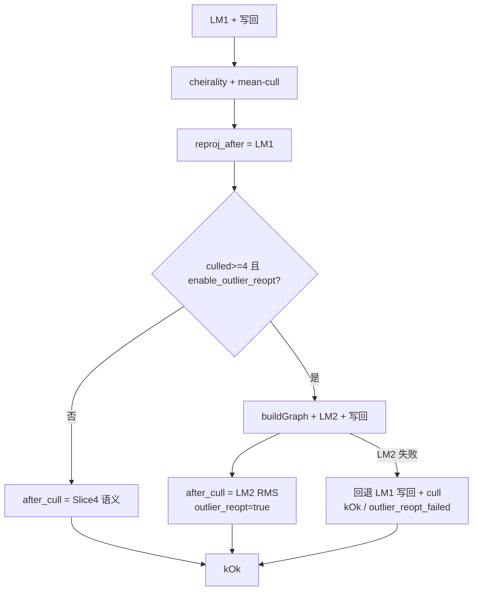

# M3.3 Slice ④b 剔点后重建图二次 LM 设计

日期：2026-08-01  
状态：已对齐（含评审修订：LM₂ 失败回退 kOk、触发 ≥4、`culled_ids_` 快照）；可写实施计划  
相关：

- roadmap [M3.3](../roadmap.md)
- Slice ④ 设计 [`m3.3-slice4-outlier-cull-design.md`](m3.3-slice4-outlier-cull-design.md)
- Slice ④ 基线（不够）[`m3.3-slice4-baseline.md`](m3.3-slice4-baseline.md)
  （`b6fbcb6` / `default_bc8b10e2`，MH_05 ATE ≈ 43.29 m）
- 父设计 [`m3.3-vo-hardening-design.md`](m3.3-vo-hardening-design.md)
- issue [#24](https://github.com/Nothand0212/phad-vio/issues/24)

本文档描述当前约定，不是绝对约束，会随项目开发修订。

## 1. 目标与非目标

**唯一目标**：在 Slice ④ mean-cull 永久删点之后，若本帧实际剔点
（`outliers_culled >= 4`），用剩余窗口观测与 `landmarks_W` **重建 factor graph**，
再跑 **一趟** LM 并写回位姿与点，消化「只删不重优」在 MH_05 上的不足
（ATE 43.29 m、剔后 RMS 仍可达 60–337 px）。

不做：

- 多轮 cull↔LM 或 ORB 式去 Huber；
- 二次 mean-cull（LM₂ 后再剔）；
- 仅 cheirality 删点（`outliers_culled == 0`）触发重优；
- 同步删 frontend track / 拒绝名单；
- 关键帧（Slice ⑤）、IMU、边缘化、改 `phad::eval`；
- 再扩 `diag.csv` 列数（保持 18 列）。

## 2. 已对齐的决策

| 决策点 | 结论 |
|---|---|
| 主动作 | cull 后 `buildGraph` → LM₂ → 写回 |
| 触发 | `outliers_culled >= 4` **且** `enable_outlier_reopt`（剔 1–3 点不重优：④ 基线 6 帧中 3 帧仅剔 1 点且剔后 RMS < 1 px，重建图 + 全 LM 纯开销） |
| 轮次 | 只重优一次，不再 cull |
| 开关 | `enable_outlier_reopt` 默认 `true`；`false` 复现 `b6fbcb6`（只 cull） |
| 与 cull 开关 | `enable_outlier_cull=false` → 无剔点 → 自然不触发 reopt |
| `lm_iterations` | LM₁ + LM₂ 累加 |
| 诊断 | `UpdateDiagnostics.outlier_reopt` / `outlier_reopt_failed`（bool）；summary `robustness.outlier_reopts`（仅成功 LM₂ 计数） |
| diag | **仍 18 列**；不追加 `outlier_reopt` 列 |
| `reproj_after` | 仍为 LM₁ 后、mean-cull **前** 全图 RMS |
| `reproj_after_cull` | 有 reopt：LM₂ 后 graph RMS；无 reopt：保持 Slice ④ 语义 |
| 失败 | LM₂ 失败 → 回退 LM₂（保留「LM₁ 写回 + cull 后」状态）→ `kOk`、`outlier_reopt=false`、`outlier_reopt_failed=true` |
| warnings | cull / reopt **不**进 session `warnings`（对齐 choice A） |
| 票务 | 续 [#24](https://github.com/Nothand0212/phad-vio/issues/24)；本片称 Slice ④b |
| 出口顺序 | **先 MH_05**，够再全序列 |
| 硬门控 | MH_01 ATE ≤ 0.099263、seg/re；健康序列 reanchors 不增；MH_05 re 豁免 |
| 基线文档 | 更新同一 [`m3.3-slice4-baseline.md`](m3.3-slice4-baseline.md)，分节 ④ / ④b |

### 新选项与诊断字段

```cpp
struct EstimatorOptions
{
  // …既有…
  bool enable_outlier_reopt = true;  // false → 复现 b6fbcb6 只 cull
};

struct UpdateDiagnostics
{
  // …既有…
  bool outlier_reopt        = false;  // 本帧是否跑了 LM₂
  bool outlier_reopt_failed = false;  // LM₂ 失败已回退 LM₁（cull 保留）；不进 diag.csv
};
```

`enable_outlier_reopt` 进 `flattenConfig()` / `config_hash`。  
无额外构造校验（bool）。

## 3. 模块边界

不新增库。改动集中在：

```text
phad::estimator   StereoVoEstimator::update
                  ← cull 后条件 rebuild + LM₂ + 写回
                  EstimatorOptions / UpdateDiagnostics
apps/offline_vo_session     ← 累计 outlier_reopts；diag 列不变
apps/phad_vo_bench          ← flattenConfig；summary 映射
phad::bench   RunSummary    ← robustness.outlier_reopts
tests/estimator|apps|bench
docs                        ← 本设计 + 基线分节 + roadmap
```

`phad::frontend` / `phad::eval` 不动。

## 4. 数据流

```text
LM₁ → 写回 window / landmarks_W
→ dropCheiralityLandmarks (+ eraseLandmarkFromWindow)
→ mean-cull if enable_outlier_cull (+ erase；更新 outliers_culled / unique)
→ 写 reproj_rms_after_px（LM₁ 图，cull 前语义 / 全因子）
→ if enable_outlier_reopt && outliers_culled >= 4:
     buildGraph(window, landmarks_W)   // 已无被删 id
     LM₂
     写回 window / landmarks_W
     outlier_reopt = true
     lm_iterations += LM₂.iterations
     reproj_rms_after_cull_px = stereoReprojRms(graph₂, values₂)
     // LM₂ 失败：回退 LM₂，保留「LM₁ 写回 + cull 后」状态
     //   → outlier_reopt=false、outlier_reopt_failed=true → kOk（位姿 = LM₁ 写回值）
   else:
     outlier_reopt = false
     reproj_rms_after_cull_px = Slice ④ 既有规则
       （cull 关：== after；cull 开：skip 已删 id）
→ kOk；estimate.T_W_B = 最终 window.back()（有 reopt 则为 LM₂）
```



要点：

- **不**在 LM₂ 后再 mean-cull / cheirality 第二轮（YAGNI；不够再立项）；
- 事务回滚包住 LM₁+cull+LM₂；**`culled_ids_` 进快照一并回滚**（现有 Slice ④ 实现即插即不回滚，失败路径下重复删除率统计失真，本片顺手修正）；
- LM₂ 写回 window / landmarks_W **之后**再更新 `last_accepted_T_W_B` / `prev_accepted_T_W_B`（下一帧 constant-velocity 初值与 `estimate` 同为 LM₂ 位姿；现有代码本就在 cull 后、kOk 前更新，顺序天然满足，实现时勿提前）。

## 5. 错误与诊断

**运行时**：不定系统 / 非有限等仍走既有 `kFailed`。**LM₂ 失败单独处理**：回退 LM₂，保留「LM₁ 写回 + cull 后」状态走 `kOk`（`outlier_reopt=false`、`outlier_reopt_failed=true`）。理由：剔点越多越可能欠约束（LM₂ 抛 `IndeterminantLinearSystemException`），而这些帧在 Slice ④ 本是 `kOk`，LM₂ 失败不应把好帧变 `kFailed`（completion 与 eval 空洞恶化，与改善 MH_05 的目标相悖）；LM₁ 写回是 ④ 已验证状态，回退严格不差于 ④。

**`diag.csv`**：保持 18 列；本帧是否 reopt 由 `lm_iterations` 抬升与
`summary.outlier_reopts` 观察（需要逐帧位时用 session 内 diagnostics，不改 CSV）。
`outlier_reopt` / `outlier_reopt_failed` 仅存在于 session diagnostics / probe，不进 diag.csv。
语义注明：`lm_iterations` 为「本帧 LM 总迭代数」（LM₁ + LM₂）；有 reopt 时
`reproj_rms_after_cull_px` 分母为 graph₂ 全图、无 reopt 时为 graph₁ skip-missing，
两者数值不可直接跨帧对比；`max_window_pose_shift_m` 仍为 LM₁ 位移，不反映 LM₂。

**`summary.json`**（`schema_version` 仍为 1）：

```json
{
  "robustness": {
    "outliers_culled": 0,
    "outliers_culled_unique": 0,
    "outlier_reopts": 0
  }
}
```

**日志**：probe 可打印 `outlier_reopts=`（对齐其它计数）；**不**进 `warnings`。

## 6. 测试与验收

### 单元测试

| 用例 | 断言 |
|---|---|
| 有 cull（≥4）且 reopt 开 | `outlier_reopt==true`；`lm_iterations` 大于仅 LM₁ 对照；位姿为 LM₂ 写回 |
| 剔 1–3 点不重优 | `outliers_culled` 1–3 → `outlier_reopt==false`，不二次 LM |
| LM₂ 失败回退 | 构造剔点后欠约束图（LM₂ 抛异常）→ `kOk`、`outlier_reopt==false`、`outlier_reopt_failed==true`、位姿为 LM₁ 写回、cull 保留 |
| `enable_outlier_reopt=false` | 有 cull 也 `outlier_reopt==false` |
| 无 cull | 不二次 LM |
| 仅 cheirality | `outliers_culled==0` → 不 reopt |
| LM₂ 后不再 cull | 同帧 cull 计数只来自 LM₁ 后那一轮 |
| 既有用例 | 不回归 |

### 契约测试

- `tests/bench/`：`outlier_reopts` 序列化；
- diag 列数仍为 18。

### 真序列（对照 `b6fbcb6` / `default_bc8b10e2`）

1. **先 `MH_05_difficult`**  
   - **够**：ATE **&lt; 1 m**；cheirality 不失控回升；记录 reopts / cull  
   - **不够**：停扩 scope，讨论多轮或其它手段  
   - 附加判据：reopt 帧 LM₂ 后 `reproj_rms_after_cull_px` 仍 **&gt; 10 px** → 病根不在被剔点（剩余点 / 观测 &lt; 4 的新点本身坏），LM₂ 无效 → 判「不够」  
2. 够 → 其余 10 条 + 更新基线文档分节 ④b + roadmap

| 项 | 门控 |
|---|---|
| MH_01 | ATE ≤ **0.099263** m；`segments=1`、`reanchors=0` |
| 健康序列 reanchors | 相对 Slice ③ **不增** |
| MH_05 reanchors | **豁免**并记录 |
| 其余 ATE | 只记录 |

## 7. 与 Slice ④ 的关系

| | Slice ④ | Slice ④b |
|---|---|---|
| 交付 | mean-cull 永久删点 | cull 后 rebuild + LM₂ |
| MH_05 | 不够（43.29 m） | 诊断门目标 &lt; 1 m |
| A/B | `enable_outlier_cull=false` | `enable_outlier_reopt=false` → ④ |
| 文档 | ④ 设计 / 基线「不够」节保留 | 本设计；基线追加 ④b 节 |

Slice ⑤（关键帧）仍单独对齐。
