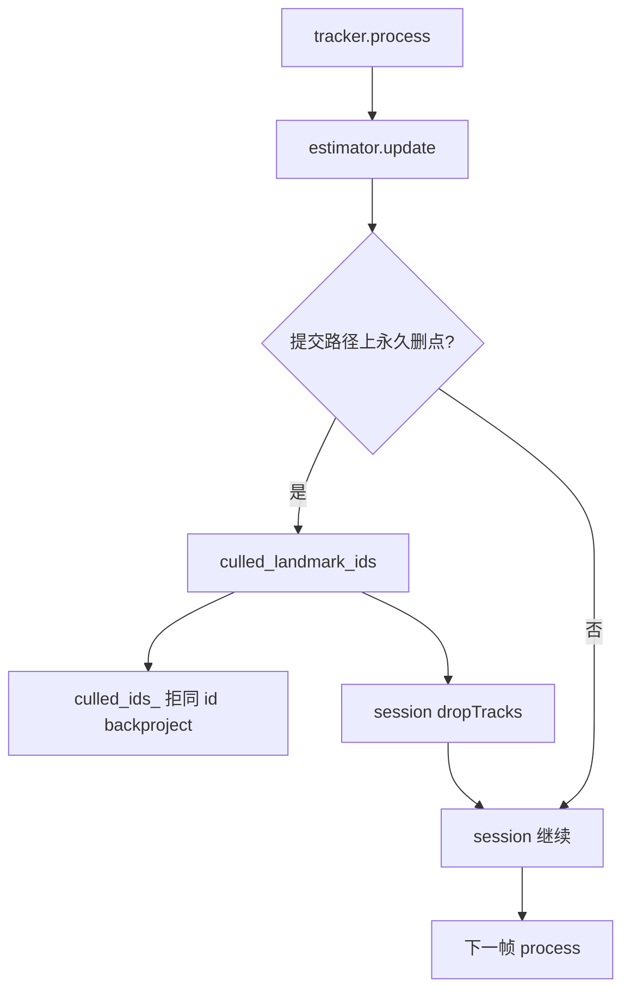

# M3.3 Slice ④c Cull 后丢 Track + 拒复生设计

日期：2026-08-02  
状态：**部分完成** — 编码已落地（`block_culled_rebirth` 默认 true +
`dropTracks` + session 回传，至 `de32bd7` / `default_9da4ccd2`）；MH_01 健康
恢复（seg/re=1/0、failed=0）但 ATE **0.120247** &gt; 锚 **0.099263** → 硬门
**不够**；MH_05 ATE **4.565** vs ④b **3.449** → **停全序列**；Slice ⑤ 仍暂停
（直至 MH_01 硬门或另开阈值片）。出口数字见
[`m3.3-slice4-baseline.md`](m3.3-slice4-baseline.md) §7–§8。  
相关：

- roadmap [M3.3](../roadmap.md)
- Slice ④ 设计 [`m3.3-slice4-outlier-cull-design.md`](m3.3-slice4-outlier-cull-design.md)
- Slice ④b 设计 [`m3.3-slice4b-outlier-reopt-design.md`](m3.3-slice4b-outlier-reopt-design.md)
- 复生对照 [`m3.3-cull-id-rebirth-open-source-refs.md`](m3.3-cull-id-rebirth-open-source-refs.md)
- ⑤前锚 / A/B [`m3.3-slice5-baseline.md`](m3.3-slice5-baseline.md) §0–§2
- 父设计 [`m3.3-vo-hardening-design.md`](m3.3-vo-hardening-design.md)
- 实施计划 [`2026-08-02_m3.3_slice4c_cull_track_drop_5a3a4e09.plan.md`](../plans/2026-08-02_m3.3_slice4c_cull_track_drop_5a3a4e09.plan.md)
- issue [#24](https://github.com/Nothand0212/phad-vio/issues/24)（续；Part of [#23](https://github.com/Nothand0212/phad-vio/issues/23)）

本文档描述当前约定，不是绝对约束，会随项目开发修订。

## 1. 目标与非目标

**唯一目标**：在保持 `enable_outlier_cull` 默认 `true` 的前提下，切断
「地图点永久删除 → 同 `LandmarkId` stereo-backproject 重生」路径，使 MH_01
不再因伪永久复生崩溃，并尽量恢复健康锚（ATE ≤ 0.099263、`segments=1` /
`reanchors=0`）。手段是 **estimator 拒复生 + apps 回传丢 frontend track**
（VINS MT=0 的工程版：信号走 composition root）。

不做：

- `TrackId ≠ LandmarkId` 类型拆分（治本切片，本片之后单独开；见 §8）；
- 改 mean-cull 阈值 / 最少观测公式（若 hotfix 后 MH_01 仍超锚再另开）；
- 改 `diag.csv` 列数（本帧 id 列表不落盘）；
- 关键帧（Slice ⑤）、IMU、边缘化、改 `phad::eval`；
- `phad::estimator` → `phad::frontend` 库依赖。

## 2. 已对齐的决策

| 决策点 | 结论 |
|---|---|
| 结构根因 | `LandmarkId` 兼任 track 与地图点；本片先堵症状 |
| 直接崩因 | 同号 XYZ 写入 `landmarks_W`（MH_01 ≈1595 帧 `reproj_before≈511` px） |
| 双保险 | ① `block_culled_rebirth` 默认 `true`；② session `dropTracks` |
| 回传落点 | **仅** `apps/offline_vo_session`（及共用 session 的 probe/bench） |
| 删哪些 id | 本帧 **mean-reproj cull ∪ cheirality** 新删的 id（已确认：一并 drop） |
| `next_id` | frontend **不**回收号段；drop 后 GFTT 补点用新 id |
| 时机 | 本帧 `estimator.update` 返回后、下一帧 `tracker.process` 前 |
| diag | **仍 18 列**；id 列表只在内存 / API |
| flattenConfig | `block_culled_rebirth` 进 `config_hash` |
| 出口顺序 | MH_01 硬门 → MH_05 诊断 → 再决定是否全序列 |
| MH_01 硬门 | ATE ≤ **0.099263**；`seg/re = 1/0`；`fail` 不构成吸收态（目标 0） |
| MH_05 | 只诊断；对照 ④b ≈3.45 m；不硬门 &lt;1 m |
| Slice ⑤ | 本片完成前 **暂停** |
| 票务 | 续 [#24](https://github.com/Nothand0212/phad-vio/issues/24)；称 Slice ④c |

### 新选项与 API

```cpp
// phad::estimator
struct EstimatorOptions {
  // …既有…
  bool block_culled_rebirth = true;  // false → 复现 ④b 伪永久（仅 A/B）
};

struct UpdateDiagnostics {
  // …既有…
  // 本帧永久移出地图的 id（mean-cull ∪ cheirality）；不进 diag.csv
  std::vector<common::LandmarkId> culled_landmark_ids;
};

// phad::frontend
class StereoTracker {
  // …既有 process()…
  void dropTracks( std::span<const common::LandmarkId> ids );
};
```

---

## 3. 模块边界

不新增库。改动集中在：

```text
phad::estimator
  EstimatorOptions.block_culled_rebirth   (default true)
  UpdateDiagnostics.culled_landmark_ids   (本帧列表)
  StereoVoEstimator::update
    ← mean-cull / cheirality 删点时 push 到本帧列表
    ← backproject 前若 block && id∈culled_ids_ → skip
        ↓
phad::frontend
  StereoTracker::dropTracks(ids)
    ← 按 id 从 LiveTrack 表擦除；不改 next_id
        ↓
apps/offline_vo_session
  update 返回后：
    if (!culled_landmark_ids.empty())
      tracker.dropTracks(culled_landmark_ids)
apps/phad_vo_bench
  flattenConfig += block_culled_rebirth
  （保留诊断 CLI：--block-culled-rebirth 可删或改为 --allow-culled-rebirth）
phad::bench / tests / README / AGENTS
docs  ← 本设计；基线写入 m3.3-slice4-baseline.md ④c 节或独立短基线
```

依赖方向：

| 允许 | 禁止 |
|---|---|
| `apps` → `frontend` + `estimator` | `estimator` → `frontend` |
| `frontend` 增加无 estimator 知识的 `dropTracks` | `frontend` include estimator 头 |

`phad::eval` 不动。

---

## 4. 数据流

```text
rectify
→ tracker.process(rectified)          // 不含上一帧已 drop 的 id
→ glue → KeyframeMeasurement
→ estimator.update(measurement)
     （正常路径）候选帧：新 id backproject 前检查 block∩culled_ids_
     LM₁ → 写回
     → dropCheiralityLandmarks → 本帧 culled_landmark_ids += 被删 id
        （并入 culled_ids_ 若尚未在集合中——仅用于拒复生；unique 统计仍可只计 mean-cull）
     → mean-cull（若开）→ 本帧 culled_landmark_ids += …；culled_ids_ 更新
     → （可选 LM₂ / reopt，④b 不变）
→ session（凡 update 返回且列表非空）：
     tracker.dropTracks(diagnostics.culled_landmark_ids)
→ 下一帧 process：LK 仅剩余 tracks；GFTT 补新 id
```

不变量：

| 项 | 规则 |
|---|---|
| 列表填充 | **仅提交成功路径**写入 `culled_landmark_ids`；任意 `restore()` 之后列表必须为空（与回滚后的地图一致） |
| `culled_ids_` | 跨帧拒复生集合；mean-cull 与 cheirality 删点都加入（block 用） |
| `outliers_culled` / `unique` | **语义不变**：仍只统计 mean-reproj cull（不把 cheirality 算进 outliers_culled） |
| `dropTracks` 触发 | session 在 `update` 返回后若 `!culled_landmark_ids.empty()` 即调用（含 `kOk`；若失败路径列表为空则自然跳过） |
| seed / re-anchor | `landmarks_W.clear()` **不**清空 `culled_ids_`；本帧若 seed 未删旧点则列表可空 |
| 同帧 | 本帧 measurement 已进入 update 后才 cull；drop 影响的是**下一帧** process |



---

## 5. 错误与诊断

| 情况 | 行为 |
|---|---|
| `dropTracks` 含未知 id | 忽略（幂等） |
| 空 span / 空列表 | no-op；session 可不调用 |
| `block_culled_rebirth=false` | estimator 允许同 id backproject（复现 ④ 伪永久）；**session 仍按列表 drop**（若非空）。纯复现 tip/`65273570` 行为：关 block **且**跳过 drop——本片用 estimator 单测覆盖 `block=false`；真序列 A/B 若需要再加 session 开关（YAGNI 默认不加） |
| `update` 抛异常前已部分删点 | 现有事务 `restore`；列表不交给 session（未填或已清） |
| diag.csv | **仍 18 列**；`culled_landmark_ids` 不落盘 |
| `flattenConfig` | 增加 `estimator.block_culled_rebirth` |
| summary | 本片 **不加** `tracks_dropped`（YAGNI） |
| warnings | cull / drop / block **不**进 session `warnings` |
| probe stdout | 不强制打印 drop 数；可选日后加 |

bench CLI：默认即 block=true；诊断可保留 `--allow-culled-rebirth`（把 block 设 false）替代现有 `--block-culled-rebirth`（默认已开则后者多余）。

---

## 6. 测试与验收

### 单元 / 集成

| 用例 | 断言 |
|---|---|
| estimator 拒复生 | mean-cull 或 cheirality 删点后同 id 再喂 → 默认不进 `landmarks_W`；`block=false` 可重建 |
| 列表与 restore | 提交路径 `culled_landmark_ids` 含本帧所删；`restore` 后调用方见空列表 |
| `outliers_culled` | 仅 mean-cull 计数；cheirality 只进列表 / `culled_ids_` |
| `dropTracks` | 表内 id 消失；未知 id 无副作用；`next_id` 不回退 |
| session 回传 | 合成：一帧产生删点 → `dropTracks` 后下一帧 `FrameTracks` 无该 id |
| diag 契约 | 仍 18 列；`block_culled_rebirth` 进 flattenConfig |
| 既有 cull / reopt / PnP / apps | 不回归 |

### 真序列

| 项 | 门控 |
|---|---|
| MH_01 | ATE ≤ **0.099263**；`segments=1` / `reanchors=0`；completion ≈ 1；`failed=0` 为目标（硬：不出现长 failed 簇） |
| MH_05 | **只诊断**；对照 ④b `3855395` / `default_65273570`（≈3.45 m）；不硬门 &lt;1 m |
| 其余 | MH_01 过且 MH_05 相对 ④b **无显著恶化**后再考虑全序列 |
| 文档 | 基线写入 `m3.3-slice4-baseline.md` ④c 节；roadmap 标 ④c；链本设计 |

若 MH_01 **止崩**但 ATE 仍明显劣于 0.099：记入基线并停全序列，**另开**阈值/最少观测片；本片不改 cull 公式。

出口顺序：**编码 → MH_01 → MH_05 →（条件）全序列**。

---

## 7. Open questions

1. ~~cheirality 是否并入 drop~~：**是**（§3）。
2. ~~`block=false` 时 session 是否仍 drop~~：**仍 drop**（§5）。
3. TrackId≠LandmarkId 切片命名与排期：④c 之后 / ⑤ 之前（§8）——不阻塞本片。

---

## 8. 文档与计划

- 实施计划：[`2026-08-02_m3.3_slice4c_cull_track_drop_5a3a4e09.plan.md`](../plans/2026-08-02_m3.3_slice4c_cull_track_drop_5a3a4e09.plan.md)
- 出口基线：[`m3.3-slice4-baseline.md`](m3.3-slice4-baseline.md) §7（MH_01）/ §8（MH_05）
- roadmap 已回填 ④c **部分完成** / 停全序列；Slice ⑤ 硬门通过前暂停

## 9. 后续（非本片）

- **TrackId ≠ LandmarkId**：frontend 只持 track；estimator 分配地图点；cull 解绑。
- MH_01 止崩但 ATE 劣于 0.099（已发生）：另开阈值/最少观测片；本片不改 cull 公式。
- Slice ⑤ 关键帧：MH_01 硬门通过或另开阈值片后再开；本片未过硬门 → **暂停**。
