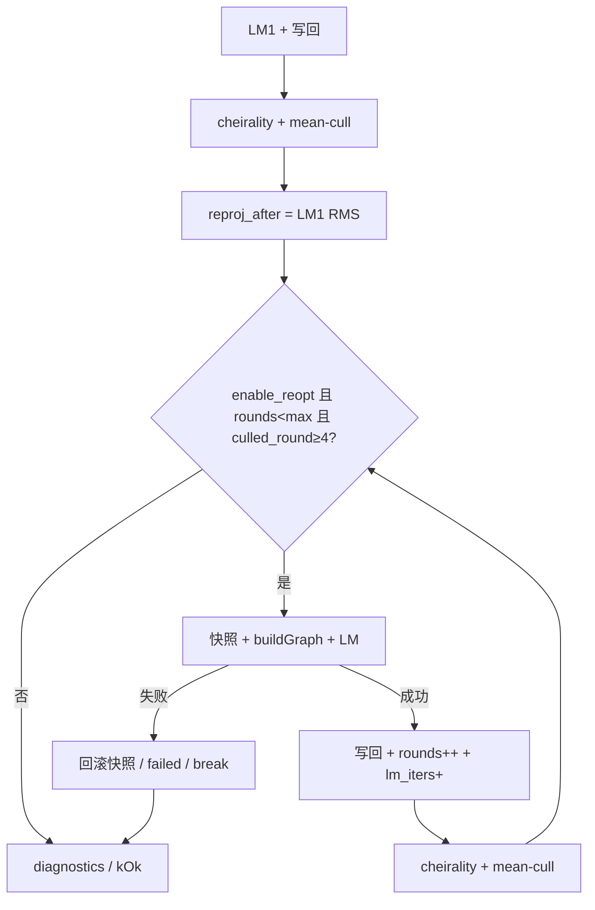

# M3.3 Slice ④e 多轮 cull↔LM 设计

日期：2026-08-02  
状态：**已对齐**（待编码）— 扩展 ④b 为有界多轮永久 mean-cull ↔ rebuild+LM；
默认 `max_outlier_reopts=3`。对照锚 ④d：`79505f8` / `default_85c97158`。  
相关：

- roadmap [M3.3](../roadmap.md)
- 开源对照 [`m3.3-slice4e-multiround-open-source-refs.md`](m3.3-slice4e-multiround-open-source-refs.md)
- Slice ④b 设计 [`m3.3-slice4b-outlier-reopt-design.md`](m3.3-slice4b-outlier-reopt-design.md)
- Slice ④d 设计 [`m3.3-slice4d-cull-threshold-design.md`](m3.3-slice4d-cull-threshold-design.md)
- 基线 [`m3.3-slice4-baseline.md`](m3.3-slice4-baseline.md) §9（④d）
- 父设计 [`m3.3-vo-hardening-design.md`](m3.3-vo-hardening-design.md) §8
- issue [#24](https://github.com/Nothand0212/phad-vio/issues/24)（续；Part of [#23](https://github.com/Nothand0212/phad-vio/issues/23)）

本文档描述当前约定，不是绝对约束，会随项目开发修订。

## 1. 目标与非目标

**唯一目标**：在 ④d（`outlier_avg_reproj_px=4.0`）与 ④b 单次 LM₂ 之上，用
**有界多轮永久 mean-cull ↔ rebuild+LM** 消化 MH_05（④d ≈ 4.565 m）与已知发散债；
MH_01 不回归（ATE ≤ **0.098784**，`seg/re=1/0`）。

不做：

- 观测级可翻转外点（ORB `PoseOptimization` 形态）；
- 去 Huber / 末轮去核（验收不够再开续片）；
- 改 `outlier_avg_reproj_px` 默认或为过门乱改阈值；
- 改硬编码 mean-cull `n_factors < 4` / 触发 `culled_round >= 4`；
- 拆 `TrackId ≠ LandmarkId`；
- 关键帧（Slice ⑤）、IMU、边缘化、改 `phad::eval`；
- 扩 `diag.csv`（仍 **18** 列）。

## 2. 已对齐的决策

| 决策点 | 结论 |
|---|---|
| 主形态 | 扩展 ④b：多轮**永久** mean-cull ↔ rebuild+LM（非观测级翻转） |
| 轮数上限 | `max_outlier_reopts` 默认 **3**（成功重优次数上限） |
| 停条件 | `culled_round < 4`，或 `rounds == max`，或重优 LM 失败 |
| 达顶 | 第 N 次 LM 后仍做 cheirality+cull；若仍 `≥4` **不再** LM |
| 布尔开关 | 保留 `enable_outlier_reopt`；`false` 忽略 max；`max=0` 同效不重优 |
| 复现 | `enable=true` + `max=1` → ④b/④d 单次 LM₂；`enable=false` → 只 cull |
| 每轮清理 | 与 LM₁ 后同序：cheirality 永久删 + mean-cull |
| 去 Huber | **本片不做** |
| 诊断 | `outlier_reopt`（bool）+ `outlier_reopt_rounds`；`outlier_reopt_failed` |
| summary | `outlier_reopts` = 累计成功重优**次数**（语义相对 ④d 变更） |
| diag | 仍 18 列 |
| 阈值 T | 保持 ④d 默认 **4.0** |
| 出口顺序 | MH_01 不回归 → MH_05 诊断 → 条件全序列 |
| MH_05 | 软：相对 4.565 明显改善；硬方向 **&lt; 1 m**；未达停全序列 |
| Slice ⑤ | 本阶段不开 |
| 票务 | 续 [#24](https://github.com/Nothand0212/phad-vio/issues/24)；称 Slice ④e |

### 新选项与诊断字段

```cpp
struct EstimatorOptions
{
  // …既有…
  bool enable_outlier_reopt = true;
  int  max_outlier_reopts   = 3;  // ≥0；0 → 不重优；进 flattenConfig
};

struct UpdateDiagnostics
{
  // …既有…
  bool          outlier_reopt         = false;  // rounds > 0
  bool          outlier_reopt_failed  = false;  // 任一轮 LM 失败已回滚
  std::uint32_t outlier_reopt_rounds  = 0;      // 本帧成功重优次数；不进 diag.csv
};
```

CLI：

```text
phad_vo_bench <sequence-root> … --max-outlier-reopts <int>
```

- 覆盖 `session_options.estimator.max_outlier_reopts`
- 须 `≥ 0`；非法 → 非 0 退出
- 进 `flattenConfig` → 独立 `config_hash` 目录

## 3. 模块边界

不新增库。改动集中在：

```text
phad::estimator
  EstimatorOptions / UpdateDiagnostics
  StereoVoEstimator::update   ← 有界 cull↔LM 循环
apps/offline_vo_session       ← summary 累加 rounds
apps/phad_vo_bench            ← flattenConfig；CLI
phad::bench RunSummary        ← outlier_reopts 语义注明
tests/estimator|apps|bench
docs                          ← 本设计；开源对照；基线 §10；roadmap
```

`phad::frontend` / `phad::eval` 不动。④c `block_culled_rebirth` + session
`dropTracks` 合同不变（各轮 `culled_landmark_ids` 仍交给 session）。

## 4. 数据流

```text
LM₁ → 写回
→ reproj_after = RMS(graph₁, LM₁)          // LM₁ 后、首次 cull 前
→ cheirality + mean-cull → culled_round；累加 cull 计数 / ids
→ rounds = 0
→ while enable_outlier_reopt
         && rounds < max_outlier_reopts
         && culled_round >= 4:
     快照 (window, landmarks_W)
     buildGraph → LM → 写回
     lm_iterations += 该趟迭代
     rounds += 1
     cheirality + mean-cull → 新 culled_round；累加计数 / ids
     // LM 失败：恢复快照；outlier_reopt_failed=true；break
→ outlier_reopt = (rounds > 0)
→ outlier_reopt_rounds = rounds
→ reproj_after_cull =
     rounds>0 ? 最后成功 LM 图全图 RMS
              : Slice ④ 语义（cull 开：skip missing；关：== after）
→ estimate.T_W_B = window.back()
→ kOk
```



要点：

- 第 N 次成功 LM 后仍执行 cheirality+cull；若仍 `≥4` 而 `rounds==max`，while
  不再进入 → **达顶只 cull、不重优**（有界代价）。
- `outliers_culled` / `unique` / `culled_landmark_ids`：本帧**所有清理轮次累加**。
- 触发阈值仍硬编码 `>= 4`（与 ④b 同）。
- 外层既有 `restore()` 包整帧 `kFailed`；每轮重优另有局部快照。
- `max_window_pose_shift_m` 仍只反映 LM₁。
- Huber 与 `outlier_avg_reproj_px=4.0` 本片不动。

## 5. 错误与诊断

**运行时**：LM₁ 失败路径不变（`kFailed`）。重优轮失败 → 回滚该轮写回，保留
上一稳定态与已发生 cull → `kOk`、`outlier_reopt_failed=true`。cull/reopt **不**
进 session `warnings`。

**`diag.csv`**：保持 18 列；多轮靠 `lm_iterations` 与 summary/probe 观察。

**`summary.json`**（`schema_version` 仍 1）：

```json
{
  "robustness": {
    "outliers_culled": 0,
    "outliers_culled_unique": 0,
    "outlier_reopts": 0
  }
}
```

`outlier_reopts`：各帧 `outlier_reopt_rounds` 之和（**次数**，非「有 reopt 的帧数」）。
相对 ④d 为有意语义变更，基线与 README 须注明。

**RMS**：`reproj_after` = LM₁ 后首次 cull 前；`reproj_after_cull` = 有成功重优时
为最后成功 LM 全图 RMS，否则 Slice ④ 语义。有/无重优帧的 after_cull 不可直接对比。

## 6. 测试与验收

### 单元测试

| 用例 | 断言 |
|---|---|
| 多轮触发 | `max≥2` 且两轮 `culled_round≥4` → `outlier_reopt_rounds==2` |
| 达 max 停止 | `max=1` 时 `rounds==1`，无第三趟 LM |
| 剔 1–3 点不重优 | 与 ④b 同 |
| `enable=false` / `max=0` | `rounds==0` |
| 中轮 LM 失败 | `kOk`、`failed=true`、回滚该轮、保留前序 |
| 达顶后只 cull | `max=1` 且 LM₂ 后再 cull≥4 → 点删、无 LM₃ |
| cull 计数累加 | 多轮后计数反映各轮之和 |
| 既有用例 | 不回归；依赖「单次 reopt」处用 `max=1` 对齐 |

### 契约测试

- bench：`outlier_reopts` 序列化（次数语义）
- apps：diag 18 列；`flattenConfig` 含 `max_outlier_reopts`
- `max_outlier_reopts < 0` 构造拒绝

### 真序列（对照 `79505f8` / `default_85c97158`）

1. **MH_01**：ATE ≤ **0.098784**；`segments=1`、`reanchors=0`、`failed=0`
2. **MH_05**：相对 4.565 明显改善 →「有效」；硬方向 **&lt; 1 m**；未达 →
   「有效但不够」，**停全序列**；记录 reopts 次数 / rounds / after_cull
3. 全序列：仅 MH_05 &lt;1 m 或明示放行；发散债只记录
4. 文档：基线 §10；roadmap / 父设计链到本片

| 项 | 门控 |
|---|---|
| MH_01 | ATE ≤ 0.098784；seg/re=1/0 |
| MH_05 | 软改善；硬方向 &lt;1 m |
| 健康序列 reanchors | 若跑全序列：相对 Slice ③不增；MH_05 re 豁免 |
| 其余 ATE | 只记录 |

## 7. 与前后片关系

| | ④b | ④d | ④e（本片） |
|---|---|---|---|
| 交付 | 单次 LM₂ | 默认 T=4.0 | 有界多轮 cull↔LM |
| MH_05 | 3.45（不够） | 4.565 | 目标压低；&lt;1 m 为硬方向 |
| A/B | `enable_reopt=false` | CLI T | `max=1` / `enable=false` |
| 下一刀 | — | 建议 ④e | 不够 → 去 Huber / 观测级续片；够或停后另议 ⑤ |

Slice ⑤（关键帧）仍单独对齐；本阶段不开。
